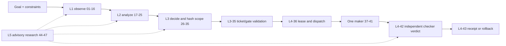

# SIRINX Production Operating Contract

Status: `LOCAL_ONLY / PRODUCTION_HOLD`
Canonical repository: `ton36475-lgtm/sirinx-co`
Authority: Postgres durable state + `sirinx-control` policy gates
Human decision: required for every external or production mutation

This file is the entry point for operating SIRINX. It is a readiness and
evidence contract, not a claim that processes are running or production is
complete.

## Current truth

- The 47 Ronin are 47 logical role identities. They are not 47 resident
  processes or 47 simultaneous model sessions.
- The safe Mac mini M2 envelope is one coordinator plus at most three worker
  lanes, with only one source-mutating maker and a separate checker.
- The canonical passive role content is
  [`crates/sirinx-agents/data/ronin-role-registry.v1.json`](crates/sirinx-agents/data/ronin-role-registry.v1.json);
  passive human-readable cards remain under `docs/agents/ronin/cards/`. Rust
  owns the executable numeric/layer semantics and loads the crate-contained
  content only through an immutable, fail-closed validator in
  `sirinx-agents`.
- All 47 passive role cards plus the Kai liaison card have been reviewed
  against the canonical fields, department ranges, authority boundaries, and
  maker/checker flow. The background contract is version 1.1; all schedules
  remain disabled and it grants no execution authority.
- Department-head definitions in `.claude/agents/` are executable agent
  surfaces. Passive role cards do not automatically inherit those tools or
  authority.
- The legacy Node team view contains 12 Hermes profile definitions, not 12
  verified active runtimes. Its compatibility field named `activeProfiles`
  carries definitions; authoritative counts remain zero until redacted CWD,
  fresh running/handshake evidence, and an injected attestation verifier all
  agree on the expected profile identity and CWD. Cross-profile replay is
  rejected. No profile-file or profile-tree metadata is inspected.
- Postgres is the source of truth for tasks, leases, approvals, outbox events,
  verification, and receipts. UI cards, terminal panes, queues, Telegram,
  Durable Objects, D1, and model responses are projections or transports.
- Existing `/api/a2a/*` routes are internal SIRINX compatibility APIs until an
  A2A v1 adapter passes conformance and trust tests.
- No MCP or A2A peer is live-connected by this candidate. Cloudflare, Claude,
  Kimi, Hermes, Codex, Telegram, and LINE entries are a disabled connection
  plan only; Telegram and LINE are messaging transports, not approval
  authorities or A2A peers.
- A26 adds only a HOLD-only Connection Evidence Admission Preview. Its closed
  schemas and pure validator can establish candidate consistency against the
  review-pinned disabled plan, but caller context and clock remain
  non-authoritative and DNS/origin authentication, replay/uniqueness storage,
  durable admission, and effect circuits are absent. Its sole success status
  is `EVIDENCE_VALIDATED_NOT_ADMITTED`; every endpoint/card/handshake/auth,
  connect/MCP/A2A/send, authority/replay, and effect flag remains false. Raw
  OmniRoute/card IDs, handshake flags, and MCP availability are now reported
  only and cannot promote runtime truth. Eleven plan entries without endpoints
  remain intentionally ineligible. The static receipt is
  [`connection-evidence-admission-preview-20260720.md`](reports/runtime/connection-evidence-admission-preview-20260720.md).
- A27 adds only the B10.0 contract layer: an ordered 13-row manifest with every
  circuit held, a generic approval-receipt v2 structural schema, and an opaque
  pure-Rust preview whose only success state is
  `CONTRACT_VALIDATED_NOT_AUTHORIZED`. The receipt is pinned to the reviewed
  manifest and A26 connection-plan digests; Telegram is bound to its exact
  transport/target/scope while LINE and customer messaging remain unbound.
  There is no migration 0007, durable authority, route, approval consumption,
  effect claim, executor, or I/O. The current free-form `/api/actions`, internal
  `/api/a2a/*`, and Telegram sender remain pre-existing compatibility paths and
  are not A27 authority; they must be migrated or quarantined before managed
  readiness. See
  [`shared-authority-contract-manifest-20260720.md`](reports/runtime/shared-authority-contract-manifest-20260720.md).
- A33 resolves the migration-0007 persistence ambiguity without implementing
  SQL: the one shared additive kernel must install all 13 ordered A27
  definition rows and 13 matching `HOLD` circuit rows while seeding zero
  tickets, grants, attestations, admissions, claims, routes, executors, LOGIN
  roles, or open circuits. `resource_cleanup` is one member of the registry,
  not a cleanup-only ledger. The kernel cannot authorize its own installation;
  the exact candidate, prerequisite NOLOGIN roles, disposable Postgres proof,
  and independent review require the pre-existing ticketed human release
  process. See
  [`EFFECT_AUTHORITY_MIGRATION_SEMANTICS.md`](docs/agent-runtime/EFFECT_AUTHORITY_MIGRATION_SEMANTICS.md).
- A28 adds only the B10.1 static compatibility accounting layer. It freezes one
  strict `DURABLE_AUTHORITY_UNAVAILABLE` refusal fixture/schema and binds 39
  designated Rust/Node/Telegram compatibility surfaces to 28 exact
  working-tree source/test/store/migration/documentation hashes. Seventeen
  surfaces still require the shared 503 refusal, 18 status projections still
  require a false-authority rewrite, and the lead-derived enqueue requires
  suppression without blocking the primary lead write. The Telegram
  live-runbook hazard is still open. Seventeen focused static tests pass, but no runtime handler,
  sender, gate, queue, registration, route, readiness projection, database,
  MCP/A2A link, or provider was changed. See
  [`B10_COMPATIBILITY_QUARANTINE_PLAN.md`](docs/agent-runtime/B10_COMPATIBILITY_QUARANTINE_PLAN.md)
  and
  [`b10-compatibility-surface-inventory-20260721.md`](reports/runtime/b10-compatibility-surface-inventory-20260721.md).
- Push, merge, deploy, Cloudflare mutation, provider calls, production database
  writes, queue mutation, and live Telegram/customer sends remain held.
- The Mac mini is `Mac14,3` with 8 GiB RAM and 8 logical CPUs. The report-bound
  2026-07-20 23:20:59 +0700 read-back showed `14,594,096 KiB` free (13.918 GiB),
  still `1,134,544 KiB` below the absolute 15 GiB build/install/model-download/
  disposable-database floor and `6,377,424 KiB` below the conservative 20 GiB
  target for the deferred full verification chain. APFS free space changed
  materially during this slice; every workload must remeasure rather than
  inheriting this sample.
  The inventory and fail-closed cleanup contract are in
  [`RESOURCE_RECOVERY_ADMISSION.md`](docs/agent-runtime/RESOURCE_RECOVERY_ADMISSION.md);
  no cleanup is authorized or implemented. A closed v2 structural preflight
  now recomputes plan/grant/manifest/process bindings but always reports
  `authorityValidated=false`, `admissionValidated=false`,
  `resource_cleanup=HOLD`, `replayProtectionAvailable=false`, and
  `canExecute=false`; it adds no migration, route, approval consumer, or
  executor. A B12 follow-on now binds launcher and selected-Cargo identities,
  user-owned path ancestry, action-time target/process/lease/resource evidence,
  PREPARED-only effect attempts, and context-bound structural post-action
  receipts. Its independently reviewed result is `VERIFIED` only for the
  HOLD-only/no-dispatch scope; 9 focused tests pass, while
  `canDispatch=false`, `approvalConsumed=false`, and `executorAvailable=false`
  remain unconditional. Ajv 8.20.0 now strictly compiles the Draft 2020-12
  dependency graph and validates positive/negative instances for all four A24
  schemas; this is schema parity, not runtime authority, and no package was
  installed. The shared Authority Kernel is design-only and SQL
  migration 0007 is deferred until disposable Postgres/RLS/race/restore proof
  is resource-admitted.
  A later read-only sample at 2026-07-20 23:42:40 +0700 showed
  `14,648,632 KiB` free (13.970 GiB), still `1,080,008 KiB` below the absolute
  15 GiB floor and `6,322,888 KiB` below the conservative 20 GiB target.
  The final A27 verification sample showed `14,445,252 KiB` free (13.776 GiB),
  still `1,283,388 KiB` below 15 GiB; resource admission remains `HOLD`.
- The local Ollama inventory includes `qwen3.5:2b` and `qwen3.5:4b`, but neither
  is admitted to an agent route. Kimi K3 has no published official local weight
  artifact or weight license as of 2026-07-20, and GLM-5.2 is far outside an
  8 GiB host envelope. Model/provider decisions and exact tickets are defined in
  [`docs/agent-runtime/PROVIDER_MODEL_ADMISSION.md`](docs/agent-runtime/PROVIDER_MODEL_ADMISSION.md).
- The local Ronin status projection no longer reads Hermes profile
  `config.yaml` files or profile-tree metadata. CWD/profile/runtime readiness
  remains unverified unless a caller injects redacted evidence, and active
  runtime additionally requires an attestation verifier. The Rust/Node Codex
  bridge is now explicitly status-only with closed input and a strictly checked
  read-only output shape; the previously advertised `handshake`, `activate`,
  `sync`, and `full` modes are rejected rather than silently returning unrelated
  status. This repair has syntax/format and static-review evidence only;
  functional tests remain blocked by resource admission.
- The role-registry slice is local dirty-worktree candidate evidence, not a
  SHA-bound release. Rust and JavaScript now validate and project the same
  crate-contained artifact; the Cargo package file list contains that artifact
  exactly once, and the obsolete docs-path copy is absent. A clean-checkout
  package build, full-workspace CI, and production read-back remain unverified.
  The Node control API currently relies on the monorepo-relative crate-data
  path; standalone npm packaging needs a future single-artifact bundling rule.
- Migrations 0005–0006 and the first durable Rust store slice are local
  dirty-worktree candidate evidence. Migration 0005 defines 13 forced-RLS
  `agent_runtime_*` tables; 0006 adds a separately provisioned NOLOGIN
  owner/app path with exact column grants and 13 command policies on only the
  five implemented tables. A dedicated non-migrating runtime store attests the
  exact role graph, ownership, all three identity sequences, withheld
  groundwork tables, and zero effective `anon`/`authenticated`/`service_role`
  access. Application startup is now connect-only; migration uses the explicit
  one-connection path. No running service constructs the dedicated runtime
  store yet, and `AGENT_RUNTIME_DATABASE_URL` is not wired to a process. None
  of this has been executed against Postgres.
- Independent review rejected the first P2 slice because it allowed maker
  self-PASS and accepted an incomplete task envelope. The local remediation
  now validates the closed `TaskEnvelopeV1` structure and requires a prior
  role-42 PASS from a different run, principal, and persisted lease with exact
  digest bindings. SQL adds same-task/run coherence and a verification-receipt
  foreign key. A second static review also required receipt-chain freeze after
  task finalization and Memory/Postgres parity for maker-only B/C source-write
  leases; both are now patched. The P2.1 remediation also removes startup
  migration authority, closes
  Supabase API-role ACLs, proves exact runtime membership, and covers three
  identity sequences. Independent final verdict is `STATIC_P2_1_VERIFIED`.
  These post-review files have only static formatting, shell-syntax, diff, and
  inspection evidence. The latest snapshot showed 10.114 GiB free, below the
  15 GiB implementation/test floor. They have not been compiled, executed, or
  re-proved on Postgres. P2 therefore remains `RETEST_BLOCKED_RESOURCE`, not
  `LOCAL_PASS`.
- A screen-observed Claude PR #9 branch claims another full codename/roster
  change at commit `6bf78b5`, but that object is not present in this checkout.
  It is not canonical or merge evidence here; it must be fetched and reconciled
  against the crate-owned registry under an exact-SHA ticket before use.

## Operator map

| Surface | Contract | Default state |
|---|---|---|
| Public web | `sirinx-web` on `:8080` | candidate-dependent |
| Rust control plane | `sirinx-control` on `:8711` | policy authority; runtime must be verified |
| Dev dashboard | local UI on `:8710` | local only |
| Node long-tail API | `dev-control-api` on `:8790` | compatibility/support plane |
| Telegram bot | command bot on `:8791` | live send held |
| Hermes evidence plane | A2A surface on `:9000` | evidence only, not authority |
| Durable data | Postgres | canonical |
| Edge | Cloudflare Access/Workers/Queues/Workflows | mutation/deploy held |

Never infer service ownership or readiness from a port alone. Verify the
process identity, repository, exact SHA, bind address, health contract, and
gate state.

## Agent operating flow



Rules:

1. Every run starts from a validated `TaskEnvelopeV1`.
2. Every write requires an exact path/resource lease.
3. Maker and checker must have different role IDs, runtime principals, and
   leases.
4. A planned wave, spawned agent, queue acknowledgement, health response, or UI
   card is not completion evidence.
5. Unknown scope, authority, outcome, contract, or model fails closed.
6. An ambiguous external effect becomes `EFFECT_UNKNOWN` and is never retried
   automatically.

Detailed contracts:

- [47-role manager architecture](docs/agent-runtime/47_ROLE_MANAGER_ARCHITECTURE.md)
- [background-task and harness contract](docs/agent-runtime/BACKGROUND_TASK_HARNESS.md)
- [agentic AI management](docs/agent-runtime/AGENTIC_AI_MANAGEMENT.md)
- [bounded spawn playbook](docs/agent-runtime/SPAWN_PLAYBOOK.md)
- [Postgres runtime authority](docs/agent-runtime/POSTGRES_RUNTIME_AUTHORITY.md)
- [provider and model admission](docs/agent-runtime/PROVIDER_MODEL_ADMISSION.md)
- [MCP, A2A, Cloudflare, and messaging connection plan](docs/agent-runtime/MCP_A2A_CONNECTION_PLAN.md)
- [resource recovery admission](docs/agent-runtime/RESOURCE_RECOVERY_ADMISSION.md)
- [legacy/canonical crosswalk](docs/agent-runtime/LEGACY_GHOSTCLAW_CONTRACT_CROSSWALK.md)

## Production evidence chain

Production remains `HOLD` until every row is verified against the same exact
40-character candidate SHA. A skipped/no-step result is not a pass.

| Order | Gate | Required receipt | Current contract state |
|---:|---|---|---|
| 1 | Resource admission | disk, memory, ports, worktree, exact SHA | `BLOCKED` at the latest 13.970 GiB sample; 1,080,008 KiB below the absolute 15 GiB floor and 6,322,888 KiB below the conservative 20 GiB target; A23 preflight and B12 admission are independently verified only for static HOLD/no-dispatch scope |
| 2 | Billing Lock | external billing-unlock evidence | `UNVERIFIED` |
| 3 | CI | required jobs executed and passed | `UNVERIFIED` |
| 4 | Migrations 0003–0004 | empty/prior-state disposable Postgres results, integrity and restore evidence | `UNVERIFIED` |
| 4a | Agent runtime migrations 0005–0006 | empty/prior-state disposable Postgres results, split-role RLS, race, tamper, failure and restore evidence | `STATIC_P2_1_VERIFIED / LIVE_UNVERIFIED_RESOURCE_GATE` |
| 5 | Authenticated browser smoke | identity, URL, SHA, assertions, screenshots/read-back | `UNVERIFIED` |
| 6 | Independent review | findings and resolution bound to candidate SHA | `UNVERIFIED` |
| 7 | PR #8 merge | separate exact merge ticket and remote receipt | `UNVERIFIED` |
| 8 | Rust deploys | one ticket and deployment/read-back receipt per service | `UNVERIFIED` |
| 9 | Cloudflare/DNS | separate ticket, preview, rollout and rollback evidence | `HELD` |
| 10 | Telegram canary | fixed destination, payload digest, delivery/read-back | `HELD` |

Evidence from a superseded SHA cannot be reused.

## Action boundary

Allowed locally without a new external-action ticket: read-only inspection,
documentation, safe scoped code edits, focused tests/builds, mock/dry-run
integrations, and PR-ready work without push, subject to resource admission and
path ownership.

Separate single-use tickets are required for:

```text
INSTALL
RESOURCE_CLEANUP
CONNECTOR_ACTIVATION
PROVIDER_CALL
QUEUE_MUTATION
A2A_EGRESS
LIVE_SEND
PUSH
MERGE
PRODUCTION_MIGRATION
CLOUDFLARE_MUTATION
DEPLOY
```

The current v1 receipt schema does not include `RESOURCE_CLEANUP`,
`CONNECTOR_ACTIVATION`, or `A2A_EGRESS`; all three are proposed v2 action kinds
and are non-executable until their additive schema/migration, held circuits,
RLS, executors, and negative tests exist. Their absence cannot be bypassed by
relabelling them as another action. Cleanup additionally uses one literal
target per grant and a fresh post-target disk/Git/exclusion receipt.
The resource-cleanup v2 and B12 admission files are plan-only structural
contracts and do not change this paragraph: no attested authority, database
circuit, approval consumer, collector, or executor exists. A post-action object
marked `STRUCTURAL_ONLY_NO_AUTHORITY` is not a durable effect or release
receipt.

Each ticket binds the task, action, target, repository SHA, plan hash, scope
hash, action digest, approver, one-use nonce digest, expiry, limits, rollback, and
verification contract. Broad phrases such as “full auto”, “install all”, or a
generic implementation approval do not authorize these external actions.

## Start-of-work checklist

- Read `AGENTS.md` and `MASTER_PLAN.md`.
- Record exact repository, branch, SHA, dirty paths, and worktree ownership.
- Confirm at least 15 GiB free and `5 GiB + reviewed worst-case growth` before
  installs, full builds, model downloads, or disposable database work. Until a
  measured peak profile exists for the deferred full chain, use 20 GiB as the
  conservative working target.
- Validate the task envelope and action class.
- Resolve exact role IDs, maker/checker split, paths, budgets, and stop rules.
- Keep protected secret/config paths unread.
- Run the smallest useful verification first.
- Record `PASS`, `FAIL`, `BLOCKED`, or `UNVERIFIED`; never infer `DONE`.

## Stop conditions

Stop immediately for missing/stale lease, conflicting writer, protected-read
request, unverified repository/model/license, resource admission failure,
scope drift, missing prior-layer receipt, replayed/expired approval, public
exposure, or ambiguous external outcome.

## Definition of production-complete

`PRODUCTION_COMPLETE` may be written only after the complete evidence chain
passes, the receipts are stored durably, rollback is tested, production
read-back matches the candidate SHA, and no blocking ticket or `EFFECT_UNKNOWN`
item remains. Until then this document's status stays
`LOCAL_ONLY / PRODUCTION_HOLD`.
