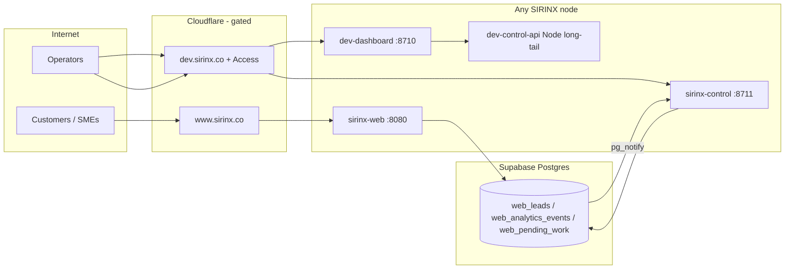
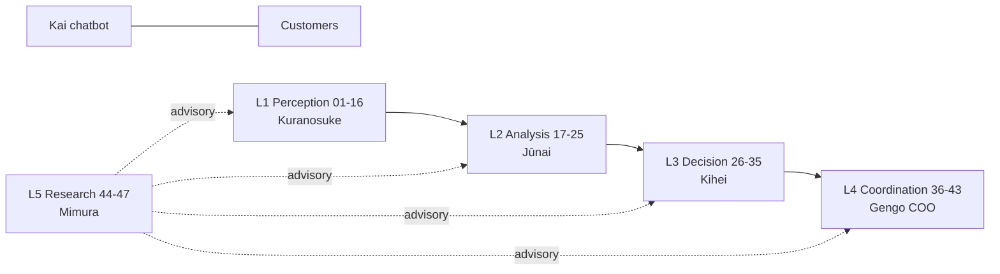
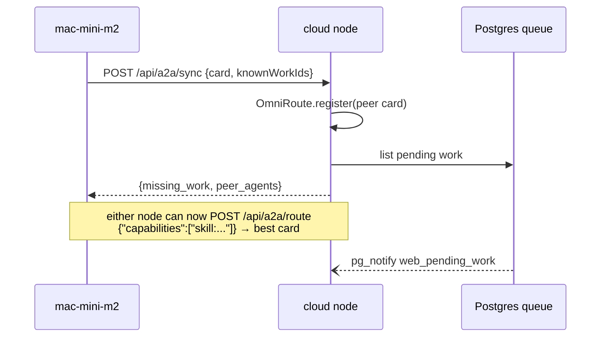

# SIRINX System Architecture

License: MIT · Canonical repo: `ton36475-lgtm/sirinx-co` · Target: www.sirinx.co

## 1. System context



## 2. Crate graph (Rust workspace, 8 crates)

```mermaid
flowchart TD
    core[sirinx-core\ndomain types]
    roi[sirinx-roi\nROI estimator]
    agents[sirinx-agents\n47 Ronin runtime]
    autoloop[sirinx-autoloop\nloop + ApprovalGate]
    store[sirinx-store\nStore trait: Memory | Postgres]
    a2a[sirinx-a2a\ncards + OmniRoute + sync]
    web[sirinx-web\naxum :8080]
    control[sirinx-control\naxum :8711]

    autoloop --> agents
    store --> core
    a2a --> core
    web --> core & roi & store
    control --> core & store & a2a
```

Rule of the graph: `sirinx-core` has no internal dependencies; binaries
(`sirinx-web`, `sirinx-control`) never depend on each other — they share
state only through the database.

## 3. Agent organization (47 Ronin)

Runtime enforcement in `sirinx-agents::Dispatcher` — an agent may only
publish to the next layer; L5 advises any operational layer; budgets:
L1 4K → L2 8K → L3 16K → L4 32K, L5 128K, Kai 16K.



The same structure exists as Claude Code sub-agents (`.claude/agents/`)
and as process rules (`AGENT_TEAM_PLAN.md`).

## 4. A2A mesh + OmniRoute

Every node runs `sirinx-control` and publishes an agent card whose
capabilities auto-load from its installed skills (`.claude/skills/` →
`skill:<name>` tags).



## 5. Safety architecture (defense in depth)

| Layer | Mechanism | Where |
| --- | --- | --- |
| Release gates | 5 gates hold-by-default, ticket to open | `sirinx-control` |
| Tool gating | ApprovalGate DryRun / Allowlist / Approved | `sirinx-autoloop` |
| Loop bounds | hard `max_steps` per autonomous run | `sirinx-autoloop` |
| Layer discipline | no layer skipping, enforced at dispatch | `sirinx-agents` |
| AuthN | bearer token on control `/api/*` | `sirinx-control` |
| Data | RLS on all tables, no public policies | Supabase |
| Consent | analytics allowlist + consent flag | `sirinx-core` |
| Process | Human ตัดสินใจสุดท้าย | `GO_LIVE_GATE_CHECKLIST.md` |

## 6. Quality pipeline

`cargo fmt` → `clippy -D warnings` → `cargo test --workspace` (58) →
`npm run check` (governance) → `npm run control:test` (120) → CI
(`.github/workflows/ci.yml`) → PR review → merge → (gated) deploy via
distroless Docker images (`DEPLOY_RUST.md`).
