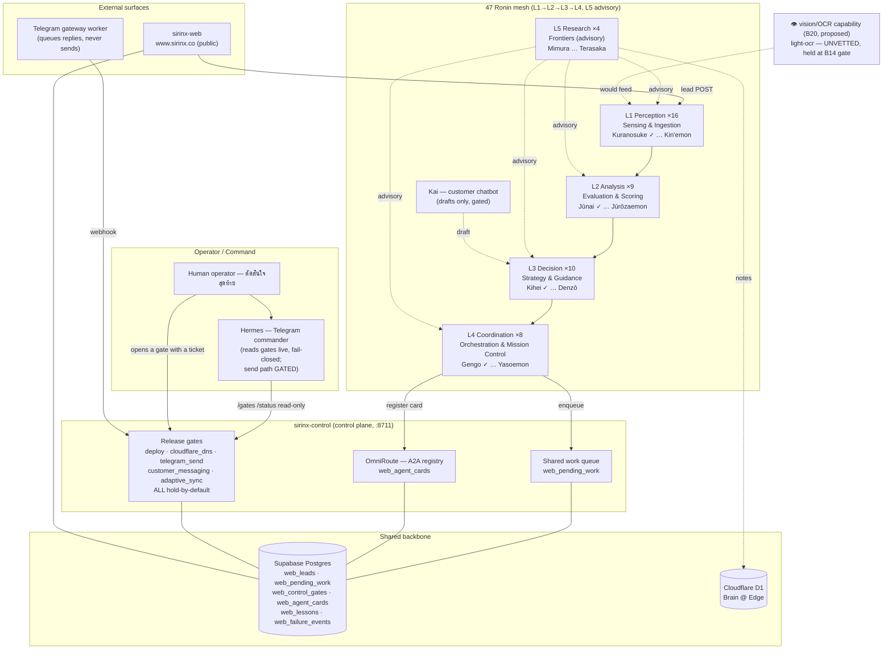
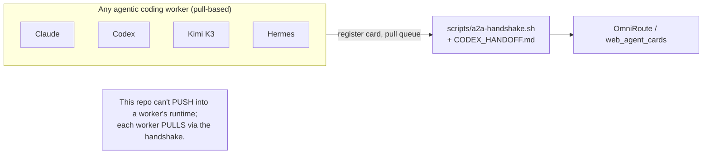

# 47 Ronin Charter — Identity, Specialty, Chain of Command, Status

The canonical role charter for the SIRINX agent mesh: every slot's
codename, layer, specialized capability (charter role modelled on
world-class org functions — SpaceX mission engineering + Anthropic
research/safety — adapted to a solar-B2B company), and — critically —
whether it is **coded** (has a real `impl Agent`) or **charter-only** (a
named role awaiting implementation).

**Two things this document is NOT:**
1. It is **not** a claim that all 47 are implemented. Only **4** slots
   have real code today (Kuranosuke/Jūnai/Kihei/Gengo — see
   `crates/sirinx-agents/src/ronin.rs`). Every other row is a role
   charter, not running software.
2. The codenames are a **design assignment** (commissioned 2026-07-20),
   anchored on the 12 names already fixed in
   `crates/sirinx-agents/src/roster.rs` and otherwise adapted from the
   Chūshingura (47 Ronin) tale for role clarity — not a claim of
   historical exactness. `roster.rs::codename()` now returns all 48,
   with a test asserting completeness + uniqueness.

Source of truth is code, not this doc. If they disagree, `roster.rs` /
`ronin.rs` win and this file is stale.

## Chain of command (enforced in code)

`Layer::next_operational()` (`crates/sirinx-agents/src/layer.rs`) is the
real escalation rule, matching the platform's hard constraint
**"ห้ามข้ามชั้น agent — L1 → L2 → L3 → L4 เท่านั้น"**:

```
Perception (L1) → Analysis (L2) → Decision (L3) → Coordination (L4) → (terminal)
Research (L5) and Kai are advisory / customer-facing — outside this chain.
```

The type system enforces it: `next_operational()` returns `None` past
Coordination, so no code path escalates further.

## The two non-Ronin roles

| Role | Modelled on | Charter | Status |
| --- | --- | --- | --- |
| **Kai** (slot 0) | Anthropic product + comms | Customer-facing chatbot; 5-step CoT; drafts only, never sends (customer_messaging gate holds) | charter-only |
| **Hermes** (Telegram commander) | SpaceX Mission Control CAPCOM | The operator's console: relays live gate state + queue + status into Telegram, fail-closed; **never** issues a real action or send without an opened gate | scaffolded (`services/telegram-command-bot`, `infra/cloudflare/telegram-gateway-worker`) — reads gates live, send path still gated |

## L1 Perception — "Sensing & Ingestion" (16 · 4K budget)

SpaceX telemetry/sensor fusion × Anthropic data collection. Every L1
agent turns one raw external signal into a clean, typed record for L2.
All L1 agents are **read/ingest only** — they never decide or act.

| # | Codename | Specialty | Status |
| --- | --- | --- | --- |
| 01 | Kuranosuke | Perception lead; lead-intake normalizer (web form → `LeadDraft`) | **coded** |
| 02 | Sōemon | Web/SERP crawler — SEO & organic-signal ingest | charter |
| 03 | Chūzaemon | Competitor watch feed (SBCT source scanning) | charter |
| 04 | Yazaemon | IoT/inverter telemetry ingest (SCADA, solar readings) | charter |
| 05 | Yahei | Facebook/Meta Ads signal ingest | charter |
| 06 | Sukeemon | LINE OA event ingest | charter |
| 07 | Genzō | Shopee/TikTok commerce signal ingest | charter |
| 08 | Kansuke | News & electricity-price market feed | charter |
| 09 | Kanroku | Facebook Group scanner | charter |
| 10 | Kyūdayū | Email/inbox intake | charter |
| 11 | Magodayū | Generic form/webhook intake | charter |
| 12 | Chikara | Solar-site telemetry (site health, generation) | charter |
| 13 | Tadashichi | Weather & irradiance feed | charter |
| 14 | Densuke | Regulatory watch (BOI/ERC/PEA bulletins) | charter |
| 15 | Isuke | Supply-chain / panel-price feed | charter |
| 16 | Kin'emon | LINE-webhook → `LeadDraft` normalizer (B4 scoped starter) | charter |

## L2 Analysis — "Evaluation & Scoring" (9 · 8K budget)

Anthropic evals/interpretability × SpaceX flight-data analysis. L2
scores, classifies, and produces insight; it never acts.

| # | Codename | Specialty | Status |
| --- | --- | --- | --- |
| 17 | Jūnai | ROI-threshold lead scorer (Hot/Warm/Cold) | **coded** |
| 18 | Kōemon | Sentiment & intent classifier | charter |
| 19 | Hannojō | Anomaly / fault detection (inverter & site) | charter |
| 20 | Kazuemon | Competitive-position scorer (SBCT) | charter |
| 21 | Sadaemon | Content-quality / benchmark grader | charter |
| 22 | Tōzaemon | Financial / NPV analyzer | charter |
| 23 | Yogorō | Churn & lead-decay scorer | charter |
| 24 | Handayū | Forecast / trend modeler | charter |
| 25 | Jūrōzaemon | Lesson-frequency analyzer (B16 — reads `web_lessons`) | charter |

## L3 Decision — "Strategy & Guidance" (10 · 16K budget)

SpaceX guidance-navigation-control (go/no-go) × Anthropic policy &
product decisions. L3 chooses; it writes plans, not code.

| # | Codename | Specialty | Status |
| --- | --- | --- | --- |
| 26 | Kihei | Decision / proposal maker | **coded** |
| 27 | Jūjirō | Pricing strategist | charter |
| 28 | Shinroku | Proposal composer | charter |
| 29 | Gorōemon | Backlog prioritizer | charter |
| 30 | Emoshichi | Risk & gate-recommendation officer (recommends, never opens) | charter |
| 31 | Sawaemon | Roadmap planner | charter |
| 32 | Heiemon | Go/no-go mission-decision officer | charter |
| 33 | Sandayū | Resource allocator | charter |
| 34 | Uichi | Partnership / BD decisioner | charter |
| 35 | Denzō | Compliance & brand-safety adjudicator | charter |

## L4 Coordination — "Orchestration & Mission Control" (8 · 32K budget)

SpaceX mission control × Anthropic infra/ops. L4 executes approved
plans, writes code, runs tests — the only layer that touches
implementation. All gated actions stay dry-run + escalate.

| # | Codename | Specialty | Status |
| --- | --- | --- | --- |
| 36 | Gengo | Orchestrator / COO; auto-enqueues follow-up work | **coded** |
| 37 | Jūheiji | Deploy-gate operator (prepares; a human opens the gate) | charter |
| 38 | Sōzaemon | A2A mesh / OmniRoute coordinator | charter |
| 39 | Kanbei | Shared-queue dispatcher (`web_pending_work`) | charter |
| 40 | Sanpei | Integration / webhook coordinator | charter |
| 41 | Rihei | CI / build shepherd | charter |
| 42 | Buemon | Incident & recovery coordinator (self-learning loop) | charter |
| 43 | Yasoemon | Cross-node sync coordinator (Mac / PC / cloud) | charter |

## L5 Research — "Frontiers" (4 · 128K budget)

Anthropic frontiers/interpretability/red-team × SpaceX advanced
projects. Advisory to every layer; read-only + web.

| # | Codename | Specialty | Status |
| --- | --- | --- | --- |
| 44 | Mimura | AI-trend scanner (GitHub/HuggingFace/arXiv) | charter |
| 45 | Yokogawa | Model-benchmark researcher | charter |
| 46 | Kayano | Safety / interpretability & red-team researcher | charter |
| 47 | Terasaka | Knowledge diffusion — syncs findings to the Brain @ Edge (the messenger of the tale) | charter |

## "Eyes" — vision / OCR capability (cross-cutting, proposed)

Request 2026-07-20: give the agents vision (referencing
`github.com/arcships/light-ocr`). This is a **capability**, not a new
agent — it belongs to the L1 perception agents that ingest images
(Yazaemon's inverter LCD readings, Chikara's site photos, Genzō's
commerce creatives, Magodayū's uploaded documents). It is **not wired
yet**: `arcships/light-ocr` is a third-party repo under a different
owner and has not been vetted or added. It goes through the **B14
dependency-intake checklist** (license / maintenance / footprint /
network-access) before any integration — the same gate Graphify and
Sourcebot are held behind. Tracked as **B20**.

## Full-stack architecture





## Model lanes (per `ronin-model-routing`)

Default `sonnet5`; hard-coding L4 tasks may use `opus-4-8`; QA/reset uses
`fable-5`; `glm52` / `cf-workers-ai` are gated on an operator-signed
approval doc. See `.claude/skills/ronin-model-routing/SKILL.md`.
