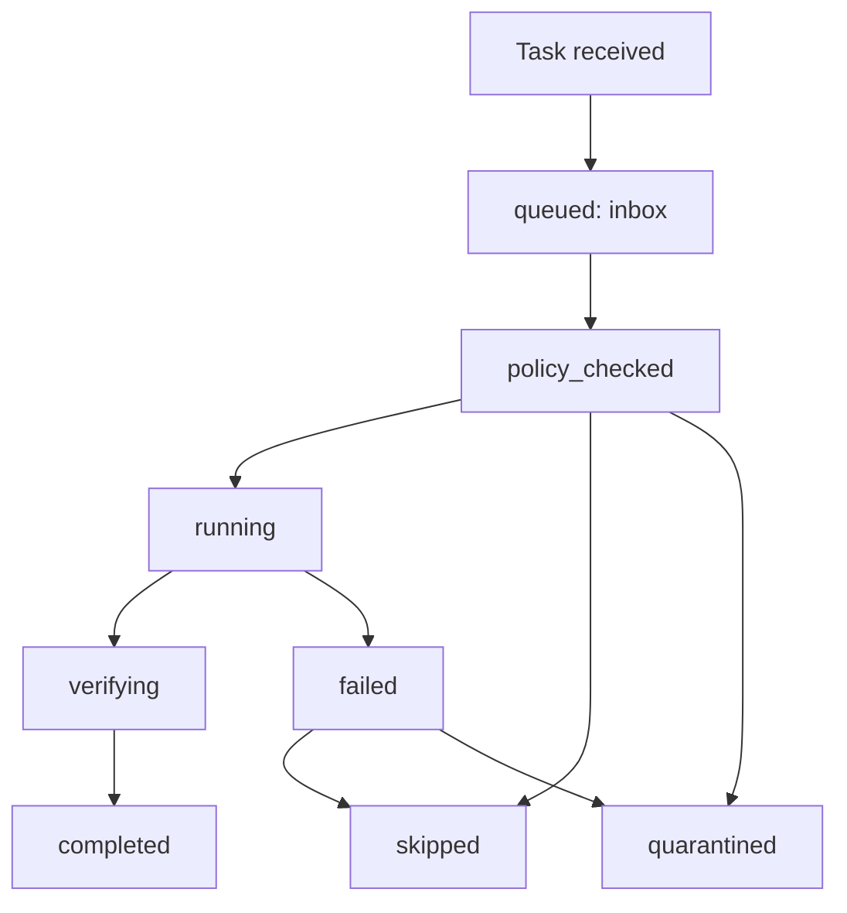

# A2A Sync State Machine

The local bridge uses a simple file-state machine.

## States

- `queued`: task is waiting in `inbox/`.
- `policy_checked`: dispatch has inspected policy, scope, and kill switch.
- `running`: adapter is creating a dry-run command plan or executing an allowed
  local-only step.
- `verifying`: outputs are checked for required artifacts.
- `completed`: task produced expected local artifacts.
- `skipped`: task is not actionable in this phase, such as missing KOB auth.
- `failed`: an allowed local step failed.
- `quarantined`: task violates policy, requests secrets, asks for public
  exposure, or targets unverified repos.

## Kill Switch

When `kill_switch/STOP_ALL` exists, dispatch must refuse new work and leave a
blocked artifact.
