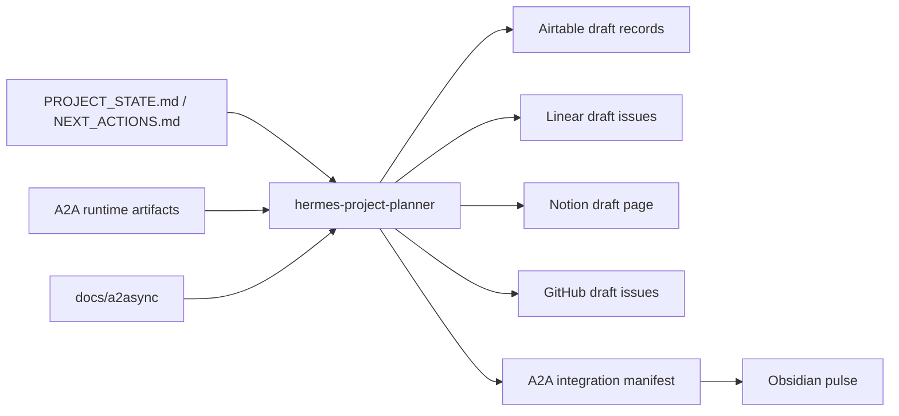

# Hermes Project Planner Tool Integration

Status: local dry-run contract for Airtable, Linear, Notion, and GitHub.

`hermes-project-planner` is the planning and routing agent that turns local
GHOSTCLAW state into external tool payloads. It does not write to external apps
until the destination is explicit.

## Role Split

| Surface                | Role                                                 | Write state                               |
| ---------------------- | ---------------------------------------------------- | ----------------------------------------- |
| Hermes Project Planner | Read local state, classify work, draft payloads      | Local only                                |
| Airtable               | Artifact/hash tracker and import review table        | Blocked until base/table target           |
| Linear                 | Implementation backlog, blockers, owner/status queue | Blocked until workspace/team target       |
| Notion                 | Executive summary, decision log, planning page       | Blocked until parent page/database target |
| GitHub                 | Issue backlog or PR planning for code work           | Blocked until owner/repo target           |
| A2A Local Queue        | Durable local task/artifact exchange                 | Active                                    |
| Obsidian Brain         | Concise memory pulse                                 | Active                                    |

## Integration Map



## Current Use Case

The active source packet is the Manus/GHOSTCLAW export lane:

- Full `SPEC_DRIVING.html` exists and has a verified hash.
- `GHOSTCLAW_COMPLETE_SYSTEM` exists and has hash-synced files.
- The package is not import-ready because key files are placeholders or missing.
- The next work is to obtain complete exports and then decide which sections
  become docs, Mission Control fixtures, Linear/GitHub issues, Airtable rows,
  and a Notion decision page.

## Draft Payload Ownership

| Payload                            | Purpose                                                                       |
| ---------------------------------- | ----------------------------------------------------------------------------- |
| Airtable `artifact_status_records` | One row per Manus artifact with file path, size, SHA, status, and next action |
| Linear `implementation_issues`     | One issue per actionable implementation or blocker                            |
| Notion `planning_page`             | Human-readable summary of the lane, decisions, risks, and next safe actions   |
| GitHub `issue_drafts`              | Repo-facing issues only after repo target is provided                         |

## Write Guard

External writes stay blocked until target binding is provided:

- Airtable: base ID and table name or table ID.
- Linear: workspace and team key or team ID.
- Notion: parent page ID or database ID.
- GitHub: owner and repository.

The connector payload generator produces local JSON files only. These are
reviewable before any connector action.

## Commands

Generate local integration payloads:

```bash
python3 scripts/a2a/a2a_tool_integration_plan.py
```

Outputs are written under:

`/Users/sirinx/SIRINXDev/.ghostclaw_runtime/a2async/tool_integrations/`

No provider call, app write, GitHub mutation, deploy, push, or public endpoint is
performed by the generator.
