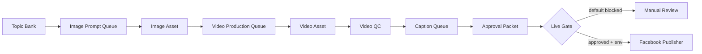

# ADS ANDROMEDA Content Factory

Status: local-first automation
Owner: SIRINXDev

This workflow turns the ADS ANDROMEDA brand memory into Facebook-ready draft
posts, media production queues, video QC gates, a schedule queue, and an
approval packet.

It does not publish to Facebook. It does not call the Facebook API. It does not
send customer messages.

## Command

```bash
cd /Users/sirinx/SIRINXDev/sirinx-agent-native-os
pnpm ads:content-factory -- --date 2026-06-04 --count 5 --start-episode 1
```

## Output

```text
outputs/content-factory/ads-andromeda/<date>/
  pipeline-manifest.json
  pipeline-board.md
  image-prompts.json
  image-prompts.md
  video-production-queue.json
  video-production-queue.md
  video-qc-checklist.json
  video-qc-checklist.md
  facebook-posts.json
  facebook-posts.md
  schedule-queue.json
  facebook-live-publish-contract.json
  publisher-dry-run.json
  approval-packet.md
  daily-money-plan.md
  telegram-work-report.md
```

## Pipeline



## Stage Rules

| Stage | Automation | Default |
|---|---|---|
| Image prompt | Generate prompts locally | enabled |
| Image generation | Provider/UI call | blocked |
| Video production | Generate spec locally | enabled |
| Video render | HyperFrames/HeyGen/render call | blocked |
| QC | Generate checklist locally | enabled |
| Caption | Generate captions locally | enabled |
| Facebook publish | API publish | blocked |

## Monetization Logic

1. Publish education first.
2. Use soft lead CTAs.
3. Route interested users to manual DM review.
4. Record repeated questions into the next episode batch.
5. Only enable live posting after the page, token, approval gate, and risk
   review are all present.

## Live Publish Gate

Blocked until all are present:

```text
FACEBOOK_PAGE_ID=<approved page id>
FACEBOOK_PAGE_ACCESS_TOKEN=<approved page token>
APPROVE_ADS_ANDROMEDA_FACEBOOK_LIVE_PUBLISH
```

## Safety

- No guaranteed ad approval.
- No ban-proof claims.
- No official Meta/Facebook partnership claims.
- No private account data.
- No auto-reply to customers.
- No paid boost automation.
