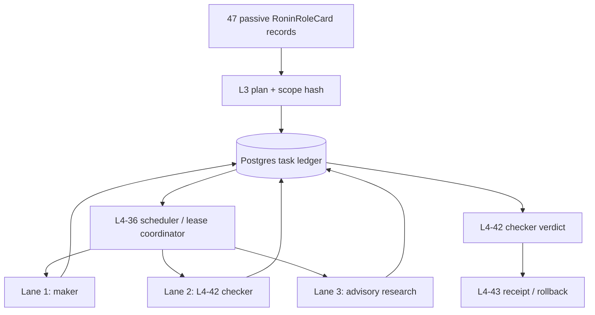

# 47-Role Manager Architecture

Status: P1 role contract complete locally; P2 fail-closed remediation is
static-only and awaits compile/test, independent re-review, and live Postgres
Authority: Rust numeric role ranges + Postgres state
Concurrency: one coordinator + maximum three worker lanes

## Purpose

The manager turns 47 logical Ronin roles into bounded, observable work without
starting 47 processes. It separates role identity, runtime principal, task,
lease, approval, execution, verification, and receipt.

The passive role registry is
[`../../crates/sirinx-agents/data/ronin-role-registry.v1.json`](../../crates/sirinx-agents/data/ronin-role-registry.v1.json).
It is packaged with and fail-closed validated by `sirinx-agents`; it does not
grant tools or start agents. The passive Markdown cards remain under
`docs/agents/ronin/cards/`, while executable surfaces remain explicitly
configured and task-bound.

## Authority layers

| Layer | Owns | Must not own |
|---|---|---|
| Rust role ranges | numeric IDs 01–47, department boundaries, layer order | provider/runtime presence |
| Passive registry | unique mission, inputs, outputs, evidence, cadence | execution authority |
| Runtime principal card | observed capability and transport | task approval or completion |
| Postgres | task state, lease, ticket, approval, outbox, verification, receipt | model inference |
| Scheduler | fair admission and lane occupancy | approval creation |
| Model/agent process | proposals or bounded work under a lease | policy override or self-approval |
| Telegram/UI/A2A/queue | ingress, projection, transport | durable truth |

## Bounded topology



Hard invariants:

- `registered_roles = 47`; active workers are normally 0–3.
- At most one source-mutating maker per worktree.
- Checker role ID, runtime principal, and lease differ from the maker role ID,
  runtime principal, and lease.
- L1 → L2 → L3 → L4 receipts are ordered; L5 is advisory.
- Kai and the human approver are outside the 47.
- Runtime/app/process presence does not activate a role.
- A role may be selected only when its inputs, action class, principal
  capability, lease, budget, and prior receipts all match.

## Run state machine

```text
DRAFT -> TRIAGED -> PLANNED -> QUEUED -> LEASED -> RUNNING
      -> CHECKING -> GUARDED
      -> WAITING_APPROVAL | EXECUTING
      -> VERIFYING -> RECEIPTED -> SUCCEEDED

unknown/untrusted input -> QUARANTINED
operator wait           -> INPUT_REQUIRED
authorization wait      -> AUTH_REQUIRED
ambiguous effect        -> EFFECT_UNKNOWN
exhausted retry         -> DEAD_LETTER
failure/cancel          -> FAILED | CANCELED
```

No direct transition may skip required receipts. Terminal success requires a
committed receipt; an agent's natural-language answer is not a transition.

## Dispatch algorithm

1. Admission/control validates or creates `TaskEnvelopeV1`, computes the input
   digest, and only then dispatches L1-01 to normalize its bounded payload into
   an observation envelope.
2. L1 observation roles collect bounded evidence.
3. L2 produces requirement, impact, risk, cost, and verification analyses.
4. L3 emits an immutable plan hash, scope hash, action manifest, and stop rules.
5. L3-35 validates action class and any required ticket.
6. L4-36 checks resource admission and uses compare-and-swap to issue an exact
   expiring path/resource lease.
7. One maker performs the bounded stage and returns a result manifest.
8. L4-42 independently verifies without repairing maker-owned files and
   returns `PASS`, `FAIL`, or `UNVERIFIED`.
9. L4-43 records the checker verdict in the receipt, rollback, or
   `EFFECT_UNKNOWN` handoff.

Suggested starting values: 90-second lease, 30-second heartbeat, one initial
attempt plus at most two retries after 5 and 30 seconds. Authentication,
approval, policy, integrity, schema, secret-like input, and ambiguous-effect
failures never retry automatically.

## Action classes

| Role class | Meaning | Repository autonomy mapping |
|---|---|---|
| A | read-only observation/research (`A_DRAFT_ONLY` is draft-only Kai) | C0 |
| B | qualified as `B_PLAN_ONLY`, `B_COORDINATION`, `B_EXACT_LEASE`, or `B_FIXTURE_ONLY` | C1–C4 within the named boundary |
| C | `C_MAKER_CHECKER`: confidential/higher-risk local work with an independent checker | C2–C5 plus data-class policy |
| D | `D_TICKETED_ONLY`: external, production, paid, messaging, provider, push/merge/deploy action | C6; exact ticket required |
| X | prohibited or unknown | C7; block |

A model cannot change an action class. Unknown defaults to X.

## Local persistence candidate (migration 0005)

The expand-only local migration creates 13 public, prefixed tables:
`agent_runtime_tasks`, `agent_runtime_runs`, `agent_runtime_task_events`,
`agent_runtime_stage_leases`, `agent_runtime_action_tickets`,
`agent_runtime_approval_grants`, `agent_runtime_outbox`,
`agent_runtime_inbox_dedupe`, `agent_runtime_verification_runs`,
`agent_runtime_receipts`, `agent_runtime_model_catalog`,
`agent_runtime_a2a_peers`, and `agent_runtime_artifacts`.

The first Rust vertical slice implements task/run/event/lease/receipt
transactions. The remaining tables are schema groundwork. After independent
review rejected maker self-PASS and partial task-envelope admission, the local
remediation added closed typed envelope validation and requires each maker PASS
to reference a prior role-42 PASS from a different run, principal, and persisted
lease with the same task/commit/plan/scope/action bindings. Checker-only PASS
cannot finalize a task, and no receipt may be appended after task finalization.
Source-write leases are restricted to maker roles 37–41 with B/C action class
in both stores. Migration 0005 now adds top-level envelope checks,
closed event states, source-writer role bounds, composite task/run coherence,
and a same-task verification-receipt FK.

These remediation edits have not been compiled or executed. Free disk was
about 3.8 GiB during remediation and later recovered externally to about
13.6 GiB, still below the 15 GiB implementation gate. SQL parsing,
least-privilege RLS behavior, concurrency races, failure injection, and restore
remain unverified. This document does not authorize a database migration or
claim P2 exit.

## API-first contract (proposed)

```text
GET  /api/agent-runtime/roles
GET  /api/agent-runtime/tasks/:task_id
POST /api/agent-runtime/tasks/plan
POST /api/agent-runtime/tasks/:task_id/lease
POST /api/agent-runtime/runs/:run_id/heartbeat
POST /api/agent-runtime/runs/:run_id/result
POST /api/agent-runtime/runs/:run_id/verify
POST /api/agent-runtime/tickets/:ticket_id/validate
POST /api/agent-runtime/tasks/:task_id/cancel
```

Mutating endpoints require authentication, idempotency keys, closed schemas,
task/scope digests, and authoritative Postgres transactions. They are design
contracts only until implemented and tested.

## A2A boundary

Use `RoninRoleCard` for internal logical roles; reserve `AgentCard` for the A2A
protocol/runtime node identity. An external A2A task maps into a new internal
task only after Agent Card trust, auth, schema, prompt-injection, idempotency,
and SSRF controls pass. Existing SIRINX sync routes are compatibility shims, not
A2A v1 conformance evidence.

## Activation milestones

1. Validate the passive registry and schemas.
2. Add cross-language parity tests before changing runtime role projections.
3. Implement a Rust `RoninRoleCard` registry as executable authority.
4. Add durable task/run/lease storage and negative transition tests.
5. Wire only a local dry-run scheduler.
6. Add one maker/checker pilot in an isolated worktree.
7. Add A2A conformance, browser, migration, and receipt harnesses.
8. Activate any external adapter only through its own ticketed rollout.
