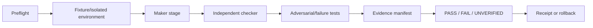

# Background Task and Harness Contract

Status: `PLAN_ONLY / ALL_SCHEDULES_DISABLED`
Runtime effect: none
Activation: requires resource admission, implementation, tests, and an exact
schedule ticket

## Background work principles

Background work is for observation, evidence maintenance, and proposal queues.
It never silently installs, edits source, calls a provider, mutates a queue,
sends Telegram, pushes, merges, migrates production data, changes Cloudflare,
or deploys.

The machine-readable proposal is
[`../../config/agent-runtime/background-tasks.plan-only.v1.json`](../../config/agent-runtime/background-tasks.plan-only.v1.json).
Every entry is disabled. Contract version `1.1` replaces positional
`ownerRoleIds` with closed `roleAssignments`. Each assignment carries the
canonical role ID, card ID, functional role ID, exact role-card cadence, and a
non-empty subset of that role's canonical outputs. The local validator rejects
unknown tasks, role aliases, mismatched identities, unrelated outputs, cadence
drift, or any enabled schedule.

## Planned tasks

| Task | Canonical role assignments | Proposed cadence | Output | Hard stop |
|---|---|---|---|---|
| Runtime admission observation | L1-13 · `perception.runtime-queue-observer` | exact role cadence during an approved mission | existing health/queue/lease/receipt observation index | unknown metric source or failed resource floor |
| Runtime/route drift | L1-06 · `perception.web-api-route-observer` + L1-13 · `perception.runtime-queue-observer` | each role's exact event/active-mission cadence | router/runtime observation diff; no port scan | identity mismatch, public bind, or protected path |
| Gate/evidence index proposal | L4-43 · `coordination.system-receipt-rollback` | promotion, external transition, rollback, or separately approved daily audit | release-or-rollback packet draft from existing evidence; no receipt creation | missing/tampered receipt or superseded SHA |
| A2A/Telegram readiness | L3-34 · `decision.a2a-telegram-integration` | protocol/card/bot/route/gate change | decision and integration-test proposal only | any live action requested |
| Candidate smoke proposal | L2-22 · `analysis.independent-qa` | each proposed implementation or exact candidate | independent QA and test-gap proposal | no exact candidate SHA |
| OSS/license refresh | L1-14 · `perception.external-repo-license-scout` + L5-47 · `research.oss-standards-provenance` | new repository intake and separately approved weekly drift review | source-linked license/provenance observation | ambiguous/missing license or untrusted source |
| Model route-plan refresh | L3-29 · `decision.model-route-cost-planner` | before inference and on verified catalog drift | route and cost-cap proposal from an already verified catalog | provider call, download, or unverified catalog needed |

The former resource sampler and port scanner are deliberately narrowed. The
plan may index only already-approved read-only health evidence and approved
router/runtime observations. It does not authorize a new machine probe, socket
scan, network request, process action, or resource cleanup. Likewise, the model
lane plans routes from a verified catalog; it does not research a catalog by
calling a provider.

Only one background lane may run at a time, and interactive operator work has
priority. The JSON plan records proposed deadlines, maximum steps, hard stops,
and activation-ticket shapes, but it is descriptive and is not a scheduler. A
future executable task contract must additionally bind an exact read-only
path/URL allowlist, output-size limit, and cancellation signal. Even after that
implementation, each task requires the exact `APPROVE_BACKGROUND_TASK ...`
ticket declared in its entry, plus resource admission and a runtime receipt,
before a scheduler may start it.

## Harness lifecycle



### Preflight

- exact repository, worktree, 40-character SHA, dirty-path ownership;
- resource admission and port/process ownership;
- task, plan, scope, action and fixture digests;
- protected-read and external-action boundaries;
- maker/checker principal separation.

### Deterministic fixtures

- temporary directories and isolated worktrees;
- synthetic data only unless the task explicitly authorizes a data class;
- disposable Postgres for migration tests;
- mocked providers, Telegram, A2A peers, Cloudflare bindings, queues, and time;
- fixed clock/random IDs when asserting receipts;
- no inherited secrets, browser profiles, cookies, or production credentials.

### Checker rules

The checker may run approved tests and inspect the candidate. It must not repair
maker-owned files, loosen an assertion, waive missing evidence, or self-approve
an external action. A failed checker returns the candidate to a new maker stage
with a new lease and result digest.

## Required test layers

| Layer | Minimum evidence |
|---|---|
| Contract | schema parse, required fields, unknown-field policy, version behavior |
| Unit | state transitions, budgets, selectors, policy decisions |
| Integration | Postgres transactions/outbox/dedupe, adapters mocked |
| Migration | empty and prior-schema disposable Postgres, 0003–0004, integrity and restore |
| A2A | Agent Card trust, task mapping, v1 conformance, SSE order, duplicates, SSRF |
| Browser | deterministic authenticated smoke, assertions, redacted screenshot/read-back |
| Queue/workflow | duplicate, reorder, retry, timeout, DLQ, pause/resume, crash-after-effect |
| Security | prompt injection, secret-like paths, auth, replay, stale lease, scope drift |
| Release | exact SHA, receipt chain, rollback, production read-back |

## Failure injection catalog

At minimum test: duplicate delivery; stale/expired lease; conflicting writer;
replayed/expired/mismatched approval; process crash before and after an effect;
Postgres unavailable; outbox publish delay; reordered event; tampered artifact;
provider timeout; ambiguous Telegram/API response; browser session expiry; A2A
version mismatch; webhook SSRF target; insufficient disk; and panic/kill switch.

## Evidence manifest

Every harness run records only bounded metadata:

```text
task_id, run_id, role_id, principal_id
repo, commit_sha, worktree_id
plan_hash, scope_hash, action_digest
fixture_digest, command/test identifiers
started_at, ended_at, result
artifact digests, receipt predecessor
```

Do not store prompts, secrets, tokens, cookies, customer payloads, raw source, or
large raw logs in the receipt ledger.

## Release-chain harness

The final release harness is strictly ordered:

```text
Billing Lock evidence
-> CI executed on exact SHA
-> disposable Postgres migrations 0003-0004
-> authenticated browser smoke
-> independent review
-> exact merge ticket and receipt
-> one exact deploy ticket/receipt per Rust service
-> optional separate Cloudflare and Telegram canaries
```

Any missing or SHA-mismatched evidence yields `UNVERIFIED`, not success.
