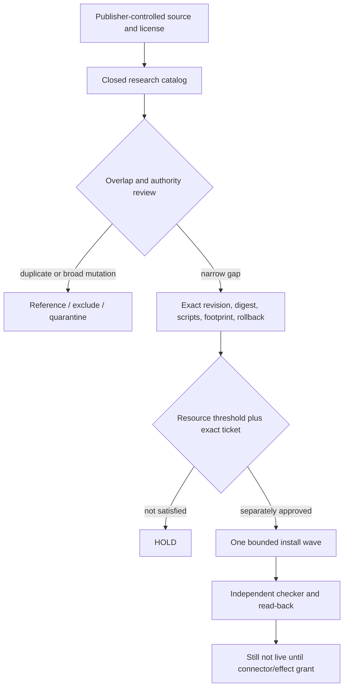

# External Component Intake and Install-Wave Contract

Status: `RESEARCH_VERIFIED / NO_CLONE / NO_INSTALL / RESOURCE_HOLD`

This contract converts the requested Cloudflare MCP, A2A, Codex, Claude, Kimi,
Hermes, Telegram, LINE, QA, API, database, swarm, and local-model landscape into
one closed admission portfolio. It does not claim that any component was
installed, connected, started, authenticated, invoked, or deployed.

Catalog `proofFlags` describe effects performed by this intake slice. For
example, `installed=false` means this work installed nothing; it does not deny
the separately observed, unreconciled pre-existing Codex/Hermes/Kimi binaries
or local model listing.

Machine-readable authority:

- [`external-components.research-only.v1.json`](../../config/agent-runtime/external-components.research-only.v1.json)
- [`external-component-intake.v1.schema.json`](../../schemas/agent-runtime/external-component-intake.v1.schema.json)
- [`validate-external-component-intake.mjs`](../../scripts/validate-external-component-intake.mjs)
- [`SIRINX_REPO_INTAKE_GATE_V1.md`](../knowledge/SIRINX_REPO_INTAKE_GATE_V1.md)

## Decision architecture



Postgres plus authenticated `sirinx-control` remains the target managed
authority. An MCP SDK, agent framework, CLI, model, Telegram/LINE library,
Cloudflare Worker, desktop app, or browser tool is a worker or transport. None
may mint a ticket, approve itself, transition a durable SIRINX task, or inherit
authority from another component.

## Portfolio result

The catalog has 26 closed entries:

- reuse/reconcile: Codex CLI, Hermes Agent, Kimi Code, Axum, SQLx, and the
  existing local Qwen3.5 conversion;
- narrow future candidates: stateless Cloudflare Agents MCP, official MCP Rust
  SDK, A2A adapters after version/TCK alignment, Playwright/Inspect AI,
  publisher-hosted Qwen2.5-Coder 1.5B and Granite 2B GGUF, and the LINE Node SDK;
- reference or exclude: broad Cloudflare API Code Mode MCP, LINE MCP server,
  Teloxide, grammY, OpenAI Agents Python, Goose, and duplicate orchestration;
- reject/hold: GLM-5.2 is impossible locally; Kimi K3 has no published artifact
  license as of 2026-07-21 and is also impossible locally on 8 GiB.

Claude Code/Cowork and the existing Telegram transport remain disabled
connection surfaces in `MCP_A2A_CONNECTION_PLAN.md`, not install candidates in
this MIT/Apache source portfolio. Their presence in a desktop UI or local path
does not supply source-license admission, connector configuration, or runtime
proof.

Permissive licensing is necessary but not sufficient. The allowed set is
closed to `MIT` and `Apache-2.0`; unknown means ineligible. Publisher identity,
revision, artifact digest, dependency/lifecycle behavior, footprint, host fit,
security boundary, and rollback are all independent gates.

The validator freezes the entire semantic object for every component and every
install wave with review-pinned SHA-256 values. This closes relationships that
plain JSON Schema enums cannot express: publisher-controlled license evidence,
source/provenance/revision policy, tickets, resource and overlap decisions,
wave membership, entry criteria, and stop points all move together or the
candidate is rejected. Before schema validation or hashing, the validator also
requires a recursively plain JSON graph: custom prototypes/`toJSON`, accessors,
symbols, sparse arrays, cycles, shared object references, and JavaScript
`Proxy` values are rejected before any proxy trap can run.

## Cloudflare MCP choice

The first design candidate is a stateless, documentation-only Worker using
Streamable HTTP and `createMcpHandler()`. It has no Durable Object, no retained
session state, no account mutation tools, no provider call, and no deployment.
Stateful `McpAgent` stays held until tenancy, retention, deletion, SQLite, and
migration behavior are reviewed.

The managed MCP Portal is also held. Portal-native management tools are exposed
in each session, so the current v1 registry's universal `toolPolicy: deny-all`
cannot truthfully model it. A future registry v2 must record built-in tools,
Code Mode, upstream default-disable behavior, sync exposure, protocol revision,
OAuth metadata, runtime receipts, and exact source/package pins before a portal
can become a candidate.

Protocol baseline: MCP `2025-11-25`, Streamable HTTP, protected-resource
metadata, PKCE S256, resource/audience binding, bearer headers only, Origin
validation, no token passthrough, separate OAuth identity and least-privilege
tool allowlist per client.

## A2A version boundary

The protocol source is on the A2A 1.0 line, but the stable JavaScript SDK is
0.3.14; v1 support is beta and the v1 TCK is alpha. The Cloudflare example uses
the 0.3 SDK and remote Workers AI, so it is reference architecture—not a v1,
provider-free SIRINX runtime. The official Rust SDK is a possible adapter/TCK
target, not a replacement for SIRINX tasks, leases, identity, or receipts.

MCP, ACP, CLI availability, and desktop presence do not establish A2A. Each
Codex/Claude/Kimi/Hermes peer still needs an exact adapter revision, HTTPS Agent
Card, binding, trust evidence, TCK/security negatives, task lease, fresh
heartbeat, and separate `CONNECTOR_ACTIVATION` plus one-use `A2A_EGRESS`
authority.

## Messaging boundary

Telegram and LINE are transports, not MCP/A2A authorities. The existing small,
fixed-destination Telegram adapter remains preferable to adding grammY or
Teloxide. For LINE, the official Node SDK is the narrow future candidate only
after tag/npm artifact parity is verified. Raw-body signature validation must
precede parsing; intake and grant-bound sends remain separate.

The LINE MCP server remains excluded because it combines account reads, push,
broadcast, profile/follower access, and rich-menu mutation and pulls a
browser-downloading Puppeteer postinstall path.

## Mac mini model decision

| Candidate | Publisher evidence | Local decision |
| --- | --- | --- |
| GLM-5.2 | MIT; official BF16 1.51 TB and FP8 756 GB | `REJECT_LOCAL_RESOURCE` |
| Kimi K3 | 2.8T announcement; weights promised 2026-07-27; no artifact license on 2026-07-21 | `HOLD_ARTIFACT_LICENSE / REJECT_LOCAL` |
| Qwen2.5-Coder 1.5B GGUF Q4_K_M | publisher-hosted, Apache-2.0, 1.12 GB | best future coding pilot after resource/install admission |
| Granite 3.3 2B GGUF Q4_K_M | publisher-hosted, Apache-2.0, 1.55 GB | fallback pilot after independent tool/harness checks |
| local `qwen3.5:2b` | official family is Apache-2.0; local Ollama conversion digest/upstream revision absent | `QUARANTINE_UNPINNED` |

All nominal long contexts are reduced to 4K input / 1K output for the first
synthetic pilot. Tools are off, network is denied, one model runs at a time,
and a different checker verifies the result.

## Held install waves

| Wave | Scope | Required stop point |
| --- | --- | --- |
| 0 | reconcile existing Codex/Hermes/Kimi/Axum/SQLx/local-model revisions and digests | `RECONCILIATION_PACKET_REVIEWED_NOT_ACTIVATED` |
| 1 | one stateless docs-only MCP local preview | `LOCAL_STATELESS_MCP_TESTED_NOT_CONNECTED_NOT_DEPLOYED` |
| 2 | exact Playwright/browser revision for non-production smoke | `BROWSER_TOOLCHAIN_VERIFIED_NO_PRODUCTION_SMOKE` |
| 3 | exactly one bounded local model candidate | `ONE_SYNTHETIC_LOCAL_PILOT_VERIFIED_NOT_ROUTED` |

Every wave is currently `HOLD`. The host sample is 14,268,520 KiB free, below
the 15 GiB floor. No install, connector, provider, Cloudflare mutation,
live-send, push, merge, or deploy authority exists.

## Validation

Run only the local static checks:

```text
node scripts/validate-external-component-intake.mjs
node --test scripts/validate-external-component-intake.test.mjs
```

Expected result: `STATIC_CATALOG_VALIDATED_NOT_ADMITTED`, 26 components, four
held waves, 11 focused tests, and every external/runtime proof flag false.
