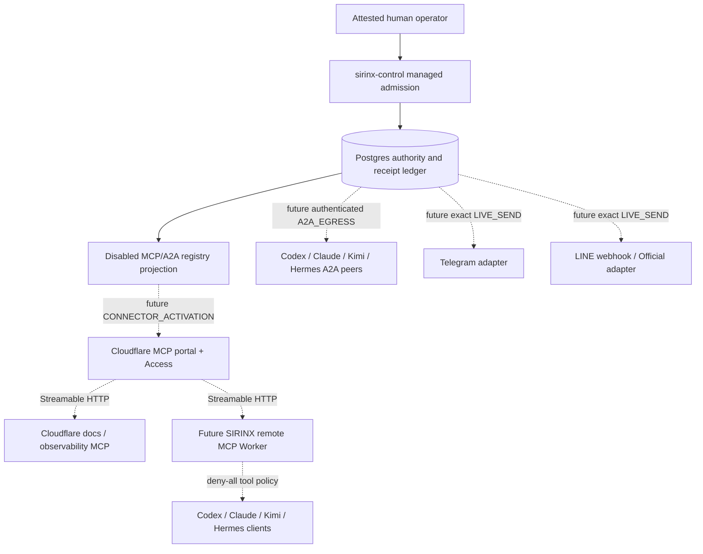

# MCP, A2A, Cloudflare, and Messaging Connection Plan

Status: `PLAN_ONLY / ALL_CONNECTIONS_DISABLED / PRODUCTION_HOLD`

This is the configuration authority for the requested Cloudflare MCP plane,
local computer clients, A2A peers, Telegram, and LINE Official. It contains no
credentials and performs no install, OAuth consent, client-config write,
network call, server start, Cloudflare mutation, A2A egress, or message send.

Machine-readable plan:
[`config/agent-runtime/mcp-connections.plan-only.v1.json`](../../config/agent-runtime/mcp-connections.plan-only.v1.json)

Closed schema:
[`schemas/agent-runtime/mcp-connection-registry.v1.schema.json`](../../schemas/agent-runtime/mcp-connection-registry.v1.schema.json)

Static loader:
[`services/dev-control-api/src/mcp-connection-plan.mjs`](../../services/dev-control-api/src/mcp-connection-plan.mjs)

Connection evidence preview:
[`services/dev-control-api/src/connection-admission.mjs`](../../services/dev-control-api/src/connection-admission.mjs)

## A26 evidence-admission preview

The closed `ConnectionEvidenceV1` and `ConnectionAdmissionPreviewV1` schemas
now provide a pure local consistency check over one exact candidate connection.
They bind peer/principal, component revision and license/provenance digests,
canonical endpoint origin, protocol/capability/data-ceiling digests, collector
identity, freshness, and task/run/lease/receipt digests. The canonical v1 plan
digest is review-pinned, so a caller cannot substitute a forged plan.

This is not durable admission. Candidate context and clock input are explicitly
non-authoritative; DNS/origin authentication, replay uniqueness, B10 circuits,
and database authority remain absent. Successful output is fixed to
`EVIDENCE_VALIDATED_NOT_ADMITTED`, with every connect/MCP/A2A/send/trust/effect
flag false. Eleven disabled entries with no remote endpoint remain ineligible.

Legacy OmniRoute inputs are also demoted to `reported*`: caller agent IDs,
surface handshakes, cmux IDs, MCP availability, successful injected probes,
and opt-in loopback probe results cannot set observed identities, endpoint
verification, registration eligibility, handshake readiness, or MCP enablement.
See the [A26 static receipt](../../reports/runtime/connection-evidence-admission-preview-20260720.md).

## Current truth snapshot (2026-07-20)

| Surface | Observed capability | Connection truth |
|---|---|---|
| Cloudflare | official remote MCP server/authorization/portal designs exist | no SIRINX Worker, portal, Access policy, OAuth client, or deployment exists |
| Codex 0.144.6 | local help exposes remote HTTP MCP configuration and OAuth metadata | no config inspected or changed; no server connected |
| Claude Code 2.1.212 | local help exposes HTTP MCP and login | no config inspected or changed; no server connected |
| Claude Cowork/Desktop | official custom connectors can reach remote MCP from Anthropic cloud | UI/session presence is not a connector receipt |
| Kimi Code 0.27.0 | ACP is present; top-level help exposed no `mcp` subcommand | installed lineage/digest and exact-revision MCP support are unverified; current `MoonshotAI/kimi-code` documents `/mcp-config`, but that cannot be projected onto this binary |
| Hermes Agent 0.18.2 | official upstream documents local stdio and remote HTTP MCP plus serve mode | protected config was not read or changed; no connection or server is proved |
| LINE Official MCP 0.5.0 | a pinned local stdio entry exists in `opencode.jsonc` | package not installed/started; server disabled; every tool denied |
| Telegram | official Bot API and webhook transport | not MCP, not A2A, not active, and no send authorized |
| LINE webhook | official Messaging API transport | not MCP, not A2A, not implemented, and no send authorized |
| Codex/Claude/Kimi/Hermes A2A | proposed peers | zero authenticated AgentCards/endpoints, TCK receipts, heartbeats, or task leases |

The registry deliberately records 16 disabled entries and zero runtime-verified
connections. A desktop window, CLI help page, configured card, shared session,
ACP initialize result, or seeded database row is identity/topology evidence at
most; none proves live MCP or A2A traffic.

## Authority architecture



Postgres plus authenticated `sirinx-control` is the target managed authority;
that managed startup is not wired yet. MCP clients, portals, Workers, A2A
peers, Telegram, LINE, models, and desktop apps are tools/transports only. They
cannot mint a ticket, approve themselves, create a source lease, or transition
a durable task.

## Protocol boundaries

### v1 registry truth limit

The frozen v1 registry is sufficient only to prove that every connection is
disabled. It cannot accurately model MCP portal built-ins, Code Mode, upstream
capability synchronization, protocol revision, OAuth metadata, A2A binding,
Agent Card signature trust, exact source/package/license pins, TCK revision, or
runtime receipts. In particular, its universal `toolPolicy: deny-all` is not a
truthful deployable description of a Cloudflare MCP Portal because portal
management tools remain exposed. The portal entry is therefore quarantined as
plan-only until an independently reviewed registry v2 replaces that field; v1
must not be used as portal activation evidence.

### Cloudflare remote MCP

- Pin MCP protocol revision `2025-11-25` and use Streamable HTTP. Legacy
  HTTP+SSE is deprecated. Require protected-resource metadata, PKCE S256,
  RFC 8707 resource binding, audience validation, bearer headers only, Origin
  validation, and no token passthrough.
- A stateless read-only server can use
  `createMcpHandler`; stateful sessions require `McpAgent`/Durable Objects only
  after a state/retention review.
- A portal is a catalog and policy surface, not the sole security boundary.
  The origin Worker must enforce its own OAuth/audience/scope checks because a
  directly reachable server URL can bypass portal routing policy.
- Set `default_disabled=true` for every portal upstream and explicitly allow
  only reviewed tools. Disable Code Mode for the first canary. Portal-native
  `portal_list_servers`, `portal_toggle_servers`, and
  `portal_toggle_single_server` remain exposed and must be inventoried rather
  than called deny-all. Capability synchronization and newly added upstream
  tools are exposure risks; verify the effective allowlist after each sync.
- Start with public documentation search only. Observability, account data,
  Workers, DNS, Queues, secrets, logs, and mutation tools remain separate.
- Claude Cowork connections originate from Anthropic cloud, so a localhost or
  LAN-only endpoint is not a functional target.

Official references: [Cloudflare remote MCP server](https://developers.cloudflare.com/agents/model-context-protocol/guides/remote-mcp-server/),
[authorization](https://developers.cloudflare.com/agents/model-context-protocol/protocol/authorization/),
[MCP portals](https://developers.cloudflare.com/cloudflare-one/access-controls/ai-controls/mcp-portals/),
[MCP transport](https://modelcontextprotocol.io/specification/2025-11-25/basic/transports),
and [MCP authorization](https://modelcontextprotocol.io/specification/2025-11-25/basic/authorization).

### Computer clients

The following are future operator commands, shown for review only. They were
not executed and contain no real origin, client ID, header, or token:

```text
Codex:       codex mcp add sirinx --url https://<reviewed-origin>/mcp
Claude Code: claude mcp add --transport http sirinx https://<reviewed-origin>/mcp
Kimi:        exact 0.27.0 support must be verified first; current Kimi Code
             upstream documents conversational `/mcp-config`, not a reviewed
             command-line configuration for this installed revision
Hermes:      use version-specific local help only after revision admission;
             never edit or inspect protected Hermes config for this plan
Cowork:      add a custom remote connector only after the origin and OAuth
             registration exist and an operator approves cloud-originated use
```

Each client gets a different OAuth client identity, audience, least-privilege
scope, and tool allowlist. No shared bearer token, wildcard header, implicit
credential inheritance, or checked-in secret is allowed. OAuth start/consent
is a human action under `CONNECTOR_ACTIVATION`; tool effects still need their
own tickets.

MCP, ACP, CLI availability, and desktop presence do not establish native A2A
capability. Each A2A peer needs an independently verified Agent Card and
implementation revision.

### A2A live sync

MCP tool access and A2A peer synchronization are separate protocols. A peer is
`LIVE` only if all are fresh and bound to the same task:

1. exact A2A implementation revision, wire protocol, binding, and license are
   admitted; source release `v1.0.1` still uses wire header `A2A-Version: 1.0`,
   while binding must be explicit (`JSONRPC`, `HTTP+JSON`, or `GRPC`);
2. `/.well-known/agent-card.json` is fetched over HTTPS from an allowlisted
   origin and its ordered interfaces, protocol/binding, security schemes,
   optional signature trust, skills, and revision are verified; public HTTPS
   delivery alone does not make the card authenticated;
3. the adapter passes the official A2A TCK plus SSRF, redirect, input-size,
   replay, stream-order, and cancellation negatives;
4. an authenticated handshake receipt and heartbeat no older than 60 seconds
   exist in Postgres;
5. the peer has an exact task/run lease and data-class authorization;
6. one single-use `A2A_EGRESS` grant and the `a2a_egress` circuit pass at action
   time; and
7. delivery/result evidence is read back without treating timeout as success.

The source repository is on the A2A 1.0 line, but the stable JavaScript SDK is
0.3.14; v1 support is beta and the v1 TCK is alpha. Cloudflare's current A2A
example pins the 0.3 SDK and uses a remote Workers AI binding, so it is
non-v1/provider-dependent reference architecture, not the deployable SIRINX
adapter. Heartbeat, task lease, `A2A_EGRESS`, circuit, and delivery receipts are
the SIRINX admission overlay rather than normative protocol requirements.

The legacy v1 approval schema has no `A2A_EGRESS` action kind. A27 now freezes
that action and `a2a_egress` in the plan-only v2 13-row map, and A33 requires
0007 to persist the complete map as held definitions; neither artifact is
durable authority. Therefore all four proposed peers remain prohibited until
the shared migration 0007 is implemented, proven, and separately installed.
Official
baseline: [A2A repository/releases](https://github.com/a2aproject/A2A/releases),
[specification](https://a2a-protocol.org/latest/specification/),
[JavaScript SDK releases](https://github.com/a2aproject/a2a-js/releases), and
[TCK](https://github.com/a2aproject/a2a-tck).

### Telegram and LINE Official

Telegram and LINE are messaging transports, not MCP/A2A peers and never an
approval authority.

- Telegram intake must validate the configured webhook secret token, bound
  payload size, update identity, and dedupe before producing an untrusted
  proposal. A bot token stays in a host secret store. Any outbound call binds
  one destination digest, payload digest, expiry, and `LIVE_SEND` grant.
- LINE intake must preserve the raw request body and verify the official
  signature before JSON parsing. The channel secret and access token remain
  opaque host references. Reply, push, broadcast, profile/follower reads, and
  rich-menu mutation are separately classified tools.
- The pinned LINE MCP surface remains disabled because it mixes metadata reads
  and messaging/account mutations. Its stdio server cannot be placed behind a
  Cloudflare portal without a separately reviewed HTTP adapter and tool split.
- Any ambiguous send after bytes leave the host becomes `EFFECT_UNKNOWN`; it is
  never automatically retried.

Official references: [Telegram Bot API](https://core.telegram.org/bots/api),
[Telegram webhooks](https://core.telegram.org/bots/webhooks),
[LINE receiving webhooks](https://developers.line.biz/en/docs/messaging-api/receiving-messages/),
and [LINE signature verification](https://developers.line.biz/en/docs/messaging-api/verify-webhook-signature/).

## Ticket and circuit matrix

| Operation | Required future action kind | Required circuit | Current state |
|---|---|---|---|
| add/enable an MCP client/server/portal, A2A peer, messaging transport, or begin OAuth | `CONNECTOR_ACTIVATION` | `connector_activation` | unsupported/held |
| install or upgrade Kimi/LINE package | `INSTALL` | `install` | existing v1 ticket kind, no circuit/execution approved |
| create portal/Access/Worker resources | `CLOUDFLARE_MUTATION` | `cloudflare_mutation` | unsupported mapping/held |
| deploy remote MCP Worker | `DEPLOY` | `deploy` | gate held; no artifact |
| emit an A2A request | `A2A_EGRESS` | `a2a_egress` | v2 plan-only/held |
| call a paid model from a tool | `PROVIDER_CALL` | `provider_call` | unsupported mapping/held |
| publish to a queue | `QUEUE_MUTATION` | `queue_mutation` | unsupported mapping/held |
| send Telegram/LINE/customer message | `LIVE_SEND` | transport-specific send circuit | held |

`CONNECTOR_ACTIVATION` and `A2A_EGRESS` are proposed action kinds, not additions
to the current v1 receipt schema. Until v2, there is no valid ticket for them.

## Safe rollout

1. Recover at least 15 GiB free and bind all dirty paths to owners.
2. Re-run the static loader/tests and compile the final protected-read and
   CodexBridge bytes.
3. Admit exact client/server/package revisions and licenses; verify Kimi 0.27.0
   interactive MCP capability before separately deciding any upgrade, and
   quarantine the LINE package independently.
4. Implement approval-receipt v2, complete circuits, human-only grant issuance,
   per-effect executors/RLS, and the durable pre-network `REQUESTING` state.
5. Build one local, stateless, documentation-only Cloudflare Worker preview
   with no credentials or outbound paid calls; do not deploy it.
6. Run independent security review and MCP protocol/input/auth negative tests.
7. Request separate Cloudflare mutation and deploy tickets for a private-dev
   origin; verify Access plus server-side OAuth and direct-origin denial.
8. Request one `CONNECTOR_ACTIVATION` ticket for one client and public docs
   tools only; complete human OAuth and read back the tool allowlist.
9. Pass A2A TCK/security tests, then request one exact
   `CONNECTOR_ACTIVATION` ticket for one peer and a separate one-use
   `A2A_EGRESS` grant for its canary. Do not activate all four peers together.
10. Only after transport-specific webhook verification may one exact
    `CONNECTOR_ACTIVATION` ticket enable one Telegram or LINE adapter; a
    fixed-destination canary then needs a separate one-use `LIVE_SEND` ticket.

Rollback disables the connector and circuit, revokes unused grants, preserves
the durable ledger, removes no secret or client config without a reviewed
target, and marks any post-request ambiguity `EFFECT_UNKNOWN`.
