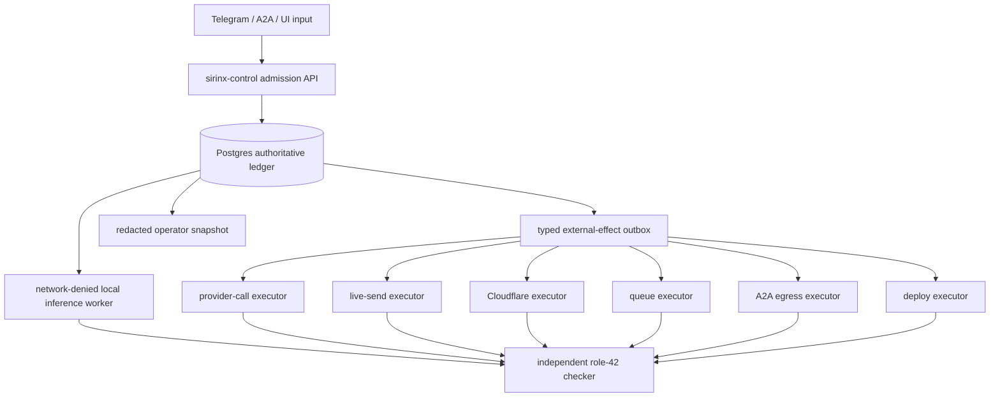

# Provider and Model Admission Contract

Status: `PLAN_ONLY / PRODUCTION_HOLD`

This contract controls local inference, paid providers, A2A egress, Cloudflare
mutation, queues, and live messaging. It does not install a runtime, download a
model, resolve a credential, invoke inference, activate a route, or send data.

## Authority and effect separation



The target managed-mode authority is Postgres plus `sirinx-control`; no other
component may transition durable state or authorize an effect. The Node dev API
is a compatibility/read-model plane. Models,
Telegram, A2A, Cloudflare, queues, dashboards, D1, Durable Objects, and desktop
apps are workers, transports, or projections; none can mint approval.

This managed mode is not implemented yet. Current startup can use a process
memory store and can expose an unauthenticated compatibility API. Those paths
must be labelled `LOCAL_DRY_RUN`, keep every effect executor disabled, and never
report managed readiness. Future managed startup must refuse readiness and
effect service unless Postgres authority and API authentication both attest
success. If Postgres fails later, outward effects stay disabled and a sticky
node-local emergency hold remains available for later reconciliation.

Every external effect needs both a held-by-default circuit gate and one exact,
single-use grant. Gate readiness alone is not execution evidence.

| Lane | Required admission | Required circuit | Retry rule |
|---|---|---|---|
| Install/upgrade | `INSTALL` grant binding exact package/artifact revision, source, license, digest, destination, resource receipt, and rollback | `install` | never auto-upgrade; verify installed revision and post-install footprint before any activation |
| Resource cleanup | `RESOURCE_CLEANUP` grant binding one literal path/device/inode or immutable object, canonical worktree snapshot, recursive target-manifest digest, cleanup-growth bound, maximum bytes, recovery source, exclusions, and post-workload threshold | `resource_cleanup` | may start below 15 GiB only above the 5 GiB emergency floor plus cleanup growth; one target then stop and re-measure; ambiguous impact is `EFFECT_UNKNOWN`; never broad auto-clean |
| Local inference | admitted artifact SHA-256, license/provenance, runtime revision, resource receipt, fixed context/output limits | `local_inference` | one bounded retry only after fresh resource admission; never fall through to a provider |
| Paid provider | `PROVIDER_CALL` grant binding provider endpoint, exact model revision, input digest, token/cost cap, expiry, and one call | `provider_call` | no automatic retry; an ambiguous post-request outcome becomes `EFFECT_UNKNOWN` |
| Connector/OAuth activation | `CONNECTOR_ACTIVATION` grant binding client, server origin, scopes, tool allowlist, expiry, and operator identity | `connector_activation` | no background consent, token exchange, or auto-reconnect |
| Telegram/live send | `LIVE_SEND` grant binding transport, fixed destination digest, payload digest, expiry, and limits | `telegram_send` or `customer_messaging` | no automatic retry after timeout or unknown outcome |
| Cloudflare mutation | `CLOUDFLARE_MUTATION` grant binding account, resource, operation, preview digest, and rollback | `cloudflare_mutation` | read-back required; unknown outcome is not redriven |
| Queue mutation | `QUEUE_MUTATION` grant binding queue, message digest, operation, and limit | `queue_mutation` | no automatic retry after an ambiguous publish/ack |
| A2A network egress | `A2A_EGRESS` grant binding exact peer card revision, origin, task, payload digest, and expiry | `a2a_egress` | no automatic retry after an ambiguous request outcome |
| Deploy | `DEPLOY` grant binding service, immutable artifact digest, environment, rollout, and rollback | `deploy` | staged read-back; no automatic rollback mutation without its own authority |

`local_inference` is intentionally not one of A27's 13 external-effect action
bindings. It remains a separate local model/resource admission circuit: this
omission grants no authority, does not permit a model run, and cannot be used to
fall through to `PROVIDER_CALL`. Any filesystem mutation needed to install or
stage a model still requires its own `INSTALL` authority.

The running gate model currently has only `deploy`, `cloudflare_dns`,
`telegram_send`, `customer_messaging`, and `adaptive_sync`. It therefore cannot
authorize installs, resource cleanup, local inference, provider, connector,
queue, generic Cloudflare, or A2A effects. The circuits above and the new
`RESOURCE_CLEANUP`/`CONNECTOR_ACTIVATION`/`A2A_EGRESS` action kinds are future
`approval-receipt.v2` plus migration-0007 work; absence means `HOLD`, not
classification under a convenient existing gate.

## Admission predicate

An entry is `ADMITTED` only when every condition is true:

```text
catalog revision ELIGIBLE and unexpired
+ exact immutable model/provider revision
+ compatible license and provenance evidence
+ independent verification receipt
+ attested runtime principal and capability
+ allowed data class, retention, and egress policy
+ resource and lane admission
+ bounded context, output, calls, time, and cost
+ different maker and checker
+ exact single-use grant when the action is external
= ADMITTED
```

Unknown license, provenance, policy, price, endpoint, alias, resource use,
principal, or revision means `INELIGIBLE`, never a lower ranking score. Model
output is untrusted proposal data and cannot approve, change action class,
transition durable state, write source, send a message, or mutate cloud state.

## Mac mini M2 decision (refreshed 2026-07-21)

Observed host: `Mac14,3`, 8 GiB RAM, 8 logical CPUs. The current free-disk
snapshot is below the repository's 15 GiB admission floor. One local model may
run at a time only after a fresh resource receipt; local inference is mutually
exclusive with a full build, Docker/disposable Postgres, authenticated browser
evidence, or another local model.

| Candidate | Evidence | Decision on this host |
|---|---|---|
| GLM-5.2 | Z.ai publishes MIT 753B artifacts: official BF16 is 1.51 TB and FP8 is 756 GB; no publisher-hosted light GGUF exists ([official BF16](https://huggingface.co/zai-org/GLM-5.2/tree/main), [official FP8](https://huggingface.co/zai-org/GLM-5.2-FP8/tree/main)) | `REJECT_LOCAL_RESOURCE`; no download or community GGUF adoption |
| Kimi K3 | Moonshot reports 2.8T parameters, hosted API ID `kimi-k3`, and full weights planned for 2026-07-27; no official artifact license is available on 2026-07-21 ([official announcement](https://www.kimi.com/blog/kimi-k3), [official model org](https://huggingface.co/moonshotai/models)) | `HOLD_ARTIFACT_LICENSE / REJECT_LOCAL`; “open” intent is not an artifact license, `Kimi K3.0` is not an admitted alias, and API use still needs a separate `PROVIDER_CALL` grant |
| Qwen2.5-Coder 1.5B Instruct GGUF | publisher-hosted Apache-2.0 GGUF; Q4_K_M is 1.12 GB and the card targets code generation/fixing/agents ([official model](https://huggingface.co/Qwen/Qwen2.5-Coder-1.5B-Instruct), [official GGUF](https://huggingface.co/Qwen/Qwen2.5-Coder-1.5B-Instruct-GGUF/tree/main)) | preferred future `PILOT_CANDIDATE`, not admitted; exact artifact digest, install grant, runtime/resource receipt, tools-off synthetic pilot, and checker still required |
| Granite 3.3 2B Instruct GGUF | publisher-hosted Apache-2.0 GGUF; Q4_K_M is 1.55 GB and the card lists code/function-calling capabilities ([official model](https://huggingface.co/ibm-granite/granite-3.3-2b-instruct), [official GGUF](https://huggingface.co/ibm-granite/granite-3.3-2b-instruct-GGUF/tree/main)) | fallback future candidate; cap at 4K–8K and independently test tool/harness compatibility |
| local `qwen3.5:2b` | already listed locally, but the official Qwen artifact is 4.57 GB Safetensors while the local/Ollama item is a separate 2.7 GB Q8 conversion ([official model](https://huggingface.co/Qwen/Qwen3.5-2B), [Ollama entry](https://ollama.com/library/qwen3.5%3A2b)) | `QUARANTINED_UNPINNED`; capture local manifest, exact digest, upstream revision, runtime revision, and resource receipt before any pilot |
| `qwen3.5:4b` | already listed locally at 3.4 GB; Apache-2.0 ([official model](https://huggingface.co/Qwen/Qwen3.5-4B), [official Ollama entry](https://ollama.com/library/qwen3.5%3A4b)) | `RESEARCH_CANDIDATE`; more memory pressure than 2B, benchmark separately |
| third-party Qwythos GGUF | locally listed, but exact upstream revision, license, provenance, and artifact digest are not cataloged | `QUARANTINED`; do not route or delete without a separate reviewed decision |

Active MoE parameters reduce compute; they do not remove inactive expert
weights from storage or unified memory. A cloud alias is not a local artifact.
Loading successfully is not production admission.

The nominal 32K/128K/262K contexts in upstream cards are not host-safe defaults.
The first admitted local pilot remains fixed to 4K input, 1K output, tools off,
synthetic public data, network denied, and one model at a time. The closed
research portfolio and immutable HOLD decisions live in
[`external-components.research-only.v1.json`](../../config/agent-runtime/external-components.research-only.v1.json).

## Closed durable contracts

The next additive slice must define and validate:

- `ProviderEndpointV1`: pinned HTTPS origin/path, adapter, opaque secret
  reference, retention/training/residency policy, pricing evidence, verification
  receipt, expiry, and state;
- `ModelRevisionV1`: exact upstream revision or local SHA-256, capabilities,
  license/provenance evidence, data ceiling, limits, tool policy, resource
  profile, and checker receipt;
- `PrincipalAttestationV1`: binary/adapter revision and digest, observed
  capabilities, network policy, evidence, and expiry;
- `RoutePlanV1`: exact task/run/stage/role/principal/model/input/schema digests,
  execution class, limits, snapshots, checker, and expiry;
- `ExternalEffectV1` and `EffectAttemptV1`: action kind, grant, target/payload
  digest, idempotency key, append-only attempt state, usage/cost metadata, and
  confirmed/unknown outcome. An executor must durably CAS the attempt to
  `REQUESTING` before any request byte leaves the host. A crash or timeout after
  that transition becomes terminal `EFFECT_UNKNOWN`; it is never automatically
  reclaimed or retried;
- `OperatorSnapshotV1`: redacted counts, states, gates, exact candidate SHA,
  freshness, and snapshot digest only.

Migration 0007 must be expand-only. It must add an
`approval-receipt.v2`-compatible action-kind constraint, exact circuit bindings,
single-effect grants, atomic grant consumption/outbox insertion, and separate
least-privilege RLS identities for catalog governance, provider calls, live
sends, Cloudflare mutations, queue mutations, A2A egress, deploys, and redacted
projections. Generic runtime workers cannot claim effect or deploy work.
Migrations 0005–0006 and the v1 receipt schema remain unchanged.

## Proposed API-first surface

The future managed authoritative API will be versioned under
`/api/agent-runtime/v1`. These routes are a contract and are not currently
wired into `sirinx-control`:

```text
POST /tasks
GET  /tasks/:task_id
GET  /tasks/:task_id/events?after=
POST /route-plans/preview
POST /route-plans
GET  /catalog/models
GET  /principals
POST /runs/:run_id/lease
POST /runs/:run_id/heartbeat
POST /runs/:run_id/result
POST /verifications
POST /tickets
POST /tickets/:ticket_id/grants
POST /effects/prepare
POST /tasks/:task_id/cancel
POST /panic/hold
GET  /operator-snapshot
```

`/effects/prepare` creates an authorized outbox item atomically; it performs no
network I/O. All mutations require scoped authentication, an idempotency key,
closed JSON, expected durable version, and exact task/plan/scope/action
bindings. A grant issuer must be an authenticated, attested human-operator
principal with the exact audience and scope, and must be distinct from the
requester, maker, checker, and executor. A model, bot, worker, desktop client,
transport, or self-asserted approver ID cannot issue a grant. Postgres
unavailable means readiness false and mutations unavailable.

## Rollout gates

1. Complete and independently review the HOLD-only resource-cleanup evidence
   and executable-admission contracts; they must remain unable to dispatch or
   consume approval.
2. A27 freezes the structural approval-receipt v2 and complete all-HOLD circuit
   map. Implement the shared Authority Kernel migration 0007 next; prove
   version-aware managed-startup
   refusal, human-only grants, disposable Postgres, per-action RLS, races,
   atomic `REQUESTING`/claim, crash points, restore, and idempotency negatives.
3. Implement the held one-target collector/executor, obtain a separate exact
   human cleanup grant, and re-measure the operation-specific threshold: at
   least 15 GiB and `5 GiB + reviewed worst-case growth`; use 20 GiB as the
   conservative full-chain target until a measured peak exists. Reconcile
   dirty path ownership before execution.
4. Compile/test the protected-read and status-only bridge repair.
5. Admit one already-installed Qwen artifact by exact digest; run one
   network-denied, tools-disabled, synthetic local pilot with a different
   checker.
6. Build provider request preview without resolving credentials.
7. Only a later exact `PROVIDER_CALL` grant may authorize one paid synthetic
   canary. Telegram, A2A egress, queue/cloud mutation, install, push, merge, and
   deploy remain separate grants.

Rollback holds the affected circuit, revokes unused grants, converts
in-flight ambiguous requests to `EFFECT_UNKNOWN`, preserves the ledger, and
reverts only to an independently verified binary/catalog revision.
