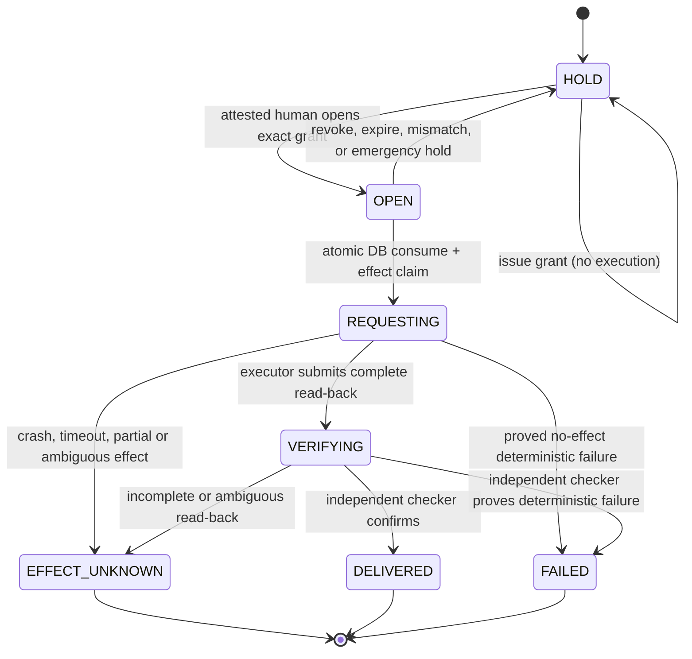

# Resource Cleanup Authority Kernel

Status: `DESIGN_COMPLETE / SQL_0007_DEFERRED / RESOURCE_CLEANUP_HOLD`

This document fixes the database and runtime boundary required to promote the
existing resource-cleanup static preflight into an authoritative, single-use
action. It does **not** grant cleanup authority, open a circuit, consume an
approval, start an executor, run a migration, or remove any data.

The current plan-only schemas and Node preflight remain negative-proof
infrastructure. In particular, a structurally valid
`resource-cleanup-approval.v2` document, a caller-recomputed hash, a task goal,
or `APPROVE_IMPLEMENTATION` is not an executable grant.

## Decision

Do not add or apply SQL migration 0007 under the current resource gate.

The repository is below the threshold required to run the disposable Postgres,
restore, race, and Rust verification matrix. Committing an unexecuted authority
migration would create a security-critical checksum without the evidence needed
to show that empty-state, prior-state, RLS, replay, and recovery behavior are
correct.

There are also two concrete compatibility reasons to defer the SQL file:

1. `AgentRuntimePostgresStore` currently attests exactly 13
   `agent_runtime_%` tables and exactly 13 policies. Adding a table or policy
   without changing that inventory makes every existing runtime login fail
   startup admission.
2. `MASTER_PLAN.md` currently assigns the name "migration 0007" to both the
   Provider/Model Effect Plane and Resource Recovery. Two independent 0007
   files or two branches editing one 0007 checksum are not allowed.

When the resource gate opens, 0007 must be one shared authority-kernel
migration. A27 already freezes the complete 13-row action/circuit contract in
code, with every row `HOLD`; 0007 may persist that complete held registry but
must not make any executor runnable by migration alone. The first later
executable canary may be only `RESOURCE_CLEANUP`, after its own exact human
ticket and the complete disposable Postgres/RLS/race/restore proof. Provider
catalog/request contracts and provider executor remain outside that canary and
land additively without rewriting an applied 0007. This preserves one
approval/effect ledger instead of creating a cleanup-only ledger that B10 would
later replace.

## Existing durable foundation

The kernel must extend, not duplicate, the expand-only groundwork already in
`0005_agent_runtime_core.sql`:

- `agent_runtime_action_tickets` already binds task/run, class, target, commit,
  plan, scope, action digest, limits, rollback, verification, requester, state,
  expiry, and version;
- `agent_runtime_approval_grants` already provides one grant per ticket, a
  globally unique nonce digest, ACTIVE/CONSUMED/EXPIRED/REVOKED state, database
  timestamps, and one-use consumption fields;
- `agent_runtime_outbox` already provides a globally unique effect key, one row
  per grant, a payload digest, claim state, attempt count, ambiguous-effect
  state, and dead-letter state;
- tasks, runs, leases, transition events, verification runs, receipts, and
  artifacts already supply the task/run/lease/receipt coherence boundary.

Migration 0006 deliberately gives the generic runtime application no access to
tickets, grants, outbox, verification, or artifacts. The authority kernel must
preserve that denial. It must not make `sirinx_agent_runtime_app` an effect
executor and must not use `web_control_gates` or the free-form `/api/actions`
compatibility route as cleanup authority.

Migrations 0005 and 0006 and `approval-receipt.v1.schema.json` remain unchanged.

The B10.0 files `approval-receipt.v2.schema.json`,
`action-circuits.plan-only.v1.json`, and the pure Rust preview are static
contracts only. They do not satisfy any database or execution requirement in
this document.

## Additive 0007 objects

The eventual migration filename is reserved as:

```text
0007_agent_runtime_effect_authority.sql
```

It adds six generic authority tables. Action-specific scope and evidence remain
closed referenced artifacts so B10 does not create a second ledger per effect.

### 1. `agent_runtime_action_circuit_bindings`

This is the closed action-to-circuit and executor-role registry.

| Column | Contract |
|---|---|
| `action_kind varchar(64)` | uppercase stable identifier |
| `circuit_name varchar(64)` | lowercase stable identifier |
| `effect_profile varchar(64)` | exact A27 effect-profile binding |
| `action_class varchar(1)` | one of `C`, `D`; cleanup is `C` |
| `approval_schema_version varchar(32)` | exactly `2.0` for all 13 rows |
| `executor_role_name varchar(128)` | exact NOLOGIN capability role |
| `created_at timestamptz` | database clock |
| `version bigint` | starts at one |

Primary key: `(action_kind, circuit_name)`.

`circuit_name` and `executor_role_name` are also unique. One circuit has one
action meaning; an alias cannot silently bind the same circuit or capability
role to a second effect profile.

The shared migration inserts all 13 ordered A27 definition rows. The cleanup
row within that registry is exactly:

```text
RESOURCE_CLEANUP | resource_cleanup | C | 2.0 |
sirinx_agent_runtime_resource_cleanup_executor
```

The other 12 definitions are installed in the same shared registry, but their
presence grants no authority: every matching circuit is seeded `HOLD`, and no
ticket, grant, attestation, admission, route, executor registration, or outbox
row is seeded. The binding decision is frozen in
`EFFECT_AUTHORITY_MIGRATION_SEMANTICS.md`.

### 2. `agent_runtime_effect_circuits`

This is a grant-bound circuit, not a broad on/off feature flag.

| Column | Contract |
|---|---|
| `circuit_name varchar(64) primary key` | one exact circuit |
| `action_kind varchar(64)` | composite FK with `circuit_name` to the registered binding |
| `state varchar(8)` | `HOLD` or `OPEN` |
| `active_grant_id varchar(160)` | nullable FK to approval grants; unique while present |
| `active_action_digest varchar(64)` | nullable lowercase SHA-256 |
| `opened_by_principal_id varchar(256)` | nullable attested human principal |
| `opened_at timestamptz` | nullable database time |
| `expires_at timestamptz` | nullable and never later than the grant expiry |
| `version bigint` | compare-and-swap version |
| `updated_at timestamptz` | database time |

The row check is structurally closed:

- `HOLD` requires every active/open field to be null;
- `OPEN` requires every active/open field, an expiry later than `opened_at`, and
  one exact grant/action digest;
- only one circuit may reference a grant;
- an open circuit never authorizes a second grant.

Whether an OPEN row is current cannot be a table CHECK because the database
clock changes. Every open/claim/status function compares its one captured
database-clock value to both circuit and grant expiry. 0007 seeds all 13
reviewed circuits as `HOLD`, version one, with no ticket or grant.
`resource_cleanup` is one of those held rows.

### 3. `agent_runtime_principal_attestations`

This is the managed, revocable evidence behind a logical principal. A digest
alone is never treated as current authority.

| Column | Contract |
|---|---|
| `attestation_id varchar(160) primary key` | stable opaque ID |
| `principal_id varchar(256)` | bounded logical principal |
| `session_login_name varchar(128)` | exact database `session_user` allowed to act |
| `principal_kind varchar(32)` | `HUMAN_APPROVER`, `ISSUER`, `EVIDENCE_VERIFIER`, `EXECUTOR`, or `POST_ACTION_CHECKER` |
| `audience varchar(256)` | exact authority-kernel audience |
| `action_kind varchar(64)` | exact action |
| `host_identity_digest varchar(64)` | admitted host identity |
| `binary_identity_digest varchar(64)` | admitted adapter/executor binary |
| `adapter_revision varchar(256)` | exact reviewed revision |
| `evidence_digest varchar(64)` | digest of independently verified evidence |
| `evidence_ref varchar(2048)` | opaque non-secret artifact reference |
| `state varchar(16)` | `ACTIVE`, `REVOKED`, or `EXPIRED` |
| `issued_at`, `verified_at`, `expires_at` | database timestamps with strict order |
| `version bigint` | compare-and-swap version |

The issue, open, admit, claim, and finish paths lock and re-check the required
attestation row with one database clock. They verify state, audience, action,
principal kind, session login, host, binary, revision, evidence digest, and
expiry. Raw assertions, credentials, cookies, tokens, and attestation bodies
are never stored.

### 4. `agent_runtime_approval_bindings_v2`

This is the v2, human-attested interpretation of an existing ticket and grant.
It does not replace either base table.

| Column | Contract |
|---|---|
| `grant_id varchar(160) primary key` | FK to `agent_runtime_approval_grants` |
| `ticket_id varchar(160) unique` | FK to `agent_runtime_action_tickets` |
| `schema_version varchar(32)` | exactly `2.0` in this slice |
| `action_kind varchar(64)` | composite FK with `circuit_name` |
| `circuit_name varchar(64)` | composite FK to the binding registry |
| `contract_digest varchar(64) unique` | domain-separated canonical v2 contract digest |
| `maker_principal_id varchar(256)` | bounded non-empty principal |
| `checker_principal_id varchar(256)` | bounded non-empty principal |
| `executor_principal_id varchar(256)` | bounded non-empty principal |
| `issuer_principal_id varchar(256)` | authenticated approval service principal |
| `approver_attestation_id varchar(160)` | FK to a current human-approver attestation |
| `issuer_attestation_id varchar(160)` | FK to a current issuer attestation |
| `approver_assertion_ref varchar(2048)` | opaque reference, never a token or assertion body |
| `issuer_attestation_digest varchar(64)` | digest of verified issuer/audience/status/expiry evidence |
| `created_at timestamptz` | database time |

The issue function joins the base grant and ticket and rejects:

- requester equal to approver;
- any equality among approver, maker, checker, and executor;
- maker equal to checker, executor, or requester;
- checker equal to executor or requester;
- a missing, revoked, stale, wrong-audience, or wrong-action human attestation;
- action class other than `C` for cleanup;
- task, run, ticket, grant, target, commit, plan, scope, action, circuit, limits,
  nonce, expiry, or schema drift.

The issuer is a service identity and does not substitute for the human
approver. Model output, a task requester, a maker, a checker, an executor, and a
caller-supplied unkeyed digest cannot mint approval.

### 5. `agent_runtime_action_intents_v2`

This generic one-to-one table binds one immutable, closed action-intent artifact
to the v2 grant. It prevents the shared 0007 kernel from becoming a
cleanup-only ledger or growing a separate approval table for every effect.

Required columns bind the grant and ticket, action kind and circuit, exact
schema ID/version, canonical artifact digest and non-secret reference, target,
payload, plan, scope, commit, lease, limits and data-class digests, artifact
expiry, database creation time, and version. The row is immutable after issue.
The referenced artifact remains action-specific and must validate against the
exact schema declared by the binding; arbitrary JSON or a caller-selected
schema ID is rejected.

For `RESOURCE_CLEANUP`, the referenced artifact is the complete reviewed
cleanup scope: repository/worktree identity, one literal target and stable
manifest, process evidence, fixed `cargo-clean` operation, recovery refs,
supporting ticket IDs, exclusions, one-call/zero-cost/runtime limits, 60-second
evidence age, capacity predicate, and required post-free threshold. The target,
commit, plan, scope, action and limits must equal the base ticket, and any
network/install recovery dependency must name a separately valid ticket.
Protected content is never copied into either the table or artifact.

### 6. `agent_runtime_effect_admissions`

This append-only record is the independent, action-time decision consumed by a
claim. It prevents an executor from authorizing itself with caller-shaped
digests.

Required bindings include admission ID, task/run/ticket/grant, action/circuit,
verifier principal and attestation ID, executor principal and attestation ID,
exact lease ID/version/expiry, repository SHA and worktree digest, target
path/device/inode and refreshed stable manifest/root digests, refreshed process
snapshot digest and completeness status, executable/selected-cargo identity
digest, operation/environment digest, filesystem device, measured free and
allocated KiB, cleanup-growth predicate, recovery evidence, collected and
verified database timestamps, admission digest, and state.

The only consumable state is `ADMITTED`. It is written by a fixed verifier
function after an independently attested verifier checks the complete evidence
artifact. `DENIED`, `EXPIRED`, and `CONSUMED` are non-consumable. The verifier
must differ from requester, maker, checker, approver, issuer, and executor. A
caller-supplied replay snapshot, process count, filesystem measurement, or
digest is never sufficient without this durable row and its verifier
attestation.

## Authority functions

No capability role receives direct table DML. The migration adds fixed-SQL,
`SECURITY DEFINER` functions with `search_path=pg_catalog`, fully qualified
objects, no dynamic SQL, PUBLIC execution revoked, and exact function ownership.

### `issue_resource_cleanup_grant_v2`

Caller: an authenticated login that is a direct member only of the cleanup
issuer capability role.

In one transaction and using one captured `clock_timestamp()` value, it:

1. verifies the human attestation status, audience, action, target, expiry, and
   issuer revision supplied by the trusted issuer adapter;
2. verifies task/run existence, exact run action class, active lease identity,
   maker/checker separation, and every v2 contract digest;
3. inserts one base ticket in `APPROVED`, one base grant in `ACTIVE`, one v2
   binding, and one generic action-intent row carrying the cleanup artifact;
4. leaves `resource_cleanup` on `HOLD`;
5. rejects a grant lifetime above 300 seconds and never stores a raw nonce,
   assertion, credential, or secret.

Issuance is not execution. The returned view is redacted and contains IDs,
digests, state, and expiry only.

### `decide_resource_cleanup_circuit_v1`

Caller: the issuer role with a fresh human assertion bound to the same grant.

`OPEN` locks the circuit, grant, ticket, v2 binding, action intent, task, run,
active lease, and current approver/issuer attestation rows in deterministic
order. It requires all rows to be current using one database clock, the action
digest to match, the grant and ticket to be unused, and the circuit deadline to
be no later than the grant deadline. `HOLD` is always restrictive, clears every
active field, increments the CAS version, and wins over stale open state.

Opening the circuit for one grant does not open cleanup generally.

### `admit_resource_cleanup_evidence_v1`

Caller: an authenticated evidence-verifier login with a current
`EVIDENCE_VERIFIER` attestation for this action. The verifier is distinct from
requester, maker, checker, approver, issuer, executor, and later post-action
checker.

After the grant exists and the exact circuit is open, the verifier collects or
independently validates the complete action-time evidence artifact. The
function locks the task/run/lease, ticket/grant/binding/scope, circuit, verifier
attestation, and executor attestation; compares one database clock to every
expiry; validates the closed artifact; and inserts one
`agent_runtime_effect_admissions` row. Essential target, executable, lease,
resource, and repository fields are stored alongside the full artifact digest
so claim-time checks do not trust self-asserted summaries.

The record is short-lived, single-grant, and single-attempt. Missing or denied
OS visibility is `DENIED`, never zero consumers. A second verifier decision for
the same grant/admission version cannot overwrite an admitted row.

### `claim_resource_cleanup_effect_v1`

Caller: an authenticated login that is a direct member only of
`sirinx_agent_runtime_resource_cleanup_executor` and whose logical principal is
the executor named in the v2 binding.

The function accepts the grant ID, nonce digest, exact action digest, one
admission ID/digest, and canonical effect payload digest. It does not accept a
replacement target, executable, evidence summary, or action.

Using one captured database-clock value, one transaction, and deterministic
`FOR UPDATE` locks, it requires:

```text
task/run/lease are coherent and current
+ ticket APPROVED and unexpired
+ grant ACTIVE and unexpired
+ v2 binding and cleanup action intent match the ticket/grant
+ requester/approver/maker/checker/executor separation still holds
+ issuer attestation is current, valid, and for this audience/action
+ executor attestation binds session_user, logical principal, host, and binary
+ resource_cleanup circuit OPEN for this grant/action digest
+ nonce digest unused and equal to the stored digest
+ independently verified admission ADMITTED, current (<= 60 seconds), and unused
+ admission task/run/grant/lease/executor/target/executable/repository bindings match
+ literal target path/device/inode and stable manifest/root digests unchanged
+ operation, limits, recovery, exclusions, resource predicate, and selected-cargo identity unchanged
= one claim may be committed
```

The same transaction then:

1. inserts exactly one `agent_runtime_outbox` row with fixed topic
   `resource_cleanup.v2`, fixed effect key `resource_cleanup:<grant_id>`, state
   `REQUESTING`, attempt count one, caller identity, claim deadline, closed
   payload, and canonical payload digest;
2. changes the base grant to `CONSUMED` with database `consumed_at`;
3. changes the base ticket to `CONSUMED`;
4. changes the effect admission to `CONSUMED`;
5. returns the circuit to `HOLD` and clears its active grant fields;
6. returns the immutable claim receipt needed by the bounded executor.

Existing uniqueness of grant ticket, grant nonce, outbox effect key, and one
outbox row per grant makes a replay fail. The function never returns an old
claim as if a second execution were authorized. A read-only status query may
report the existing row, but it cannot claim it again.

Migration 0007 expands the outbox state constraint with `REQUESTING` and
`VERIFYING`; generic retry workers are denied those rows. `REQUESTING` is the
durable pre-effect boundary. Immediately before spawn, the executor rechecks
the admission-bound target, parent path, launcher, selected Cargo binary,
toolchain, operation, environment, and lease. Any drift before a proven spawn
is a deterministic no-effect failure; any uncertainty becomes
`EFFECT_UNKNOWN`. The future Rust launcher must prove a descriptor/atomic
launch binding or refuse—the same-user writable path cannot be treated as
TOCTOU-proof by a second pathname check alone.

### `finish_resource_cleanup_effect_v1`

Caller: the same executor principal that owns the claim, but only for submitting
the bounded command outcome and complete read-back artifact.

It may transition the fixed outbox row from `REQUESTING` to `VERIFYING`, or
directly to `EFFECT_UNKNOWN` when outcome is ambiguous. It cannot mark the
effect delivered. A separate `verify_resource_cleanup_effect_v1` function is
owned by a current, independently attested `POST_ACTION_CHECKER` principal who
differs from requester, maker, pre-action verifier, approver, issuer, and
executor. That checker may transition `VERIFYING` exactly once to:

- `DELIVERED` only after post-target free-space, Git/worktree, excluded-path,
  command, and independent receipt evidence passes;
- `FAILED` only when evidence proves the tool-native operation never began or
  had a deterministic no-effect failure;
- `EFFECT_UNKNOWN` whenever the executor cannot prove the complete effect.

The checker function requires a prior independent durable checker receipt plus
the cleanup post-action artifact digest. A generic runtime receipt INSERT or a
self-referential receipt ID is not cleanup verification. Neither function can
return a grant or ticket to an executable state or change the payload, target,
action, nonce, or effect key.

### `expire_resource_cleanup_claim_unknown_v1`

Caller: a separately admitted reconciler/issuer path, never the executor that
lost the claim.

An expired `REQUESTING` or `VERIFYING` row becomes `EFFECT_UNKNOWN`. It is
never reset to `PENDING`, never automatically requeued, and never receives a
replacement grant. A later recovery investigation starts from a new task and
new human approval.

## Roles, ownership, grants, and RLS

Production role creation remains an operator bootstrap action outside the
migration. The migration fails if any prerequisite role is absent or unsafe; it
never creates a LOGIN role or password.

| Role | Attributes and purpose |
|---|---|
| `sirinx_agent_runtime_owner` | existing NOLOGIN, NOINHERIT owner of all tables, indexes, sequences, triggers; no login may be its member |
| `sirinx_agent_runtime_resource_cleanup_authority` | new NOLOGIN, NOINHERIT function owner with exact column grants only; no login membership |
| `sirinx_agent_runtime_resource_cleanup_issuer` | new NOLOGIN, INHERIT capability group; trusted authenticated issuer login only |
| `sirinx_agent_runtime_resource_cleanup_evidence_verifier` | new NOLOGIN, INHERIT capability group; independent action-time verifier only |
| `sirinx_agent_runtime_resource_cleanup_executor` | new NOLOGIN, INHERIT capability group; one bounded executor login only |
| `sirinx_agent_runtime_resource_cleanup_checker` | new NOLOGIN, INHERIT capability group; independent post-action checker only |

These capability roles inherit no other role. Their logins and logical
principals are pairwise distinct, and none may be a member of the owner or
authority role. The generic runtime login remains a member only of
`sirinx_agent_runtime_app`.

Every new table is owned by `sirinx_agent_runtime_owner`, has `ENABLE RLS` and
`FORCE RLS`, and starts with all table, column, sequence, and function
privileges revoked from PUBLIC, `anon`, `authenticated`, `service_role`, and
`sirinx_agent_runtime_app`.

Only the function-owner authority role receives the minimum column privileges
and matching command-specific policies needed by the fixed functions:

- binding registry: SELECT;
- circuits: SELECT and CAS UPDATE;
- tickets/grants: SELECT, INSERT, and the state/version/time columns required by
  issue/consume only;
- attestations, v2 bindings, action intents, and effect admissions: the fixed
  issuer/verifier paths receive only the exact SELECT/INSERT/CAS columns they
  require;
- outbox: SELECT, fixed-topic INSERT, and state/claim/error/time UPDATE only;
- task/run/lease: SELECT only.

Issuer, verifier, executor, and checker capability roles receive EXECUTE only
on their named functions and no table/sequence access. All functions verify an
ACTIVE principal-attestation row that binds `session_user` to the exact logical
principal, role kind, host, binary, action, audience, and expiry; role
membership alone is insufficient. They reject callers holding two capability
roles.
Function bodies use no caller-controlled identifier, table name, SQL fragment,
or search path.

## Version-aware startup admission

The current startup check must not replace `count = 13` with a looser
`count >= 13`. That would make unknown tables or policies invisible.

Before 0007 can land, `attest_runtime_connection` must use a versioned exact
inventory:

```text
foundation version 0006:
  exact 13 tables, 3 sequences, 13 app policies, 1 trigger function

effect-authority version 0007:
  exact foundation inventory
  + exact six new tables
  + exact new indexes/constraints
  + exact authority-role policies
  + exact issuer/open/admit/claim/submit/verify/reconcile functions and owners/config/ACL
  + exact 13 ordered A27 action/circuit bindings
  + exact 13 held circuit rows, including resource_cleanup
```

The runtime app's five-table, 63-column capability matrix remains unchanged.
The eight 0005 groundwork tables plus all six new tables remain forbidden to
that login. Startup also proves:

- migration version/checksum is the expected candidate;
- all `agent_runtime_%` relations are enumerated and correctly owned with FORCE
  RLS;
- there are no extra policies, function overloads, default PUBLIC execute
  grants, sequences, action bindings, or open circuits;
- external Supabase API roles retain no effective privilege;
- issuer/executor/authority roles have exact safe attributes and memberships;
- action and circuit rows match the code's closed registry.

A server with schema 0007 and code that understands only 0006 refuses startup.
A server with 0007-aware code and only schema 0006 may start the existing
non-effect runtime but reports the cleanup effect service unavailable and held;
it may not emulate authority in memory.

## Executor boundary

The migration creates authority and a claim boundary, not a shell executor.
The later executor is a separate, single-purpose Rust component. It receives
only the immutable claim receipt, rebuilds action-time evidence, and uses an
allowlisted process API with:

```text
absolute cargo executable identity and digest
fixed cwd equal to the canonical repository
argv = clean --manifest-path <repo>/Cargo.toml --target-dir <repo>/target
non-inherited exact environment
one target
one call
fixed timeout
no shell
no glob
no rm
no git clean
no Docker/model/package-store cleanup
no process stop
no automatic continuation
```

The executor cannot issue grants, open circuits, change targets, select another
operation, restart a consumed claim, run builds/tests afterward, or read
protected configuration. Execution remains a later separately reviewed slice.

## State and crash semantics



- Crash before the claim transaction commits: no claim and no consumed grant.
- Commit outcome unknown to the executor: query status only; never call the
  executor until the durable row is reconciled.
- Crash after `REQUESTING` but before process start: conservative
  `EFFECT_UNKNOWN`; no replay.
- Crash or timeout after process start: `EFFECT_UNKNOWN`; no replay.
- Circuit expires before claim: claim fails and the circuit is held.
- Grant expires before claim: claim fails even if a stale circuit says OPEN.
- Restrictive hold always wins over cached/open projections.

`ReplaySnapshot`, an API response, a log line, a task card, a caller-supplied
hash, or a Node in-memory queue is evidence input only. The database transaction
is the sole consume/claim authority.

## Exact disposable Postgres acceptance matrix

SQL 0007 cannot be claimed ready until the following exact-SHA-bound suite runs
on an isolated disposable Postgres image with network restricted to the
container-private network and loopback. Missing fixture variables are a failure,
not a skip/pass.

### Migration and restore

1. **Empty state:** apply 0001 through 0007; verify exact inventory, role
   ownership, FORCE RLS, policies, functions, all 13 held circuits, and all 13
   ordered bindings, with zero seeded authority rows.
2. **Prior state:** seed sentinels after 0001/0002, apply 0003 through 0006,
   create representative unconsumed 0005 tickets/grants/outbox rows, apply 0007,
   and prove every prior row and checksum is unchanged.
3. **0006-code compatibility:** prove old code refuses the unexpected 0007
   inventory rather than silently accepting it.
4. **0007-code compatibility:** prove the ordinary runtime app keeps its exact
   five-table capability and cannot see or mutate the new kernel.
5. **Backup/restore:** backup the migrated database, restore into a fresh
   database with prerequisite roles, re-run admission and receipt/claim
   integrity checks, and prove the circuit restores held unless a separately
   reviewed recovery rule proves a still-valid bound open row. Default is HOLD.
6. **Migration failure rollback:** inject a missing/unsafe prerequisite role and
   prove 0007 aborts atomically with no partial object or grant.

### RLS and privilege negatives

For PUBLIC, `anon`, `authenticated`, `service_role`, migration login, generic
runtime login, issuer login, evidence-verifier login, executor login,
post-action-checker login, authority role, and wrong-role login, test every
table command, every column command, sequence usage, function execute, schema
create, role membership, `SET ROLE`, function overload, and search-path shadow
attempt. Expected access must be enumerated exactly; an unexpected success
fails the suite.

Prove specifically that:

- the issuer cannot claim or finish an effect;
- the evidence verifier cannot issue, open, claim, submit, or finish an effect;
- the executor cannot issue a ticket/grant, open a circuit, or change scope;
- the post-action checker cannot issue, open, admit, claim, or submit an effect;
- the generic runtime app still cannot read tickets, grants, outbox, or any new
  table;
- the function owner cannot be used as a login or inherited role;
- no external API role can call a definer function through PUBLIC/default ACL;
- malicious payload strings cannot select an identifier or execute SQL.

### Approval and tamper negatives

Reject absent/revoked/expired/wrong-audience/wrong-action issuer attestations;
absent/revoked/expired/wrong-host/wrong-binary approver, verifier, executor, or
post-action-checker attestations; session login/logical principal mismatch;
requester equal to approver; any maker/checker/approver/verifier/executor/
post-action-checker equality;
caller-recomputed unkeyed grant hashes; wrong task/run/lease/executor; wrong
action/circuit/class/schema; ticket/grant/plan/scope/action/commit/target drift;
stale/future/reordered process evidence; manifest/worktree/exclusion drift;
symlink, hard-link, device, inode, operation, recovery, limit, and capacity
drift; raw nonce storage; and TTL measured from caller time instead of database
time.

### Replay and race matrix

1. Two concurrent issue requests with the same ticket, grant, nonce, or contract
   digest: exactly one commits.
2. Two concurrent circuit-open CAS requests: exactly one version commits.
3. Two concurrent claims for one grant: exactly one outbox row, one consumed
   grant, one consumed ticket, and one held circuit result.
4. Same nonce with a different grant: rejected by global uniqueness.
5. Same grant with a different effect key or payload digest: rejected.
6. Claim at, just before, and just after DB-clock expiry: only the strictly
   unexpired case may commit.
7. Circuit hold racing a claim: deterministic locking; either the claim commits
   fully before the hold or the hold wins and no claim commits. No split state.
8. Connection drop before commit, during commit acknowledgement, after claim,
   and during finish: reconcile durable state and never replay automatically.
9. Expired claim reconciliation racing finish: one terminal outcome only.
10. Pool reuse and process restart: authority and replay invariants remain.

### State and receipt integrity

Prove the atomic invariant after every injected failure:

```text
ACTIVE grant + APPROVED ticket + OPEN exact circuit + absent/ADMITTED unused admission + no outbox
or
CONSUMED grant + CONSUMED ticket + HOLD circuit + CONSUMED admission + exactly one REQUESTING/VERIFYING/terminal outbox
```

No intermediate combination is admissible. Terminal results bind post-action
evidence and the independent run receipt. A missing receipt, short reclaim,
changed excluded path, changed Git/worktree snapshot, or ambiguous effect cannot
be `DELIVERED`.

The harness must clean up only its exact labelled disposable container/network,
must refuse `KEEP=1` in capacity-recovery mode, and must re-read free space after
cleanup. Docker/database startup remains barred until the resource admission
threshold is satisfied.

## Files required in the implementation slice

No file in this list is changed by this design document. The future
implementation owns these paths together so schema, code, and startup admission
cannot drift:

```text
crates/sirinx-store/migrations/0007_agent_runtime_effect_authority.sql
schemas/agent-runtime/approval-receipt.v2.schema.json
schemas/agent-runtime/external-effect.v1.schema.json
schemas/agent-runtime/effect-attempt.v1.schema.json
schemas/agent-runtime/resource-cleanup-approval.v2.schema.json
crates/sirinx-core/src/agent_runtime.rs
crates/sirinx-store/src/agent_runtime.rs
crates/sirinx-store/src/postgres.rs
crates/sirinx-store/tests/agent_runtime_rls.rs
crates/sirinx-store/tests/resource_cleanup_authority.rs
crates/sirinx-store/tests/fixtures/agent_runtime_roles.sql
scripts/test-agent-runtime-postgres.sh
services/dev-control-api/src/resource-cleanup-preflight.mjs
docs/agent-runtime/IMPLEMENTATION_PLAN.md
MASTER_PLAN.md
PRODUCTION.md
```

The implementation must add typed Rust action/circuit/grant/effect states and
domain-separated canonical hashing before store mutation methods. The store API
must expose issue, hold/open, claim, status, finish, and reconcile operations;
it must not expose a generic SQL action executor.

## Migration-number collision rule

There is exactly one migration version 0007 in the repository and exactly one
checksum after review.

- Before creating the file, search every active branch/worktree for an existing
  0007 candidate and coordinate ownership.
- If B10 already owns a reviewed 0007, this kernel is integrated into that same
  candidate before either is applied; otherwise the conflicting branch rebases
  and renumbers its unapplied migration.
- Once any environment applies 0007, the file is immutable. Provider/model,
  connector, A2A, or additional executor work uses 0008 or later.
- The master plan must be updated in the same implementation change so B10 does
  not continue promising a second migration 0007.
- No squashing or renaming may hide a migration that was already applied.

## Current truth

As of this design:

```text
RESOURCE_CLEANUP_ACTION_KIND       = PLAN CONTRACT ONLY
RESOURCE_CLEANUP_CIRCUIT           = ABSENT / EFFECTIVE HOLD
ATTESTED_HUMAN_AUTHORITY           = ABSENT
DATABASE_REPLAY_PROTECTION         = NOT WIRED TO A CONSUMER
ATOMIC CONSUME + EFFECT CLAIM      = NOT IMPLEMENTED
RESOURCE_CLEANUP_EXECUTOR          = NOT IMPLEMENTED
MIGRATION 0007                     = DEFERRED
RESOURCE_CLEANUP EXECUTION         = PROHIBITED
PRODUCTION                         = HOLD
```

The next safe action is to recover enough separately authorized capacity to run
the disposable Postgres matrix, then implement the shared kernel as one
reviewable candidate. No cleanup action is inherited from this document.
