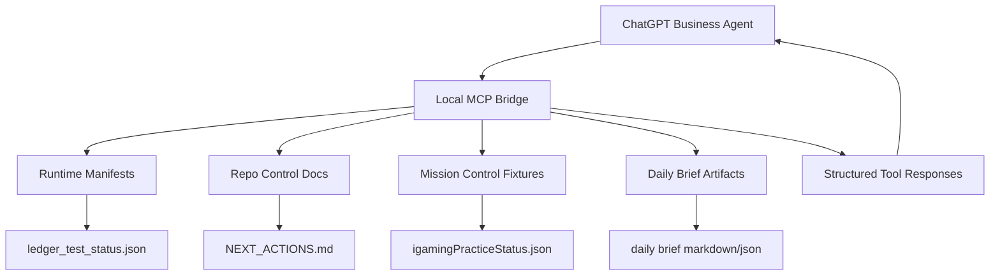

# ChatGPT Agent MCP Bridge Spec

Status: local-only specification
Scope: read-only MCP bridge for ChatGPT Business Agent workflows
Source context: operator-provided ChatGPT Agent workflow screenshots and the current GHOSTCLAW/SIRINXDev local runtime architecture

## Purpose

Create a small MCP bridge that lets a ChatGPT Agent read safe status from the GHOSTCLAW/SIRINXDev runtime without becoming a production automation engine.

The first use case is a daily "Morning Chief of Staff" agent that can summarize:

- ledger kata test status
- Mission Control readiness
- active next actions
- local daily brief inputs
- runtime reports under `.ghostclaw_runtime`

This bridge is not a replacement for Codex, OpenClaw, n8n, Hermes, or Mission Control. It is a safe read-only connector for ChatGPT Agent workflows.

## Role Split

| Layer | Role | Allowed in v0 |
| --- | --- | --- |
| ChatGPT Agent | Office/knowledge worker that turns status into briefs, tasks, and replies | Read safe MCP tools |
| Codex | Repo/code worker | Implement and verify local code |
| MCP Bridge | Read-only adapter between ChatGPT Agent and local runtime manifests | Return structured status |
| Hermes/GhostClaw | Policy, audit, runtime boundaries | Enforce no secret/live mutation |
| n8n/OpenClaw | Deep workflow automation | Not activated by this bridge |

## Architecture



## Safety Boundary

The bridge must be read-only in v0.

Hard blocked:

- service-role key access
- `.env` or credential reads
- live Gmail/Calendar/Notion writes
- Supabase mutation or migration execution
- payment provider calls
- public endpoint exposure
- deploy, push, publish, or live customer message send
- browser automation against authenticated third-party sites

Allowed:

- read specific allowlisted runtime JSON/Markdown files
- read specific allowlisted repo docs
- return summaries and structured status
- produce draft-only brief text

## Recommended Transport

v0 transport: `stdio` local MCP server.

Reason:

- simplest for local ChatGPT/Codex style tooling
- no public port
- no localhost HTTP exposure
- no auth surface beyond local process access

Future transport: streamable HTTP on `127.0.0.1` only, after a separate policy review.

## Allowlisted Read Roots

```text
/Users/sirinx/SIRINXDev/.ghostclaw_runtime/
/Users/sirinx/SIRINXDev/sirinx-agent-native-os/docs/
/Users/sirinx/SIRINXDev/sirinx-agent-native-os/apps/mission-control/src/fixtures/
/Users/sirinx/SIRINXDev/sirinx-agent-native-os/NEXT_ACTIONS.md
/Users/sirinx/SIRINXDev/sirinx-agent-native-os/PROJECT_STATE.md
```

The server must reject any path outside these roots.

## v0 Tool Catalog

### `ghostclaw_get_ledger_kata_status`

Purpose: return the latest ledger kata runtime test status.

Input:

```json
{
  "include_markdown_summary": true
}
```

Output:

```json
{
  "status": "passing",
  "tests_passed": 6,
  "tests_total": 6,
  "generated_at": "2026-06-24T03:46:09+07:00",
  "blocked_actions": [
    "real_money_gambling",
    "live_payment_provider",
    "service_role_key_display",
    "public_endpoint",
    "supabase_live_migration"
  ]
}
```

Annotation:

- `readOnlyHint: true`
- `destructiveHint: false`
- `idempotentHint: true`
- `openWorldHint: false`

### `ghostclaw_get_mission_control_status`

Purpose: return safe fixture-backed Mission Control readiness for Agent briefs.

Reads:

```text
apps/mission-control/src/fixtures/igamingPracticeStatus.json
```

Output:

- active local panels
- practice fixture status
- hard boundary blocks
- last fixture update time

### `ghostclaw_get_next_actions`

Purpose: return a concise next-action board from `NEXT_ACTIONS.md`.

Input:

```json
{
  "section": "igaming",
  "limit": 10
}
```

Behavior:

- parse headings and checklist lines
- return only task titles and status
- do not expose secret-like content
- if parsing fails, return a safe error with the file path and remediation

### `ghostclaw_get_project_state_summary`

Purpose: return a concise current state summary for daily planning.

Input:

```json
{
  "sections": ["iGaming", "Autopilot", "AI Money"],
  "max_bullets": 12
}
```

Output:

- section title
- status bullets
- blockers
- recommended next safe action

### `ghostclaw_create_morning_brief`

Purpose: compose a draft-only morning brief from safe read-only sources.

Input:

```json
{
  "audience": "operator",
  "timezone": "Asia/Bangkok",
  "include_sections": [
    "ledger_status",
    "next_actions",
    "project_state",
    "blocked_actions"
  ]
}
```

Output:

- Markdown brief
- JSON metadata with source file list
- no email/chat/customer send
- no calendar mutation

## ChatGPT Agent Template: Morning Chief Of Staff

Agent name: `GHOSTCLAW Morning Chief of Staff`

Apps:

- ChatGPT channel first
- Gmail/Calendar/Notion/Drive only after explicit connector policy and workspace review

Skills:

- memory-management
- task-management
- update
- start

Files:

- this MCP bridge spec
- a short operator profile
- safe project glossary

Instructions:

```text
You are the GHOSTCLAW Morning Chief of Staff.

Your job is to prepare a concise daily brief from safe read-only MCP tools.

Rules:
- Use MCP tools only for read-only status.
- Never request secrets.
- Never mutate Gmail, Calendar, Notion, Supabase, Git, payment providers, or public endpoints.
- Summarize blockers separately from next actions.
- Prefer one page: Today, Risks, Waiting, Suggested Focus.
- If a tool reports stale or missing data, say exactly which manifest is stale or missing.
- Do not claim live production status unless a source explicitly says production was verified.
```

Schedule:

```text
Weekdays 08:00 Asia/Bangkok
Channel: ChatGPT
Output: daily brief only
```

## Data Freshness Rules

| Source | Fresh if | Stale behavior |
| --- | --- | --- |
| `ledger_test_status.json` | generated within 24 hours | say "ledger status stale" |
| Mission Control fixture | updated within 7 days | say "fixture needs refresh" |
| `NEXT_ACTIONS.md` | file exists and has checklist lines | return parse warning |
| runtime daily brief | generated same day | say "no current daily brief" |

## Error Design

Errors must be actionable:

```json
{
  "error": "ledger_status_missing",
  "message": "ledger_test_status.json was not found under the runtime allowlist.",
  "next_action": "Run python3 scripts/igaming_practice/run_ledger_kata_status.py"
}
```

## Evaluation Questions

Use these to test whether an Agent can use the MCP bridge correctly:

1. What is the latest ledger kata status and when was it generated?
2. Which iGaming actions are hard-blocked right now?
3. What are the top five next actions for the iGaming practice lane?
4. Is Mission Control showing a static fixture or a runtime-generated status?
5. Create a one-page morning brief without calling any external app.
6. Which manifest should be refreshed before relying on ledger status?
7. What command should refresh the ledger kata status?
8. Which files were used as sources for today's brief?
9. What should remain blocked before any live payment work?
10. What is the safest next local step for the operator?

## Implementation Plan

Phase 1: spec only.

- Create this document.
- Do not create MCP server code.
- Do not activate ChatGPT connectors.

Phase 2: local read-only MCP server.

- Implement `stdio` MCP server.
- Add allowlist path validator.
- Add JSON/Markdown response formatter.
- Add tool schemas and structured output.
- Add local tests with sample runtime fixtures.

Phase 3: Agent template pack.

- Create `GHOSTCLAW Morning Chief of Staff` instructions.
- Add sample schedule.
- Add eval prompts.
- Keep app connectors disabled until separate review.

Phase 4: optional localhost HTTP bridge.

- Only bind to `127.0.0.1`.
- Add token/local auth if needed.
- Keep public exposure blocked.

## Definition Of Done For v0

- The MCP server exposes only read-only tools.
- All paths are allowlisted.
- Missing/stale data returns actionable errors.
- No secrets are read or printed.
- No external apps are called.
- The morning brief can be created from local runtime files.
- Tests cover allowed and blocked path reads.

## Current Recommended Next Gate

```text
APPROVE_IMPLEMENT_CHATGPT_AGENT_MCP_BRIDGE_READONLY_LOCAL_ONLY
```
