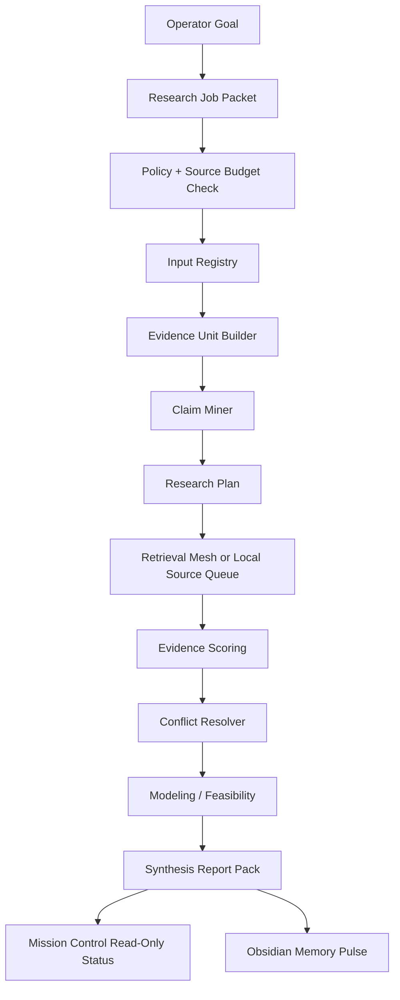

# Deep Research Control Plane

Status: local-only operating design

This document defines how GHOSTCLAW turns Deep Research from a document
template into a controlled work surface. It does not authorize web scraping,
provider calls, model installs, GPU work, connector writes, publishing, push, or
deploy. It defines how those actions will be routed later through policy,
budgets, audit logs, and evidence requirements.

## 1. Control Plane Role

The Deep Research Control Plane coordinates five things:

1. a research job packet;
2. a source and evidence registry;
3. an agent mesh with bounded responsibilities;
4. a verification and conflict loop;
5. a report pack that can drive decisions, tasks, and memory.

It is the layer between a broad business question and executable research work.
It must preserve the difference between facts, claims, assumptions, inferences,
recommendations, and unresolved questions.

## 2. Job Classes

| Job Class                 | Primary Use                                  | First Output                  | External Action Gate             |
| ------------------------- | -------------------------------------------- | ----------------------------- | -------------------------------- |
| `claim_verification`      | Check whether a claim is supported           | claim/evidence matrix         | retrieval lane                   |
| `market_intelligence`     | Compare competitors, offers, pricing         | market evidence table         | browser/source capture lane      |
| `technical_due_diligence` | Audit papers, specs, repos, datasheets       | technical risk register       | source retrieval + local parser  |
| `financial_modeling`      | Model ROI, LCOE, NPV, payback, sensitivity   | scenario model                | spreadsheet/modeling lane        |
| `visual_evidence_audit`   | Analyze screenshots, PDFs, tables, charts    | visual evidence manifest      | Visual RAG lane                  |
| `content_research`        | Turn evidence into articles, offers, scripts | evidence-backed content brief | publication QA lane              |
| `tool_feasibility`        | Evaluate GitHub tools and automation stacks  | feasibility scorecard         | external repo audit lane         |
| `decision_brief`          | Summarize options for operator decision      | executive summary             | no external gate if inputs local |

## 3. End-to-End Job Flow

Current phase stops before `Retrieval Mesh` if the job would require live web,
provider, connector, browser-session, paid-portal, or confidential upload work.

## 4. Agent Routing

| Agent             | Route Source             | Writes Runtime? | Writes Repo? | External Calls |
| ----------------- | ------------------------ | --------------- | ------------ | -------------- |
| Research Governor | job packet + policy      | yes             | templates    | no             |
| Input Grounder    | local files/metadata     | yes             | no           | no             |
| Evidence Builder  | local source registry    | yes             | schemas only | no             |
| Claim Miner       | local text/transcript    | yes             | no           | no             |
| Research Planner  | claims + source budget   | yes             | plan docs    | no             |
| Retrieval Agents  | policy-approved lane     | yes             | no           | gated          |
| Visual RAG Agent  | screenshot/PDF manifests | yes             | no           | gated          |
| Financial Agent   | local assumptions/model  | yes             | examples     | no             |
| Red Team Agent    | evidence + assumptions   | yes             | no           | no             |
| Synthesis Agent   | verified artifacts       | yes             | report docs  | no             |

KOB should plan and compress context. Codex should create local files,
schemas, validators, and report artifacts. DeerFlow can run long-horizon
research only after a sandboxed execution lane exists. Mission Control reads
status only.

## 5. Source Policy

Preferred source order:

1. primary laws, regulations, standards, tariffs, and official notices;
2. peer-reviewed papers and technical reports;
3. vendor datasheets for vendor-specific specifications;
4. public competitor pages for offer/positioning analysis;
5. reputable market data and industry reports;
6. social posts, marketing pages, and screenshots as claims, not facts.

Blocked unless a separate lane opens:

- logged-in scraping;
- captcha or quota bypass;
- paid portal extraction;
- browser profile/session export;
- confidential document upload;
- secret or token access;
- publication or live connector writes.

## 6. Evidence Scoring

Each evidence record must carry:

- source authority;
- recency;
- directness;
- transparency;
- bias/sponsorship risk;
- conflict state;
- confidence label;
- exact timestamp, page, crop, local path, or URL reference when available.

Status values:

- `supported`
- `partially_supported`
- `contradicted`
- `unverified`
- `out_of_scope`

Confidence values:

- `high`
- `medium`
- `low`
- `unverified`

## 7. Mission Control Surface

The first Mission Control panel should stay read-only and show:

- job count by state;
- latest runtime report path;
- valid/invalid job packet status;
- valid/invalid evidence pack status;
- active job classes;
- blocked external actions;
- next safe action;
- links to local docs and runtime artifacts.

No button in this panel should execute a retrieval job, provider call, connector
write, deploy, publish, or push. Execution must go through the command broker
and executor lease flow.

## 8. First Production-Useful Jobs

1. `claim_verification`: SIRINX Solar + BESS 3-year payback claim.
2. `visual_evidence_audit`: tariff/PPA/FiT PDF table verification.
3. `market_intelligence`: solar competitor landing-page positioning audit.
4. `tool_feasibility`: marketing automation GitHub repo feasibility scorecard.
5. `content_research`: evidence-backed AI Money local-business content pack.
6. `decision_brief`: weekly operator research digest from completed packs.

## 9. Go / No-Go Rules

Go for local design work when:

- packet examples validate;
- schemas parse;
- evidence pack examples validate;
- runtime report writes outside git;
- policy file exists;
- blocked action list is present.

Hold before real research execution when:

- sources are missing;
- source policy is ambiguous;
- retrieval requires external access;
- a claim is high-stakes and lacks expert review labels;
- the job would expose secrets or private client data;
- the result would be published without a QA lane.

## 10. Next Build Slice

Completed local UI slice:

1. generate a Mission Control fixture from the current runtime report;
2. add a read-only Deep Research tab;
3. create a job-packet factory for local inputs only;
4. add a validator for `source_registry.json`;
5. add a local report pack folder generator.

The next safe implementation slice is:

1. bind approved local source files or approved URLs in `source_registry.json`;
2. add source ingestion adapters only after policy allow;
3. keep retrieval and provider work behind separate executor leases.
