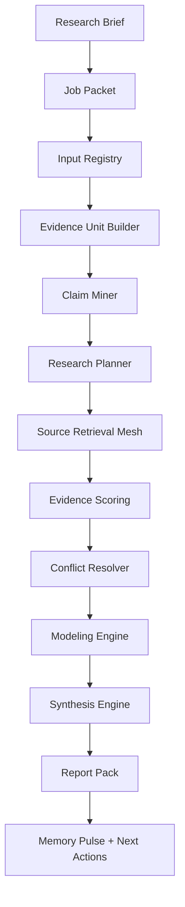

# Deep Research System Design

Status: local-only production design

This document turns Sovereign Deep Research OS into an executable design lane
for GHOSTCLAW. The target is not a generic summarizer. The target is a local
research operating system that converts messy inputs into claims, evidence,
conflicts, models, reports, and next decisions.

## 1. Operating Principle

Deep Research work must answer five questions:

1. What is being claimed?
2. What source proves or weakens each claim?
3. What conflicts exist?
4. What assumptions make the claim true or false?
5. What decision should the operator take next?

The system must separate:

- observation
- extracted claim
- external evidence
- inference
- assumption
- recommendation

## 2. System Boundary

Allowed in the current local design lane:

- create job packets
- validate local JSON examples
- design the Deep Research control plane
- generate local runtime reports
- design agent roles and evidence schemas
- prepare source budgets and stopping criteria
- create report templates

Blocked in this lane:

- browser scraping
- provider API calls
- paid portal access
- confidential raw-file upload
- public endpoint exposure
- model install or GPU execution
- publication, deploy, push, or connector write
- legal, financial, medical, or safety advice without confidence labels

## 3. End-to-End Workflow



## 4. Agent Mesh

| Agent             | Purpose                                                | Output                        |
| ----------------- | ------------------------------------------------------ | ----------------------------- |
| Research Governor | owns job packet, source budget, stop rules             | validated job manifest        |
| Input Grounder    | registers local videos, PDFs, screenshots, URLs, notes | source registry               |
| Evidence Builder  | creates timestamp/page/crop evidence units             | evidence_units.json           |
| Claim Miner       | extracts atomic claims from sources                    | claims.json                   |
| Research Planner  | converts claims into search/source plans               | query_plan.json               |
| Academic Agent    | validates technical claims against papers and reports  | academic_evidence.csv         |
| Regulatory Agent  | validates permits, laws, tariffs, standards            | regulatory_matrix.md          |
| Market Agent      | checks market size, competitors, pricing, demand       | market_evidence.csv           |
| Financial Agent   | builds ROI/LCOE/NPV/payback scenarios                  | scenario_model.json           |
| Visual RAG Agent  | handles PDF pages, tables, screenshots, charts         | visual_evidence_manifest.json |
| Red Team Agent    | challenges claims and finds contradictions             | contradiction_log.md          |
| Synthesis Agent   | writes final decision report                           | research_report.md            |

## 5. Runtime State

Runtime artifacts must stay outside git:

`/Users/sirinx/SIRINXDev/.ghostclaw_runtime/a2async/deep_research/`

Recommended folders:

- `jobs/`
- `sources/`
- `claims/`
- `evidence/`
- `models/`
- `reports/`
- `quarantine/`

Repo artifacts stay small and reviewable:

- docs
- schemas
- templates
- example packets
- validator scripts

## 6. Research Job Lifecycle

```text
DRAFT
-> PACKET_VALIDATED
-> INPUTS_REGISTERED
-> CLAIMS_EXTRACTED
-> RESEARCH_PLANNED
-> EVIDENCE_COLLECTED
-> CONFLICTS_RESOLVED
-> MODEL_BUILT
-> REPORT_DRAFTED
-> QA_CHECKED
-> READY_FOR_OPERATOR_REVIEW
```

Failure states:

```text
POLICY_BLOCKED
QUARANTINED
INSUFFICIENT_EVIDENCE
SOURCE_CONFLICT_UNRESOLVED
MODEL_ASSUMPTIONS_MISSING
```

## 7. GHOSTCLAW Integration

| GHOSTCLAW Layer    | Deep Research Role                                                 |
| ------------------ | ------------------------------------------------------------------ |
| Hermes / Policy    | source policy, budget, hard stops, confidence rules                |
| KOB                | planning, source strategy, context compression                     |
| Codex              | local schemas, validators, docs, scripts, runtime reports          |
| DeerFlow           | long-horizon research execution after sandbox approval             |
| Visual RAG Adapter | rendered-page/table/chart evidence and crop references             |
| Obsidian Brain     | concise digest pulse and durable decision memory                   |
| Mission Control    | read-only job status and report readiness                          |
| Command Broker     | blocks provider calls, browser scraping, deploy, push, publication |

Control-plane details live in
`docs/deep_research/DEEP_RESEARCH_CONTROL_PLANE.md`. That document defines job
classes, agent routing, Mission Control requirements, and the next build slice.

## 8. Output Pack

Every serious job should produce:

- `job_packet.json`
- `source_registry.json`
- `claims.json`
- `evidence_units.json`
- `source_quality_table.csv`
- `claim_evidence_matrix.csv`
- `contradiction_log.md`
- `scenario_model.json`
- `research_report.md`
- `executive_summary.md`
- `action_roadmap.md`
- `memory_pulse.md`

## 9. Quality Gates

- Every material claim is supported or marked unverified.
- Video claims include timestamps.
- PDF/table/chart claims include page/crop references.
- Financial claims include base, aggressive, and worst cases.
- Conflicting evidence is visible.
- Sponsored or marketing sources are labeled.
- Recommendations include confidence and assumptions.
- Public-facing claims go through publication QA.

## 10. First Real Use Cases

1. SIRINX Solar + BESS payback claim verification.
2. Solar tariff/PPA/FiT document verification.
3. Competitor solar landing-page evidence audit.
4. AI Money local-business offer research.
5. Marketing automation repo/tool feasibility audit.
6. Manus artifact review and conversion into Mission Control tasks.

## 11. Job Classes

Deep Research jobs should be routed by job class, not by freeform prompt alone.

| Job Class                 | Best For                                             | First Output                    |
| ------------------------- | ---------------------------------------------------- | ------------------------------- |
| `claim_verification`      | checking business, technical, or financial claims    | `claim_evidence_matrix.csv`     |
| `market_intelligence`     | competitor, pricing, channel, and offer research     | `market_evidence_table.csv`     |
| `technical_due_diligence` | papers, specs, GitHub repos, datasheets, standards   | `technical_risk_register.md`    |
| `financial_modeling`      | ROI, LCOE, NPV, payback, sensitivity ranges          | `scenario_model.json`           |
| `visual_evidence_audit`   | screenshots, charts, PDF pages, tables, dashboards   | `visual_evidence_manifest.json` |
| `content_research`        | evidence-backed article, script, and campaign briefs | `content_research_brief.md`     |
| `tool_feasibility`        | open-source tool and automation stack decisions      | `tool_feasibility_scorecard.md` |
| `decision_brief`          | operator-ready next-decision summaries               | `executive_summary.md`          |

## 12. Next Build Slice

The next safe build slice is local-only:

1. generate a Mission Control fixture from the runtime report;
2. add a read-only Mission Control tab;
3. create a local job-packet factory;
4. create a source registry validator;
5. create report-pack folder generation;
6. keep retrieval, provider, browser, publication, push, deploy, and connector
   work behind separate executor leases.
