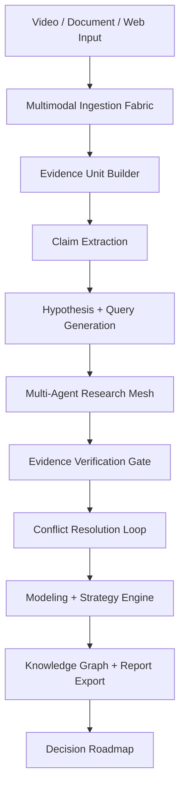
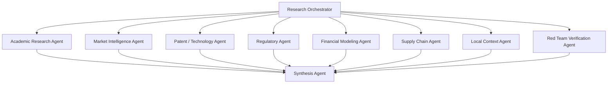

# Sovereign Deep Research OS

Status: local-only architecture spec
Positioning: MIT-inspired agentic research operating system, not MIT-certified
Boundary: no external research call, provider call, video processing, model install, or connector activation in this spec phase

## Purpose

Sovereign Deep Research OS turns video, documents, screenshots, tables, PDFs, and web sources into verified research outputs that can support strategic decisions.

The system is not a chatbot summarizer. It is a research operating system with:

- multimodal ingestion
- timestamped evidence units
- atomic claim extraction
- research planning
- multi-agent retrieval
- evidence scoring
- conflict resolution
- financial/business modeling
- knowledge graph export
- decision roadmap output

The core question it must answer is:

> What does the input claim, how well is it supported, under which assumptions is it true, what conflicts exist, and what should the operator do next?

## Non-Claims And Source Boundary

External claims from videos, posts, screenshots, or social content must not be treated as verified facts until the system has:

1. a transcript, video file, PDF, screenshot, or URL snapshot as input;
2. timestamped or location-specific evidence units;
3. independent source checks;
4. confidence scoring;
5. contradiction logging.

If a YouTube or social video is only provided as a URL or screenshot without transcript or file access, the system may create a research plan, but it must not cite the video content as verified.

## Operating Flow



## Layer A: Input And Grounding

The input layer converts raw media into auditable evidence units.

Modules:

| Module | Responsibility |
| --- | --- |
| Video Ingestion | Accept local video, metadata, and source notes |
| Scene Slicer | Split video into scene/segment ranges |
| ASR | Convert speech into transcript with timestamps |
| OCR | Extract on-screen text, tables, labels, and captions |
| Visual Grounding | Identify visible objects, charts, tables, UI, diagrams, products, and equipment |
| Timestamp Indexer | Link every claim to timestamp/page/frame/region |
| Frame Hashing | Hash frames or crops for repeatable evidence checks |

Output is not a summary. Output is an evidence ledger.

Example evidence unit:

```json
{
  "evidence_id": "vid_001_seg_04_claim_02",
  "source_type": "video",
  "timestamp_start": "00:02:14",
  "timestamp_end": "00:02:31",
  "page_number": null,
  "bbox": null,
  "modality": ["speech", "visual", "ocr"],
  "raw_text": "ระบบนี้คืนทุนใน 3 ปี",
  "visual_context": "Solar panels and battery cabinet are visible",
  "claim_type": "financial_claim",
  "confidence": 0.78,
  "source_hash": "sha256:pending"
}
```

## Layer B: Claim Extraction And Hypothesis

The system must extract atomic claims before searching.

Claim classes:

| Claim Type | Example |
| --- | --- |
| Technical | Battery chemistry tolerates high heat |
| Financial | Payback is 3 years |
| Market | Market grows 20 percent per year |
| Regulatory | No additional license required |
| Operational | Production capacity is 10 tons per day |
| Strategic | Suitable for the Thailand-Laos border market |
| Speculative | Could become the next dominant platform |

Every important claim should become multiple search queries.

Example:

```json
{
  "claim": "Solar + BESS payback is 3 years in Thailand",
  "claim_type": "financial_claim",
  "queries": [
    "Thailand commercial solar BESS payback period 2025",
    "PEA commercial electricity tariff Thailand solar battery ROI",
    "solar battery LCOE Thailand tropical degradation study",
    "Thailand solar rooftop battery storage regulation permit",
    "BESS self consumption commercial building Thailand ROI"
  ]
}
```

## Layer C: Multi-Agent Research Mesh

Research should be split by expertise, not handled by a single summarizer.



Agent roles:

| Agent | Responsibility |
| --- | --- |
| Academic Research Agent | Papers, technical reports, datasheets, PDF sources |
| Market Intelligence Agent | Business reports, competitors, pricing, adoption |
| Patent / Technology Agent | Patents, technology novelty, claims around invention |
| Regulatory Agent | Law, permits, standards, tariffs, compliance |
| Financial Modeling Agent | ROI, LCOE, NPV, sensitivity analysis |
| Supply Chain Agent | Input materials, logistics, availability, border context |
| Local Context Agent | Thai language, local market, local rules, local competitors |
| Red Team Verification Agent | Contradictions, hallucination risk, weak assumptions |
| Synthesis Agent | Final report, confidence, roadmap, unresolved questions |

## Verification Gate

Every claim must pass through a verification gate.

Evidence score:

```text
Evidence Score =
  source authority
+ recency
+ directness
+ methodological transparency
+ cross-source agreement
- conflict penalty
- sponsorship bias
- outdated data penalty
```

Confidence levels:

| Level | Meaning |
| --- | --- |
| High | Primary or authoritative sources agree, method is transparent, recent enough |
| Medium | Evidence is usable but assumptions or context are limited |
| Low | Old, indirect, marketing-led, sponsored, or conflict-heavy |
| Unverified | No independent evidence yet |

## Conflict Resolution Loop

If sources disagree, the system must not force one answer.

Resolution output must include:

- claim
- conflicting evidence
- assumptions behind each position
- scenario where the claim is true
- scenario where it fails
- base-case conclusion
- worst-case conclusion
- confidence

Example conclusion:

```text
Claim: Solar + BESS payback is 3 years.
Decision: Partially supported.
Confidence: Medium.
Reason: 3-year payback may be possible only under aggressive assumptions:
high tariff, high self-consumption, low CAPEX, favorable cycling, and limited
degradation cost. Base-case model indicates 4.8-6.2 years. Worst-case model
indicates 7.5+ years.
```

## Modeling And Strategy Engine

Quantitative claims should become models whenever possible.

Model modules:

- ROI calculator
- LCOE calculator
- NPV calculator
- payback period model
- sensitivity analysis
- risk matrix
- regulatory checklist
- scenario simulator
- supply chain dependency table

Output examples:

```text
financial_model.xlsx
scenario_simulator.json
risk_matrix.md
simulator_parameters.json
```

## Output Artifacts

The production report pack should include:

```text
01_research_whitepaper.md
02_executive_summary.pdf
03_knowledge_graph.graphml
04_claim_evidence_matrix.csv
05_actionable_roadmap.md
06_simulator_parameters.json
07_contradiction_log.md
08_source_quality_table.csv
```

## Source Budget And Stopping Criteria

Do not hard-code "read 50-100 sources" as a universal rule.

Use a budget and stop criteria:

- stop when each material claim has 2-3 independent reliable sources;
- continue when a high-impact claim has unresolved conflict;
- stop when additional sources repeat the same evidence without adding quality;
- open a red-team loop when a claim is high-risk, high-cost, legal, financial, or safety-related;
- mark as unverified when no reliable sources are found within the budget.

## MIT-Inspired Interpretation

This architecture is MIT-inspired, not MIT-certified.

Borrowed principles:

| MIT-style idea | System translation |
| --- | --- |
| Human-AI collaboration | Operator review, uncertainty labels, decision roadmap |
| Prototype-driven research | Simulator, dashboard, experiment pack |
| Multimodal intelligence | Video, speech, OCR, screenshot, PDF, table, chart |
| Creative computation | Knowledge graph, visual report, model outputs |
| Management science | ROI, NPV, scenario planning, KPI evaluation |
| Risk and regulation | Compliance checklist, red-team review, audit trail |

## Implementation Phases

### Phase 1: Video Intelligence MVP

Goal: video to timestamped claims.

Outputs:

```text
video_index.json
transcript.srt
ocr_segments.json
visual_summary.json
claims.json
```

### Phase 2: Research Agent MVP

Goal: claim to evidence.

Outputs:

```text
evidence_table.csv
source_map.json
claim_verification_report.md
```

### Phase 3: Verification And Modeling

Goal: evidence to confidence and scenarios.

Outputs:

```text
financial_model.xlsx
scenario_simulator.json
risk_matrix.md
regulatory_checklist.md
```

### Phase 4: Knowledge Graph And Executive Report

Goal: decision-ready research package.

Outputs:

```text
research_whitepaper.md
executive_summary.pdf
knowledge_graph.graphml
claim_evidence_matrix.csv
actionable_roadmap.md
```

## Orchestrator Prompt

```text
You are the Sovereign Deep Research Orchestrator.

Your mission is to transform multimodal input such as video, transcript,
documents, screenshots, tables, and web sources into a verified,
citation-grounded research report suitable for strategic decision-making.

You must not trust any single source by default.

Workflow:
1. Ingest all provided inputs.
2. Segment video or multimedia content into timestamped evidence units.
3. Extract atomic claims from speech, visuals, OCR text, charts, tables, and implied arguments.
4. Classify each claim as technical, financial, market, regulatory, operational, strategic, or speculative.
5. Generate diverse search queries for each important claim.
6. Retrieve evidence from academic, government, industry, market, legal, patent, and reputable public sources.
7. Score every source for authority, recency, directness, transparency, and bias risk.
8. Compare input-derived claims against external evidence.
9. If evidence conflicts, run a conflict-resolution loop and identify assumptions that explain the discrepancy.
10. Convert quantitative claims into mathematical or financial models whenever possible.
11. Produce a claim-evidence matrix, confidence assessment, contradiction log, strategic interpretation, implementation roadmap, risk mitigation plan, and final report.

Rules:
- Every factual claim must be supported by a citation or marked as unverified.
- Every video-derived claim must include timestamp references.
- Do not hide uncertainty.
- Do not overstate findings.
- Separate observation, inference, assumption, and recommendation.
- Prefer primary sources over commentary.
- Prefer recent sources when the topic is time-sensitive.
- Preserve data sovereignty: confidential raw files should remain local whenever possible, and only redacted claims should be sent to external services.
```

## GHOSTCLAW Integration

Recommended placement:

```text
GHOSTCLAW / SIRINXDev
├─ Hermes / Policy Gate
├─ Sovereign Deep Research OS
│  ├─ Multimodal Ingestion
│  ├─ Claim Miner
│  ├─ Research Planner
│  ├─ Research Mesh
│  ├─ Verification Engine
│  ├─ Modeling Engine
│  └─ Report Export
├─ Visual RAG Adapter
├─ AI Money System
├─ Mission Control
└─ ChatGPT Agent MCP Bridge
```

Initial connector path:

- ChatGPT Agent MCP Bridge reads completed research status and safe reports.
- Codex implements local scripts and schemas.
- Visual RAG Adapter supplies screenshot/PDF/page evidence.
- AI Money System consumes business feasibility outputs.
- Mission Control displays research job status.

## Hard Blocks

- no unverified video citation
- no confidential raw file upload without redaction policy
- no paid provider call without budget policy
- no production decision without confidence and assumption labels
- no legal/financial/safety recommendation without human expert review
- no public endpoint in the MVP

## Current Recommended Next Gate

```text
APPROVE_ADD_DEEP_RESEARCH_JOB_PACKET_AND_SCHEMA_LOCAL_ONLY
```
