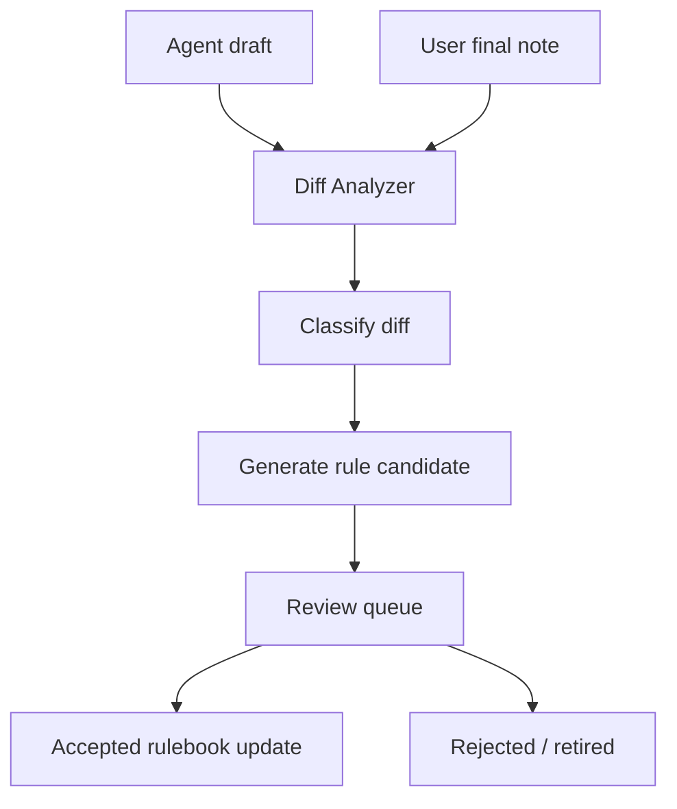

# Obsidian Edit Learning Protocol

Status: local-only protocol

## Goal

Turn user edits into transparent Markdown rules without fine-tuning a model.

## Inputs

```text
agent_draft.md
user_final.md
move_or_rename_log.json
tag_changes.json
link_changes.json
operator_comment.md
```

## Diff Classes

| Diff Class | Meaning | Rule Candidate |
| --- | --- | --- |
| title_rewrite | User changed title style | title rule |
| summary_rewrite | User rewrote summary | style rule |
| folder_move | User moved note | folder routing rule |
| tag_change | User added/removed tags | tagging rule |
| link_change | User added/removed links | linking rule |
| section_reorder | User rearranged note | template rule |
| claim_softening | User reduced certainty | evidence/uncertainty rule |
| language_change | User changed Thai/English balance | language style rule |

## Rule Candidate Schema

```yaml
rule_id: rule-YYYYMMDD-001
source_diff_id: edit-diff-YYYYMMDD-001
rule_type: style | folder | tag | link | canvas | uncertainty
status: draft
confidence: medium
before: "Agent pattern before edit"
after: "User-preferred pattern"
rule_text: "Reusable rule in plain language"
applies_to:
  - research_notes
  - business_notes
examples:
  - input: "..."
    preferred_output: "..."
```

## Learning Workflow



## Acceptance Criteria

A learned rule can become active only when:

- the diff is attributable to a real user edit;
- the rule is written in plain Markdown;
- the rule includes source diff ID;
- the rule does not encode secrets or private raw content;
- the rule does not conflict with a higher-priority safety rule;
- the operator has accepted or configured auto-accept for that rule class.

## Conflict Handling

When rules conflict:

1. safety rules override all other rules;
2. project-specific rules override generic rules;
3. newer rules do not automatically override older rules;
4. conflicting rules should be marked `needs_review`.

## Output

The system should produce:

```text
rule_candidates.md
rule_candidates.json
edit_diff_summary.md
```

No rule should be silently hidden in model memory.
