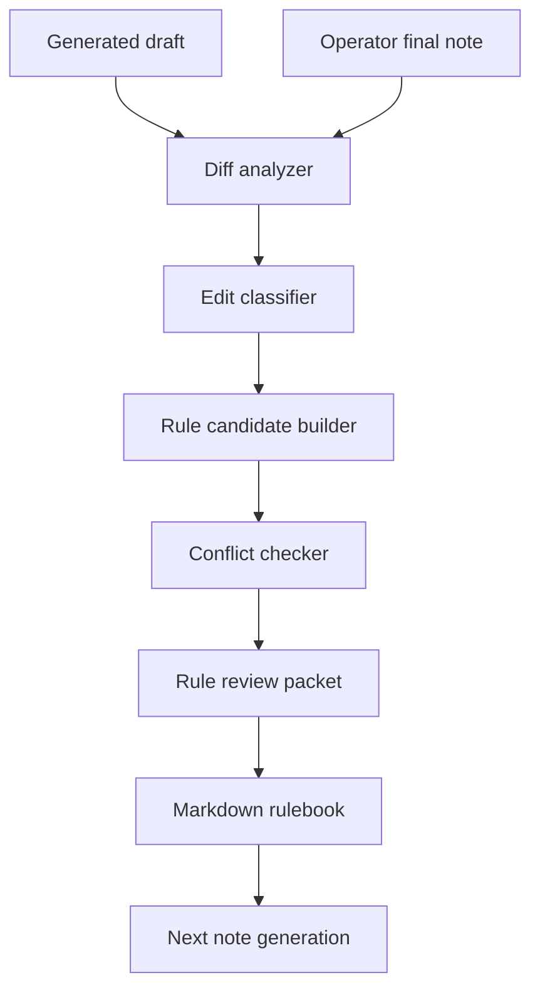

# Learning From Edits Protocol

Status: local-only protocol
Boundary: no hidden memory, no fine-tuning, no automatic rule activation in v0

## Purpose

The Obsidian Knowledge Agent should improve from real operator edits without hiding those preferences inside a model. Every improvement must be visible as Markdown, linked to evidence, and reversible through Git.

## Inputs

```text
agent_draft.md
operator_final.md
edit_diff.md
move_or_rename_log.json
tag_changes.json
link_changes.json
operator_comment.md
```

## Learning Pipeline



## Edit Classes

| Class | Signal | Candidate Rule |
| --- | --- | --- |
| `title_rewrite` | title changed | title and naming rule |
| `summary_rewrite` | opening summary rewritten | style and density rule |
| `section_reorder` | headings moved | template rule |
| `claim_softening` | certainty reduced | evidence and confidence rule |
| `folder_move` | note moved | folder routing rule |
| `tag_change` | tags added or removed | tagging rule |
| `link_change` | backlinks added or removed | linking rule |
| `canvas_relayout` | nodes moved/grouped | Canvas layout rule |
| `language_balance` | Thai/English mix changed | language style rule |

## Rule Candidate Format

```markdown
# Rule: Thai Executive Summary First

status: proposed
rule_type: style
source_diff_id: edit-diff-20260624-001
applies_to:
  - business_notes
  - project_state_notes

## Pattern

When the operator asks for a business or project note, start with the decision impact before details.

## Before

The draft opened with background context.

## After

The operator moved the decision, risk, and next action to the top.

## Rule

Start with:

- decision impact;
- current state;
- next action;
- evidence links;
- open risks.
```

## Activation States

| State | Meaning |
| --- | --- |
| `proposed` | generated from one edit diff |
| `reviewed` | accepted by operator or policy |
| `active` | used by future drafts |
| `conflict` | conflicts with existing rule |
| `retired` | kept for history but not applied |

## Conflict Rules

1. Safety and secret-handling rules override style rules.
2. Project-specific rules override generic rules.
3. Newer rules do not automatically override older rules.
4. Conflicting rule candidates must be marked `conflict`.
5. Rules with private raw content must be redacted before storage.

## Outputs

```text
edit_diff_summary.md
rule_candidates.md
rule_candidates.json
rule_conflicts.md
```

## Non-Goals

- No fine-tuning.
- No vector-only preference memory.
- No silent prompt rewriting.
- No automatic activation from a single ambiguous edit.
- No storage of private raw notes inside shared rulebooks.
