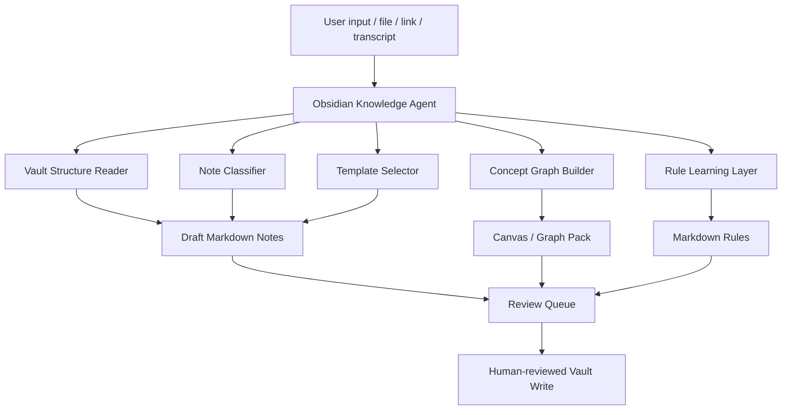

# Obsidian Knowledge Agent OS

Status: local-only architecture spec
Scope: turn Obsidian into a transparent AI knowledge system without fine-tuning or black-box memory
Boundary: no live Vault write, no connector activation, no file mutation outside an allowlist in this spec phase

## Purpose

Obsidian Knowledge Agent OS turns an Obsidian Vault into a structured, self-improving knowledge system.

The agent should be able to:

- create concise notes from short ideas, links, articles, and research snippets;
- create structured knowledge packs from larger inputs such as courses, projects, papers, and business research;
- classify notes into the existing Vault structure;
- create backlinks, tags, and concept maps;
- create Obsidian Canvas files for large knowledge domains;
- learn from user edits by storing new rules as Markdown;
- remain transparent and Git-auditable.

This system must not require model fine-tuning. It learns by updating visible Markdown rules, templates, and routing notes.

The product goal is simple: every capture should make the Vault easier to reuse next time. A short idea becomes an atomic note. A large course, research thread, or project becomes a knowledge pack with notes, links, rules, and an optional Canvas draft.

## GHOSTCLAW Placement



## Operating Modes

| Mode | Purpose | Default |
| --- | --- | --- |
| `draft_only` | Generate notes under runtime output, not Vault | Yes |
| `vault_review_queue` | Write to a review folder inside the Vault | Later |
| `direct_vault_write` | Write to final Vault locations | Blocked until explicit policy |
| `rule_learning` | Convert user edits into Markdown rules | Allowed only from diff/evidence |
| `canvas_generation` | Generate `.canvas` concept graph files | Draft-only first |

## Core Workflow

```text
Input
-> classify size and domain
-> inspect Vault rules and folder map
-> choose note template
-> draft note or knowledge pack
-> generate links/tags/concepts
-> create review packet
-> compare user edits
-> extract reusable rule
-> update transparent Markdown rulebook
```

## Knowledge Agent Loop

```text
Capture
-> classify
-> draft
-> link
-> graph
-> review
-> observe edits
-> distill rule
-> apply rule to the next draft
```

The loop is intentionally transparent. Learning happens through Markdown rules and evidence-backed edit diffs, not hidden model state.

## Note Types

| Input | Output |
| --- | --- |
| Short idea | atomic note |
| Link/article | source note + summary + claims |
| Research paper | literature note + claim/evidence table |
| Course | course map + lesson notes + concept graph |
| Project | project hub + tasks + decisions + evidence |
| Business research | market note + offer note + action roadmap |
| Video/transcript | timestamped claim notes |

## Vault-Aware Folder Contract

The agent should not invent folder chaos. It should read a small folder map first.

Example folder map:

```yaml
vault_root: "/Users/sirinx/Documents/Obsidian Vault/SIRINX"
review_queue: "00_INBOX/AI_REVIEW_QUEUE"
knowledge_rules: "00_SYSTEM/Knowledge Agent Rules"
concept_graphs: "00_SYSTEM/Canvas"
project_notes: "10_PROJECTS"
research_notes: "20_RESEARCH"
business_notes: "30_BUSINESS"
daily_notes: "40_DAILY"
archive: "90_ARCHIVE"
```

## Transparent Learning From Edits

The system learns from user edits by comparing:

- agent draft
- final user-edited note
- accepted/rejected links
- moved folder path
- renamed title
- added/removed tags
- rewritten summary style

It then writes a rule such as:

```markdown
## Rule: Thai business research summaries

When summarizing Thai business research for the operator:

- start with the decision impact;
- keep sections short;
- separate facts, assumptions, and next actions;
- include Thai-English terms if the source uses both;
- avoid overclaiming if evidence is weak.

Source: edit-diff-2026-06-24-001
Status: active
```

## Rulebook Files

Recommended Markdown rule files:

```text
00_SYSTEM/Knowledge Agent Rules/
├─ 00_RULE_INDEX.md
├─ 01_STYLE_RULES.md
├─ 02_FOLDER_ROUTING_RULES.md
├─ 03_TAGGING_RULES.md
├─ 04_LINKING_RULES.md
├─ 05_CANVAS_RULES.md
├─ 06_PROJECT_NOTE_RULES.md
├─ 07_RESEARCH_NOTE_RULES.md
└─ 99_RETIRED_RULES.md
```

## Concept Graph And Canvas

For large inputs, the agent should create:

- concept nodes;
- source nodes;
- question nodes;
- decision nodes;
- project/action nodes;
- edges with relation labels.

Example relations:

```text
supports
contradicts
depends_on
derived_from
next_action
related_to
example_of
```

The first implementation should output JSON/Markdown graph specs before writing `.canvas` files.

## Review Queue Packet

Every generated note pack should include:

```text
manifest.json
draft_note.md
source_summary.md
link_suggestions.json
tag_suggestions.json
concept_graph.json
rule_learning_candidates.md
```

## Safety Boundary

Hard blocked in v0:

- reading `.env`, credentials, browser profiles, private keys, or password stores;
- writing directly to final Vault folders;
- deleting or moving existing Vault files;
- syncing to cloud;
- publishing notes;
- sending content to third-party services;
- learning from edits without keeping the original diff evidence.

Allowed in v0:

- generate local runtime draft packs;
- read explicitly allowlisted rule files;
- write review packets under `.ghostclaw_runtime`;
- propose Vault paths and links;
- produce Markdown rules as drafts.

## Integration With Existing Systems

| System | Integration |
| --- | --- |
| ChatGPT Agent MCP Bridge | Agent can read safe Knowledge Agent status |
| Sovereign Deep Research OS | Research reports become literature/project notes |
| Visual RAG Adapter | Screenshots/PDF evidence become visual evidence notes |
| AI Money System | Offer/case-study outputs become business knowledge notes |
| Mission Control | Shows draft pack count, review queue status, rule updates |
| Hermes Memory | Stores high-level pulse, not raw private notes |

## Agent Surfaces

| Surface | Role | Boundary |
| --- | --- | --- |
| ChatGPT Agent | Morning brief, task capture, source triage | Read status and create draft requests only |
| Codex | Maintains specs, scripts, schemas, tests | No direct Vault mutation in v0 |
| Hermes | Policy and memory pulse | Records summaries, not raw private notes |
| Obsidian Vault | Source of truth for accepted knowledge | Writes require the Vault operation contract |
| Mission Control | Operator panel | Shows draft/review/rule status only |

## Value-Creation Use Cases

| Domain | Output |
| --- | --- |
| Deep Research | claim notes, evidence notes, decision maps, report index |
| AI Money System | offer notes, client case studies, prompt packs, content calendars |
| iGaming Practice | interview notes, ledger kata learnings, architecture cards |
| Visual RAG | screenshot evidence cards, PDF/table interpretation notes |
| Daily Operations | morning brief notes, action lists, project state deltas |

## Definition Of Done For v0

- Draft pack generator exists.
- Folder map is machine-readable.
- Rulebook template exists.
- Edit-learning protocol exists.
- No direct Vault mutation by default.
- Review packet can be inspected before writeback.
- Git can audit generated rules and accepted changes.
- Vault operation contract exists and is referenced by any future writer.
- Machine-readable policy blocks destructive, sync, publish, and secret-bearing paths.

## Current Recommended Next Gate

```text
APPROVE_ADD_OBSIDIAN_KNOWLEDGE_AGENT_SCHEMA_AND_DRAFT_PACK_LOCAL_ONLY
```
