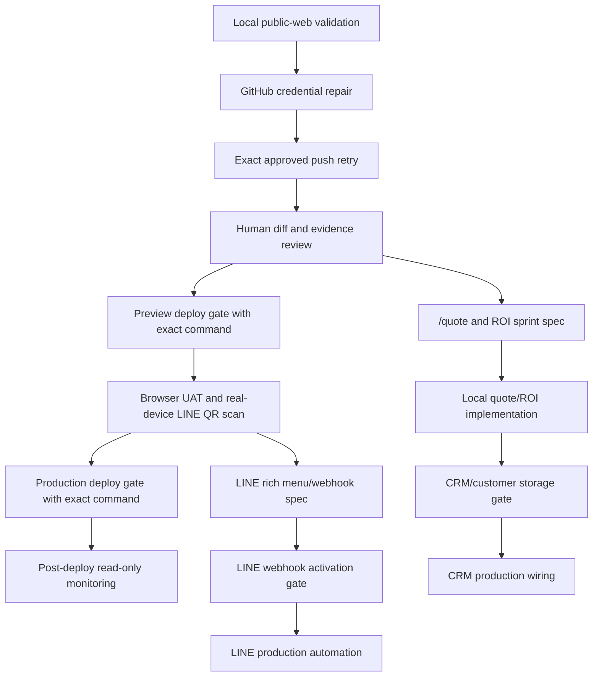

# Public Web Goal Dependency Layout - Next Gate

Status: `REMOTE_PUSHED_DEPLOY_GATE_BLOCKED`
Date: 2026-07-08
Owner lane: Codex Builder local worker

## Purpose

This document converts the active broad goal into a governed dependency layout
for the next safe execution gates. It does not change website UI, routes, remote
configuration, webhook state, analytics, CRM, or customer data storage.

## Current Public Web State

| Area | State | Evidence |
| --- | --- | --- |
| `apps/public-web` dependency layout | locally repaired | `docs/receipts/PUBLIC_WEB_DEPENDENCY_LAYOUT_REPAIR_20260708.md` |
| LINE/i18n/trust bundle | locally committed | `c75c9ef7` |
| Competitor SWOT/AEO backlog | locally committed | `4103d3ef` |
| Push gate | completed; local HEAD matches `origin/feat/sirinx-web-line-trust-v1` at `f8ae622f232f51b1e1542599d54cf1e1b8b0b270` | `docs/receipts/PUBLIC_WEB_PUSH_GATE_SUCCEEDED_20260708_1604.md` |
| Preview deploy gate | blocked; approval text used `<exact deploy command>` placeholder | `docs/receipts/PUBLIC_WEB_DEPLOY_GATE_BLOCKED_PLACEHOLDER_20260708_1634.md` |
| Evidence packet | updated to current gate | `vault/evidence/sirinx-web-line-trust-v1/EVIDENCE.md` |

## Dependency Graph

## Required Gate Order

1. Keep the current pushed branch intact and review the pushed commits on GitHub.
2. Review GitHub branch/PR evidence after the push.
3. Approve preview deploy with a real target and exact command.
4. Run browser UAT and real-device LINE QR scan.
5. Approve production deploy only after preview evidence.
6. Keep webhook, analytics, CRM, and customer storage blocked until separate
   exact gates exist.

## All-Project Rollout Dependency Layout

| Project | Next Safe Local Work | Blocked Until |
| --- | --- | --- |
| SIRINX_SOLAR / sirinx.co | Review pushed public-web branch; continue browser UAT planning | Preview deploy target and exact deploy command |
| POCKET_HATCHERY | Create context/spec pack only; no deploy or data mutation | Project owner confirms active repo/source |
| AGM_CREATIVE | Create context/spec pack only; no social automation | Project owner confirms active repo/source |
| ADS_ANDROMEDA | Create context/spec pack only; no paid provider calls | Paid ad/provider gate |
| PHITSANULOK_NEWS | Create editorial/SEO governance spec only; no publish | Publishing approval |
| GhostClaw OS | Continue local verifier/agent governance docs only | Runtime/cloud mutation gate |
| SIRINXDev Agent-Native Monorepo | Maintain governed receipts, verifiers, and task dependency maps | Exact push/deploy/provider gates |

## Public Web Sprint Backlog After Push

| Backlog Item | Dependency | Verification |
| --- | --- | --- |
| Browser UAT TH/EN/CN across public pages | pushed branch or local preview | screenshot/report packet |
| Existing bot manual confirmation | local preview and human click test | UAT receipt |
| Real-device LINE QR scan | phone scan by human | manual acceptance note |
| `/assessment` dynamic warning i18n | separate scoped refactor | language-switch verifier update |
| `/quote` intake spec | push/review stable | BRD/FRD/UI flow/test cases |
| ROI calculator upgrade | `/quote` spec approved | unit tests and build |
| CRM lead capture | explicit CRM/customer storage approval | data contract/RLS/security review |

## Stop Conditions

Stop and request a narrower gate if any of these occur:

- GitHub auth requires reading or printing secrets.
- Remote URL must be changed.
- Deploy command is a placeholder or missing target.
- Webhook, analytics, or CRM/customer data storage is requested without exact
  approval.
- Browser UAT finds visible regression in language switch, LINE CTA, existing
  bot, or mobile layout.

## Next Safe Action

Provide a real preview deploy target and exact deploy command after human/GitHub
review. The placeholder gate `Allowed command: <exact deploy command>` is not
executable and does not authorize deploy, merge, webhook activation, production
analytics, CRM/customer storage, or any production action.
