# SIRINX Agent Mesh — Architecture (Verified Current State)

- **Date:** 2026-07-19 (Asia/Bangkok, +07)
- **Scope:** Architecture of the SIRINX agent mesh as it **actually exists today** in `/Users/sirinx/SIRINXDev/sirinx-co` — not the plan. Plan-only components are drawn dashed and labeled.
- **Primary source:** `reports/agent-inventory/SIRINX_AGENT_MESH_DEEP_RESEARCH_20260719.md` (47KB deep research, same day), independently **spot-verified in this pass** against repo files (agents dir, `ronin.rs`, `roster.rs`, skills registry, `config.mjs`, `team-runtime-bridge.mjs`, `openrouter-fusion-router.mjs`, `adaptive-command-gateway.mjs`, migrations, drizzle/D1 schemas, `git worktree list`, `git log`). Where repo and report disagree, **the repo wins** — see "Discrepancies" below.
- **HEAD:** `245d029` on branch `agent/b1-b2-command-center` (`git log --oneline -8` matches the report's anchor commits).

**Diagram legend:**

| Style | Meaning |
|---|---|
| green (solid) | PRESENT — code exists and runs (may still be gated/dry-run) |
| orange (solid) | PARTIAL — scaffold/contract only, phase-locked or registry-only |
| grey (solid) | MISSING — no code path in repo |
| dashed border | PLAN / SCHEMA ONLY — documented or typed, not implemented |
| red | LOCKED — declared but cannot execute (approval-required, no call path) |

---

## Verification summary (this pass)

| Claim | Result | Evidence |
|---|---|---|
| 6 sub-agent files in `.claude/agents/` | ✅ confirmed | `ls .claude/agents/` → kai + ronin-l1..l5 (6 files) |
| 4 coded Ronin agents | ✅ confirmed | `crates/sirinx-agents/src/ronin.rs:40,61,112,147` (Kuranosuke, Junai, Kihei, Gengo); pipeline `:168` |
| 47-slot roster = plan/schema only | ✅ confirmed | `crates/sirinx-agents/src/roster.rs:34` `SIZE: u8 = 47`; only 12 codenames `:37-54` |
| 50 skills, registry says 49 | ✅ confirmed | `ls .claude/skills/ \| wc -l` → 50; `SKILLS_REGISTRY.md:4` "(49 total)" |
| Kimi K3 lane exists, locked | ✅ confirmed | `services/dev-control-api/src/team-runtime-bridge.mjs:80-100` (`moonshotai/kimi-k3`, `approval-required-paid-api`, `canCallProvider: false`) |
| Fusion panel K3 swap, no call route | ✅ confirmed | `services/dev-control-api/src/openrouter-fusion-router.mjs:13` (`moonshotai/kimi-k3`), `:349-350` (`canApproveProviderCallNow: false`, `providerCallRouteExists: false`) |
| Hermes MODEL_POLICY qwen-only | ✅ confirmed | `services/hermes-api/src/adaptive-command-gateway.mjs:35-60` (router/planner/reviewer all `qwen/qwen3.7-max`) |
| Telegram gate hardcoded "hold" | ✅ confirmed | `services/telegram-command-bot/src/config.mjs:32` (`state: "hold"` inside `TELEGRAM_SEND_GATE` `:30-39`) |
| Hermes phase lock | ✅ confirmed | `services/hermes-api/src/inbox.mjs:269` (`if (!normalized.dryRun)` → 403 `phase_1_dry_run_only` `:206`) |
| hermes-api has no own package.json | ✅ confirmed | dir = README + 4 src files only |
| Live Telegram mode refused | ✅ confirmed | `services/telegram-command-bot/src/index.mjs:25-29` (exit 1 without `--dry-run`) |
| B3 = first unblocked queue item | ✅ confirmed | `MASTER_PLAN.md:35` (queue B3–B8, B7 blocked on keystore) |
| All gate checklist boxes unchecked | ✅ confirmed | `GO_LIVE_GATE_CHECKLIST.md` — 18 `[ ]` boxes, 0 `[x]` |
| "4 lanes with worktrees (vibe/codex, vibe/opencode, claude-fable-5)" | ❌ **not found** | `git worktree list` shows main checkout + 2 codex PR-8 tmp worktrees only; no `vibe*` dirs; `claude-fable` = 0 repo hits. See Discrepancies. |

---

## Diagram 1 — Agent Mesh System Graph (verified current state)

```mermaid
flowchart TD
  subgraph ORCH["Orchestration — main worktree · branch agent/b1-b2-command-center · HEAD 245d029"]
    SRV["dev-control-api server.mjs — serves hermes-api inbox, dashboard probes, agent team view · dashboard 8710 to control 8711 (services/dev-control-api/server.mjs:615-651; INTEGRATION_MAP.md:56)"]
    MPLAN["MASTER_PLAN queue — B3 port routes into sirinx-web = next unblocked (MASTER_PLAN.md:35) · all 5 gates HOLD (crates/sirinx-store/migrations/0003_control_gates.sql:17-21) · 18/18 checklist boxes unchecked (GO_LIVE_GATE_CHECKLIST.md)"]
  end

  subgraph SUBAGENTS["Claude sub-agents — .claude/agents/ · exactly 6 files · VERIFIED"]
    L1["ronin-l1-perception-lead · Kuranosuke · L1 read-only scan, 4K class"]
    L2["ronin-l2-analysis-lead · Junai · L2 score/rank, 8K class"]
    L3["ronin-l3-decision-lead · Kihei · L3 plan docs only, 16K class"]
    L4["ronin-l4-coordination-lead · Gengo · L4 only dept allowed to edit code, 32K class"]
    L5["ronin-l5-research-lead · Mimura · L5 advisories + web, 128K class"]
    KAI["kai-customer-liaison · Kai · DRAFTS only · customer_messaging gate hold"]
  end

  subgraph RONINCODE["Coded Rust agents — 4 of 47 REAL · crates/sirinx-agents/src/ronin.rs"]
    PIPE["run_lead_pipeline: Kuranosuke 01 to Junai 17 to Kihei 26 to Gengo 36 (ronin.rs:40,61,112,147,168) · Lead to PendingWork · tested"]
  end

  subgraph ROSTER47["47-Ronin roster — PLAN / SCHEMA / DESCRIPTORS ONLY"]
    PDOC["Org chart: AGENT_TEAM_PLAN.md:15-22 · L1 01-16 + L2 17-25 + L3 26-35 + L4 36-43 + L5 44-47 = 47 + Kai unnumbered"]
    PRS["Rust schema: roster.rs:34 SIZE=47 · only 12 codenames known (:37-54)"]
    PJS["JS descriptors: agent-team.mjs:108-163 · 47 numbered role descriptors · mode 12-active-profiles-plus-47-role-roster (:306-307) · profiles live outside repo at ~/.hermes/profiles"]
    POVR["Overstated done-claim: MASTER_PLAN.md:23 (A9) says 47 Ronin sub-agents consolidated — reality is 6 files + 4 coded agents"]
  end

  subgraph MODELS["Model lanes — ALL LOCKED · NO provider-call code path exists anywhere"]
    K3["kimi-k3-openrouter · moonshotai/kimi-k3 · NEW in 245d029 · approval-required-paid-api · canCallProvider false (team-runtime-bridge.mjs:80-100)"]
    QW["qwen-3-7-max-openrouter · qwen/qwen3.7-max · approval-required-paid-api (team-runtime-bridge.mjs:58-78)"]
    OLL["qwen-3-6-local-ollama · observed-local-model · manual local smoke planning only (:102-124)"]
    FUS["Fusion Router panel x5 incl moonshotai/kimi-k3 (:13, swapped for ~moonshotai/kimi-latest) + judge (:16) · canApproveProviderCallNow false (:349) · providerCallRouteExists false (:350)"]
    HP["Hermes MODEL_POLICY — router/planner/reviewer all qwen-only · K3 absent (adaptive-command-gateway.mjs:35-60) · canCallProvider false, shouldForwardToLlm false (:420-441)"]
  end

  subgraph INTEG["Integrations — rated by code, not docs"]
    A2A["a2a-sync — POST /api/a2a/sync + /api/a2a/route (sirinx-control/src/lib.rs:357-358,602-660) · no client loop, no card persistence"]
    OMNI["OmniRoute — in-memory capability router (sirinx-a2a/src/lib.rs:41-88) · singleton Arc RwLock in sirinx-control (:67-68)"]
    MUX["agents-mux — tmux launcher web/dashboard/control/telegram-dry-run/audit (scripts/agents-mux.sh:1-77)"]
    CDX["codex — handoff protocol + gated driver registry · classification passed, dry-run only (CODEX_HANDOFF.md:14; agent-driver.mjs:22-28)"]
    CLD["claude — 6 agents + 50 skills real · launcher gated · canLaunchAgents false (agent-driver.mjs:29-35,110)"]
    TG["telegram — redacted config + dry-run bot + preview · live refused (index.mjs:25-29) · gate hardcoded hold (config.mjs:32) · durable gate not linked"]
    HRM["hermes — inbox normalizer + policy gate + command gateway · phase-locked dry-run (inbox.mjs:269-271) · no own package.json · served via dev-control-api"]
    OPC["opencode — registry entry only · classification needs_install · no binary invocation (agent-driver.mjs:59-65)"]
    CCW["claude-cowork — 0 repo hits · only Microsoft Copilot Cowork as comparison in a skill doc"]
    CMX["cmux — one comment only (scripts/agents-mux.sh:5-6)"]
  end

  subgraph SKILLS["Skills layer — 50 dirs VERIFIED · registry + 4 docs still say 49 (SKILLS_REGISTRY.md:4)"]
    SK["24 stub · 21 doctrine-complete · 3 reference · 2 active · 3 skills reference stale paths (sirinx-master-knowledge to apps/sirinx-web — does not exist; start-run-debug + website-browser-automation to absent pnpm dashboard:*)"]
  end

  SRV --> HRM
  SRV --> TG
  L1 --> L2 --> L3 --> L4
  L5 -. "advises only, never decides" .-> L3
  KAI -. "drafts wait on customer_messaging gate (hold)" .-> MPLAN
  SUBAGENTS == "only the L1-L4 leads also exist as executable Rust" ==> PIPE
  ROSTER47 -. "plan-only superset of the 6 real files" .-> SUBAGENTS
  SK -- "capabilities auto-loaded as skill:name (main.rs:48-54)" --> OMNI
  A2A --> OMNI
  MUX -. "launches sirinx-web + control, never codex/claude/opencode binaries" .-> SRV
  K3 -. "declared, never callable" .-> FUS
  HP -. "policy ignores K3, stays qwen-only" .-> QW
  MPLAN -. "B5 will register hermes-os :9000 card — queued, not built" .-> A2A

  classDef present fill:#143d1f,stroke:#3fa34d,color:#e8f5e9;
  classDef partial fill:#4a2c00,stroke:#e69100,color:#fff3e0;
  classDef missing fill:#333,stroke:#777,color:#ccc;
  classDef plan fill:#1c1c24,stroke:#9e9e9e,stroke-dasharray:6 4,color:#cfcfcf;
  classDef locked fill:#3d0c0c,stroke:#c62828,color:#ffcdd2;

  class A2A,OMNI,MUX,CDX,CLD,PIPE,L1,L2,L3,L4,L5,KAI,SK,SRV present;
  class TG,HRM,OPC partial;
  class CCW,CMX missing;
  class PDOC,PRS,PJS,POVR plan;
  class K3,QW,OLL,FUS,HP locked;
  style ROSTER47 stroke:#9e9e9e,stroke-dasharray:6 4,color:#cfcfcf;
```



**Read:** the only fully real agent machinery is the 6 markdown sub-agents (doctrine) + the 4-agent Rust lead pipeline (code) + 50 skills + OmniRoute/A2A plumbing inside sirinx-control. Everything else is locked lanes, dry-run scaffolds, registry entries, or plan documents.

---

## Diagram 2 — Storage / Persistence Layer (as actually found)

**What exists:** there is **no SQLite, sled, redb, or local DB file anywhere** in the repo. Durable state lives in **three separate, unconnected stores** plus an in-memory default:

1. **Postgres (Supabase) via sqlx** — primary Rust store. `crates/sirinx-store` defines `trait Store` (`src/lib.rs:42`) with two impls: `PostgresStore` (`src/postgres.rs:19`, chosen when `DATABASE_URL` is set) and `MemoryStore` (`src/memory.rs:17`, default — **data not persisted**). Both `sirinx-web` (`src/main.rs:15-26`) and `sirinx-control` (`src/main.rs:15-27`) select backend by env var. 4 migrations create 6 tables, all RLS-enabled with no public policies.
2. **Cloudflare D1 `sirinx-unified-db`** — edge store behind the brain-sync worker (`infra/cloudflare/brain-sync-worker/schema.sql`, 4 tables incl. FTS5). Header claims applied live 2026-07-18 (`schema.sql:1-3`) — **not independently verifiable**; worker deploy is gated (`wrangler.toml:5-8`).
3. **MySQL via Drizzle** — `apps/public-web` app-level store (`drizzle.config.ts:11` `dialect: "mysql"`; 7 tables in `drizzle/schema.ts:6,24,61,92,121,140,168`). Separate from the Rust/Supabase layer; no code links them.
4. **JSON/markdown files are NOT durable stores** — `exports/` contains only a handoff example (`node-heartbeat.example.json`); `exports/telegram-preview-latest.json` does not exist yet (preview never run on this checkout). The OmniRoute agent-card registry is **in-memory only** (`sirinx-control/src/lib.rs:67-68,99`) — cards are lost on restart; the D1 `a2a_agent_cards` replica is populated independently and nothing syncs the two.

```mermaid
erDiagram
  %% ── Store 1: Postgres/Supabase (sqlx, crates/sirinx-store/migrations 0001-0004) ──
  WEB_LEADS {
    uuid id PK
    text status
    double monthly_electric_bill
    jsonb interest
    jsonb consent
    timestamptz created_at
  }
  WEB_ANALYTICS_EVENTS {
    bigint id PK
    text event
    jsonb payload
    text page
    jsonb consent
  }
  WEB_PENDING_WORK {
    uuid id PK
    text source
    text title
    jsonb detail
    text status
    text claimed_by
  }
  WEB_CONTROL_GATES {
    text name PK
    text state
    text ticket
    timestamptz updated_at
  }
  WEB_FAILURE_EVENTS {
    uuid id PK
    uuid run_id
    text tool_name
    text error_kind
    int attempt
  }
  WEB_LESSONS {
    uuid id PK
    text tool_name
    text error_kind
    text guidance_kind
    bigint occurrences
  }

  %% ── Store 2: Cloudflare D1 sirinx-unified-db (brain-sync-worker/schema.sql) ──
  BRAIN_NOTES {
    text id PK
    text path
    text title
    text content
    text tags
    int deleted
  }
  BRAIN_NOTES_FTS {
    text id
    text title
    text content
  }
  BRAIN_SYNC_LOG {
    integer id PK
    text node_id
    integer pushed
    integer pulled
    text synced_at
  }
  A2A_AGENT_CARDS {
    text id PK
    text name
    text capabilities
    text endpoint
    integer priority
  }

  %% ── Store 3: MySQL via Drizzle (apps/public-web/drizzle/schema.ts) ──
  PW_USERS {
    int id PK
    text email
  }
  PW_LEADS {
    int id PK
    text status
  }
  PW_BLOG_POSTS {
    int id PK
    text slug
  }
  PW_PROJECTS {
    int id PK
    text title
  }
  PW_CONTACT_SUBMISSIONS {
    int id PK
    text email
  }
  PW_PAGE_VIEWS {
    int id PK
    text path
  }
  PW_EVENTS {
    int id PK
    text event
  }

  WEB_LEADS ||--o{ WEB_ANALYTICS_EVENTS : "same web funnel, no FK, migration 0001"
  WEB_PENDING_WORK ||--|| WEB_CONTROL_GATES : "queue rows fire pg_notify while gates decide execution, no FK, migrations 0002-0003"
  WEB_FAILURE_EVENTS ||--o{ WEB_LESSONS : "rolled up via dedupe key, logical rollup, no FK, migration 0004"
  BRAIN_NOTES ||--|| BRAIN_NOTES_FTS : "FTS5 virtual index mirror, schema.sql"
  BRAIN_NOTES ||--o{ BRAIN_SYNC_LOG : "sync runs logged per node, logical, no FK"
```



**Notes on the relationships drawn:** none of these tables have cross-table foreign keys; the drawn edges are the *logical* couplings that exist in code (shared funnel, notify trigger + gate decision, lesson rollup, FTS mirror, sync log). `web_control_gates` is seeded with 5 gates all `hold`, CHECK-constrained so `open` requires a non-blank ticket (`0003_control_gates.sql:9-21`).

---

## Diagram 3 — Dispatch Flow As It Works Today (dry-run / phase-locked)

```mermaid
sequenceDiagram
  autonumber
  participant H as Human operator
  participant D as dev-control-api server.mjs
  participant I as hermes-api inbox.mjs
  participant P as policy-core index.mjs
  participant G as adaptive-command-gateway.mjs
  participant S as sirinx-store — Postgres if DATABASE_URL else MemoryStore

  H->>D: POST /api/hermes-inbox/dry-run (server.mjs:615-651)
  D->>D: signatureVerified hard-coded false (server.mjs:620)
  D->>I: normalizeHermesInboxRequest (inbox.mjs:86-179)
  I->>I: non-local source without verified signature → 401 (inbox.mjs:265-267)
  I->>I: dryRun===false → 403 phase_1_dry_run_only (inbox.mjs:269-271,206)
  I->>P: policy evaluation (index.mjs:134-201)
  P-->>I: externalWrites false · approval gates for external/customer/paid/destructive
  I-->>D: dry-run result, never a real write
  D->>S: 202 → auto-open approval request record (server.mjs:623-632)

  H->>G: slash command e.g. /mission (adaptive-command-gateway.mjs:231-418)
  G->>G: parse + classify per MODEL_POLICY qwen-only (:35-60)
  Note over G: provider NEVER called — canCallProvider false, shouldForwardToLlm false (:420-441); provider_call in BLOCKED_ACTIONS (:26)
  G-->>H: mission lands WAITING_APPROVAL, approvalRequired true (:456,472)
  G-->>H: workerExecution all false (:648-697)

  H->>D: npm run telegram:preview (telegram-notify-preview.mjs:23-40)
  D-->>H: writes exports/telegram-preview-latest.json only
  Note over D: preview does NOT consult durable gate; JS gate hardcoded hold (config.mjs:32); real send triple-gated --send + env creds + SIRINX_TELEGRAM_CONFIRM=SEND

  Note over H,S: NOT WIRED TODAY — provider call (any lane), worker/MCP execution, gateway restart, Telegram live send, deploy, heartbeat endpoint, A2A client sync loop, card persistence
```

**The only end-to-end path that completes today:** a dry-run inbox request → policy gate → approval-request record. Everything downstream of "approved" (execute, send, deploy, call a model) stops at a named, hold-by-default gate that requires a human ticket.

---

## Discrepancies found (report / commissioning brief vs repo)

1. **"4 lanes with worktrees" (brief) — not verifiable, likely stale.** `git worktree list` today shows: main checkout (`agent/b1-b2-command-center`) + `/private/tmp/sirinx-pr8-candidate-20260719` + `/private/tmp/sirinx-pr8.i38fKJ` (both codex PR-8 branches). No `vibe/codex`, no `vibe/opencode` directories or branches, `claude-fable-5` = 0 repo hits. Diagram 1 therefore draws lanes as **logical/registry lanes**, and actual on-disk worktrees are recorded here only.
2. **Checklist box count:** deep-research report says "19/19 prerequisites open" (`§f` G11); the file contains **18** `[ ]` checkboxes, 0 checked (verified by grep). All-unchecked status itself confirmed.
3. **K3 lane line range:** report says `team-runtime-bridge.mjs:80-100`; confirmed exactly (`makeKimiK3OpenRouterLane()` spans :80-100, `id` at :82, `modelId` at :85).
4. **hermes-api file count:** report says 5 files — README.md + 4 src files = 5, confirmed; no `package.json`, confirmed.
5. **Skills per-status breakdown** (24 stub / 21 doc / 3 reference / 2 active, 3 stale-path) is taken from the deep-research report's per-skill table; this pass verified the total (50) and the registry drift (49), not all 50 individual statuses.

No other disagreements: every load-bearing claim in §a–§f of the research report that was spot-checked (agents, roster, K3, fusion router, Hermes policy, telegram gate, phase lock, gates SQL, B3 queue, mux, driver locks, claude-cowork/cmux absence) matched the repo.

---

## Truth Protocol — what could NOT be verified

- **Live deployment of the brain-sync worker** to Cloudflare; `schema.sql:1-3` header claims D1 applied 2026-07-18 — repo-external, unverifiable here.
- **Existence/pricing of `qwen/qwen3.7-max` and `moonshotai/kimi-k3` on OpenRouter** — `sourceVerification` strings are hardcoded (`team-runtime-bridge.mjs:68,90`); code itself warns "recheck before paid call" (`openrouter-qwen-adapter.mjs:253`).
- **Whether OpenRouter accepts `~vendor/x-latest` panel slugs** — likely placeholders (one was already swapped out by 245d029).
- **The 24/21/3/2 skills status split** (verified 50 total + registry drift only).
- **External systems:** hermes-os A2A at `127.0.0.1:9000`, Obsidian vaults, GhostClaw repo, `~/.hermes/profiles`, legacy `/Users/sirinx/sirinx-os` — outside this repo.
- **Bot-token rotation status** for the hardcoded token in the sirinx-solar-energy audit copy (`project-inventory.mjs:258-262`) — a human action outside the repo.
- **Where `pnpm night-watch` is defined** (referenced only in `project-inventory.mjs:400`).
- **Whether any wrapper enforces the durable gate** on `telegram-notify-preview.mjs --send` — repo shows procedural gating only.
- **Origin of the brief's "vibe/codex, vibe/opencode, claude-fable-5" worktrees** — possibly a different machine or an already-cleaned-up state; treated as plan context, not repo reality.
- **`OPENROUTER_API_KEY` / `DATABASE_URL` presence in the host environment** — deliberately not checked (secret-presence is a manual gate step).

---

*Generated 2026-07-19. Read-only: no repo files modified except this report; no gates opened, no secrets read, no git writes.*
