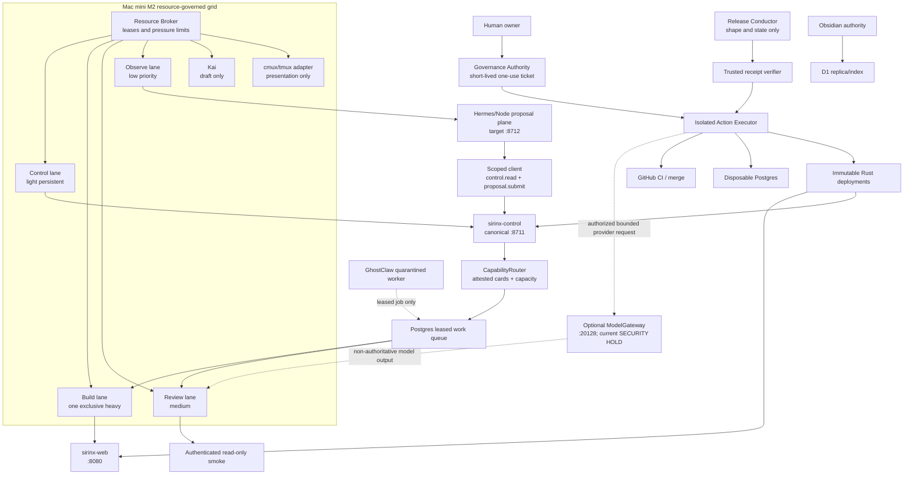
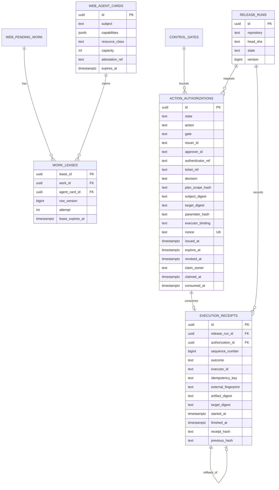
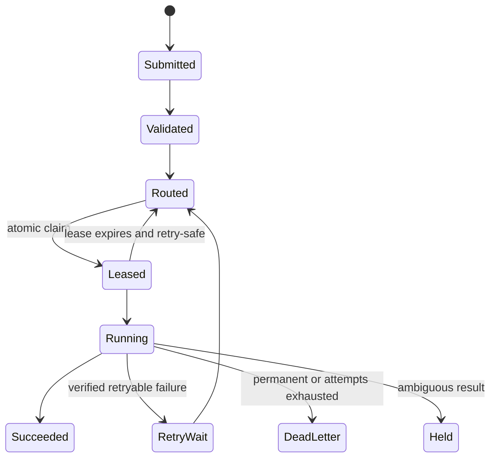

# SIRINX Agent Mesh Migration Blueprint

- Date: 2026-07-19 (Asia/Bangkok)
- Mode: architecture and contract artifacts only
- Candidate branch: `codex/agent-mesh-migration-blueprint-20260719`
- Candidate base: `41bfffa`
Production status: **NOT PRODUCTION-COMPLETE**

## 1. Executive decision

The target is a ticket-driven release and agent mesh, not blanket autonomous
authority. The system may advance automatically after a narrow authorization is
verified, atomically claimed, used once, and bound to an exact subject, target,
SHA or artifact digest, action, expiry, and rollback plan.

The following remain separate external side effects and must never inherit one
another's authority:

1. unlock or relock billing;
2. rerun CI;
3. create and destroy a disposable Postgres instance;
4. run authenticated read-only browser smoke;
5. approve and merge PR #8;
6. deploy `sirinx-web`;
7. deploy `sirinx-control`;
8. verify post-deploy health and close billing.

Any timeout after dispatch is `UNKNOWN`, not a retryable failure. The release
must stop at `HELD` until a trusted receipt is reconciled.

This document does not authorize source changes, installs, provider calls,
message sends, GitHub mutations, merge, push, billing changes, or deploy. The
current spec-first contract still requires the exact approval phrase
`APPROVE_IMPLEMENTATION` before implementation work begins.

## 2. Requirement-to-decision matrix

| User outcome | Current evidence | Target decision | Completion evidence |
|---|---|---|---|
| All Mac mini agents in auto-mode | Only a small subset of local services is active; no `sirinx-agents` mux session | Map logical agents onto five resource-governed lanes | Active leases, pressure telemetry, clean shutdown receipts |
| Spawn sub-agents | Logical routing exists; A2A is local “A2A-style” only | Attested agent cards, capacity, TTL, leases, official protocol boundary | Card attestation and completed work receipts |
| cmux grid | Latest supplied UI shows one `sirinx` workspace with four visible panes; pane process/worktree health is not proven and external CLI inventory was denied | Keep tmux as execution baseline; add a dedicated cmux adapter | Adapter contract tests against a pinned cmux release plus pane/lease receipts |
| Mermaid system and database | Existing documents mix planned and live claims | Use the verified diagrams in this blueprint | Review tied to this commit |
| Postman API | External collection reference exists, but no export was versioned | Check in a loopback-only dry-run collection now; OpenAPI 3.1 becomes the later source of truth | JSON validation plus Newman contract run when tooling is already available |
| Research all GitHub repos | Old audit listed 12 repos | Track all 18 owned repos; quarantine imports one repo/feature per PR | Pinned source SHA, license/security review, provenance manifest |
| Top-tier/trending research | Star counts are adoption hints, not architecture proof | Borrow patterns only after fit, license, security and eval review | ADR per adopted pattern |
| OmniRoute | Two unrelated products share one name | Rename concepts to `CapabilityRouter` and optional `ModelGateway` | No ambiguous configuration or metrics names |
| Superpowers | Methodology reference only | Use its spec/review/checkpoint discipline; do not make it runtime authority | Workflow checklist, no runtime dependency |
| PR #8 release | Remote branch and old evidence are behind the corrected candidate | Rebuild evidence for exact candidate SHA after external gates open | Authoritative receipts for every release stage |

## 3. Authoritative evidence boundary

### 3.1 Local runtime snapshot

Read-only audit timestamp: `2026-07-19T02:09:09+07:00`.

| Area | Verified snapshot | Decision |
|---|---|---|
| Host | Apple M2, 8 GB RAM, macOS 26.5.2 | One heavy lane maximum |
| Disk | Data volume at 95%, about 11-12 GB free | **CAPACITY HOLD** for Docker builds, clones, disposable DB and local-model work |
| tmux | Two one-window sessions only | No evidence of a four-lane or 47-process mesh |
| cmux | App 0.64.19 active; latest supplied UI shows one `sirinx` workspace with four panes; external CLI inventory denied | Layout verified from UI only; pane commands, worktrees, leases and health remain unverified |
| Node dashboard/control | `:8710` and `:8711` active; control is local dry-run | Preserve as proposal/read-model plane |
| Rust web/control | `:8080` down; Rust control not running | No live Rust service claim |
| Hermes | `:8643`, `:8644`, and local A2A `:9000` active | Local dry-run/proposal evidence only |
| Model gateway | Earlier audit found `:20128` down; a later snapshot found a Node dev listener on `*:20128`; same-session bounded health observations varied between HTTP 500 and timeout | **SECURITY/READINESS HOLD**: volatile LAN-wide bind, unhealthy readiness, no provider inference proof |
| Databases | Postgres/MySQL/Redis/NATS listeners absent; OrbStack stopped | No current database runtime claim |
| Telegram | Send gate remains held | Dry-run only |
| Hermes `:9119` | Loopback dashboard exposed a credential-bearing page without enforced auth | **SECURITY HOLD**; do not expose or tunnel |

The original working repositories were dirty during the audit. Runtime/source
parity therefore remains unverified even where a listener responded.

### 3.2 Screenshot evidence

The supplied Kimi screenshot shows two Kimi UI sub-agent cards (`Kat` and
`Zack`) reporting research work. This is evidence of that UI state only; it does
not prove a local cmux workspace, tmux worktrees, A2A conformance, or provider
inference.

The Hermes One screenshot shows a request that stopped after one invalid API
response and labels the fast response as likely rate-limited. It does not prove
the provider cause, Kimi K3 activation, or a successful model call. No automatic
provider retry is authorized from this evidence.

The latest cmux screenshot shows a functioning `sirinx` workspace layout with
four panes. Its messages are downstream: two Codex agent-definition errors, a
dangerous hook-bypass invocation, a Kimi compatibility stub, and a MaxPlus key
pool mismatch. `reports/runtime/CMUX_RECOVERY_PACKET_20260719.md` contains the
bounded recovery plan. None of those messages is evidence of a cmux config
parse failure.

### 3.3 PR #8 candidate truth

| Object | State at this snapshot |
|---|---|
| Remote release branch | `origin/agent/b1-b2-command-center@b7ba23f` |
| Prior hardened evidence commit | `929681a` |
| Corrected local candidate | `41bfffa` (`407355f` plus `41bfffa`) |
| Old image/evidence binding | Bound to an older SHA and therefore stale for the corrected candidate |
| Billing | External lock remains unresolved |
| Merge/deploy | Not authorized and not performed |

The corrected candidate passed local Rust format/clippy/tests, Node checks,
120 control tests, 13 release-preflight tests, 9 Telegram tests, and diff checks.
Those checks are local preparation only. A normal Cargo run may skip Postgres
integration tests when `TEST_DATABASE_URL` is absent, so it is not new evidence
for migrations 0003-0004 on disposable Postgres.

## 4. GitHub portfolio truth

Authenticated GitHub inventory timestamp: `2026-07-19 02:07:08 +07`.

- 18 owned repositories: 12 public and 6 private.
- All were non-archived and non-forks at the snapshot.
- `codexskills` and `sirinx-godmode` were empty and are not capabilities.
- Repository descriptions are owner claims, not runtime proof.
- No repository was cloned, installed, or executed during this inventory.

| Repository | Visibility | Role / disposition |
|---|---|---|
| `sirinx-co` | Public | Canonical target monorepo; current release hold |
| `sirinx-os` | Private | Local-first agent OS; quarantine source, dirty runtime checkout |
| `hermes-os` | Private | Hermes local control plane; proposal/operator boundary |
| `automated-marketing-agency` | Public | Candidate marketing/CRM patterns; selective intake |
| `sirinx` | Public | Corporate web candidate; selective intake |
| `sirinx-solar-energy` | Public | Solar domain candidate; high-risk integration review |
| `ghost-claw-os` | Public | Contract/scaffold candidate; security quarantine |
| `automation-mobile-app` | Public | Mobile GhostClaw references; security quarantine |
| `automation-dashboard` | Public | Dashboard candidate |
| `automation-documentation` | Public | Documentation source |
| `automation-system-backend` | Public | API/database candidate |
| `chokma-growth-os` | Private | Growth/CRM candidate |
| `oz-corp-omega-dual-node` | Public | Large topology source; very-high-risk selective intake |
| `oz_mobile_app` | Private | Mobile/MCP/debate candidate |
| `sirinx-skills-kit` | Public | Skills-only package |
| `unknowcoding-newbie-dev-skill` | Public | Skills-only package |
| `codexskills` | Private | Empty placeholder |
| `sirinx-godmode` | Private | Empty placeholder |

The May audit map is stale: it covers 12 repos, omits six current repos, and
describes `sirinx-co` as a single-page target at `046ad37`. Source heads for
`automated-marketing-agency`, `ghost-claw-os`, and `sirinx` have also drifted.
The rule remains: never bulk-copy; pin a source SHA and import one bounded
feature per reviewed PR.

Root metadata in `ghost-claw-os` and `automation-mobile-app` included an Android
release-keystore filename. The file was not opened. Both repos require an
explicit secret-history and signing-key quarantine review before any intake.

## 5. Reference research: borrow patterns, not products

Star counts below are a point-in-time adoption signal and can change. They do
not replace official documentation, license review, security review, or a local
evaluation.

| Domain | High-signal references at the snapshot | Pattern to evaluate |
|---|---|---|
| Agent orchestration | [Hermes Agent](https://github.com/NousResearch/hermes-agent) 216,787 stars; [OpenHands](https://github.com/OpenHands/OpenHands) 81,205; [deer-flow](https://github.com/bytedance/deer-flow) 77,348; [AutoGen](https://github.com/microsoft/autogen) 59,809; [CrewAI](https://github.com/crewAIInc/crewAI) 55,740; [LangGraph](https://github.com/langchain-ai/langgraph) 37,569; [OpenAI Agents SDK](https://github.com/openai/openai-agents-python) 27,994 | Durable handoff, checkpoint, eval, human review |
| Terminal/grid | [tmux](https://github.com/tmux/tmux) 47,848; [Zellij](https://github.com/zellij-org/zellij) 34,347; [cmux](https://github.com/manaflow-ai/cmux) 24,730; [herdr](https://github.com/ogulcancelik/herdr) 17,933; [claude-squad](https://github.com/smtg-ai/claude-squad) 8,135 | Worktree isolation and attention management; cmux license/adapter review |
| Model gateway | [LiteLLM](https://github.com/BerriAI/litellm) 53,950; [external OmniRoute](https://github.com/diegosouzapw/OmniRoute) 18,665; [Portkey Gateway](https://github.com/Portkey-AI/gateway) 12,466 | Budgets, fallback, telemetry; credentials stay gated |
| Postgres queue | [River](https://github.com/riverqueue/river) 5,449; [PGMQ](https://github.com/pgmq/pgmq) 5,028; [pg-boss](https://github.com/timgit/pg-boss) 3,760; [Graphile Worker](https://github.com/graphile/worker) 2,332; [Apalis](https://github.com/apalis-dev/apalis) 1,324 | Atomic lease, visibility timeout, archive/DLQ |
| Protocol | [A2A](https://github.com/a2aproject/A2A) 24,850; [MCP servers](https://github.com/modelcontextprotocol/servers) 88,613; [MCP Rust SDK](https://github.com/modelcontextprotocol/rust-sdk) 3,641; [A2A Rust SDK](https://github.com/a2aproject/a2a-rs) 51 | Pinned official protocol conformance and auth; reference servers are not production proof |
| API contract | [OpenAPI Generator](https://github.com/OpenAPITools/openapi-generator) 26,578; [Swagger UI](https://github.com/swagger-api/swagger-ui) 28,903; [Redoc](https://github.com/Redocly/redoc) 25,815; [Scalar](https://github.com/scalar/scalar) 15,637; [Newman](https://github.com/postmanlabs/newman) 7,243 | OpenAPI 3.1 as source, generated Postman/Newman |

Weekly trending at the same snapshot included
[stablyai/orca](https://github.com/stablyai/orca),
[openai/codex](https://github.com/openai/codex), and
[DesktopCommanderMCP](https://github.com/wonderwhy-er/DesktopCommanderMCP).
Trending is a discovery stream only. Fleet UIs and desktop-control MCPs have
broad mutation surfaces and stay quarantined until license/security/eval gates
pass.

## 6. Bounded contexts and authority

| Context | Owner | May write | Must not own |
|---|---|---|---|
| Web Funnel | `sirinx-web` | leads, consented analytics | release gates, agent authorization |
| Governance Authority | `sirinx-control` governance module | gates, one-use authorizations, revocations | provider credentials, deploy execution |
| Work Coordination | queue/card services | work state, leases, card presence | business leads, billing |
| Agent Runtime | logical L1-L5/Kai workers | bounded work outputs and receipts | direct external authority |
| Release Evidence | release ledger | runs, verified receipts, hash chain | execution credentials |
| Action Executor | isolated ticket-specific adapters | external action receipt only | policy decisions |
| Hermes Local Operator | Node/Hermes proposal plane | local proposals/read models | authoritative gates or receipts |
| Knowledge Plane | Obsidian local authority, D1 replica | curated knowledge/index | execution authority |
| GhostClaw Media Jobs | future leased workers | job artifacts in quarantine | gates, billing, customer send |

The current `/api/actions` endpoint must be treated as a plan preview. An open
gate currently returns `executed:true` without a real executor or immutable
receipt; that response is not execution proof.

## 7. Target topology

### Port and name decisions

| Surface | Target | Decision |
|---|---:|---|
| Developer dashboard | `8710` | UI only |
| Rust canonical control | `8711` | Governance/work authority, loopback or private Access |
| Node long-tail compatibility | `8712` | Local proposal/read/dry-run plane only |
| Rust web | `8080` | Public service |
| Hermes local A2A | `9000` | Adapter candidate, not protocol proof |
| Optional model gateway | `20128` | `ModelGateway`; current LAN-wide listener/inconsistent HTTP-500-or-timeout health hold; target loopback-only until separately approved |
| Hermes insecure dashboard | `9119` | Security hold; no tunnel/exposure |

The Rust in-process type currently named `OmniRoute` becomes the documented
`CapabilityRouter`. The external provider/model gateway keeps the documented
name `ModelGateway`. They must use different config namespaces, metrics, ports,
and tickets. A separate OmniRoute dev runtime exists in `sirinx-os`, but it is
not registered in `sirinx-co` or the current OpenCode provider path. During M3,
keep a temporary Rust compatibility alias, emit a deprecation warning for the
old configuration key, migrate metrics/dashboards, and remove the alias only
after one full release cycle.

The present single optional bearer token is a local-development compatibility
mechanism, not the target authorization model. Service identities must carry
scoped grants:

| Scope | Permitted caller/action |
|---|---|
| `control.read` | read health, metrics, held gates, queue summary and cards |
| `proposal.submit` | submit a non-executable proposal for human/governance review |
| `work.submit` | create a bounded work item; no claim or external execution |
| `a2a.sync` | authenticated card/work synchronization only |
| `gate.decide` | named governance principal; maker-checker required |
| `authorization.issue` | named approver, exact ticket/scope/digests |
| `action.execute` | isolated executor with a claimed one-use authorization |
| `receipt.write` | executor/verifier append-only receipt identity |

Hermes receives only `control.read` and `proposal.submit`. It never receives
`gate.decide`, `authorization.issue`, `action.execute`, or `receipt.write`.
Production identities should use a verifiable workload identity mechanism;
they must not share one bearer secret across all `/api/*` routes.

## 8. cmux and Superpowers decisions

### cmux

`scripts/agents-mux.sh` emits tmux commands such as `has-session`,
`new-session`, and `send-keys`. The public cmux CLI uses workspace/surface/send
and a socket API. Replacing `MUX_BIN=tmux` with `cmux` is therefore unverified
and likely incompatible.

Implementation target:

1. keep a tested tmux adapter as the execution baseline;
2. define a small `MuxAdapter` contract: create workspace, create surface,
   send command, query status, focus surface, close workspace;
3. implement cmux separately against a pinned CLI/socket protocol;
4. keep command construction out of the UI adapter;
5. make the resource broker admit work before any surface is opened;
6. write a receipt that maps work lease to workspace/surface and exit state.

cmux is a supervision UI, never a scheduler or an authorization source.

### Superpowers

Use Superpowers as a workflow doctrine: clarify, write a spec, isolate work,
review, test, and checkpoint. Do not clone or install it as a runtime dependency
for this migration, and do not grant it provider, GitHub, shell, or deploy
authority.

## 9. Database ownership and migrations

Existing migrations remain authoritative through `0004`:

- `0001`: leads and analytics;
- `0002`: pending work;
- `0003`: durable control gates;
- `0004`: bounded failures and lessons.

Runtime services currently auto-apply embedded migrations. Production target:

- `sirinx_migrator`: sole DDL identity;
- `sirinx_web_app`: DML on leads/events only;
- `sirinx_control_app`: DML on gates, work, cards, authorizations, receipts;
- runtime services fail closed on schema incompatibility and never own DDL.

Reserved additive sequence, subject to implementation review:

| Migration | Purpose | Required properties |
|---|---|---|
| `0005_agent_cards` | persistent card registry | attestation, capability, capacity, last-seen, TTL |
| `0006_work_leases` | durable dispatch | constrained states, row version, attempt, lease, atomic `SKIP LOCKED` claim, retry schedule, DLQ |
| `0007_action_authorizations` | one-use authority | explicit state/decision; issuer, independent approver and authenticator; ticket and plan/scope hash; exact action/subject/target/params/executor; unique nonce; issue/expiry/revoke/claim/consume timestamps; atomic claim owner |
| `0008_release_runs_receipts` | release saga and evidence | immutable sequence, outcome, executor, idempotency key, start/finish timestamps, external fingerprint, rollback link, verified hash chain |

Database constraints, not application convention, enforce maker-checker and
one-use rules: `approver_id != issuer_id`, the release author/reviewer/executor
separation required by the action, a unique nonce, one transition from
`AUTHORIZED` to `CLAIMED`, and one terminal consumption. Receipt rows are
append-only to the application role, unique by `(release_run_id,
sequence_number)` and by idempotency key, and verify `previous_hash` plus the
canonical row digest before advancing a release.

Queue state:

Only `ACTIVE` agent cards with unused capacity may receive a lease:
`DISCOVERED → ATTESTED → ACTIVE → STALE → EVICTED`.

## 10. Release saga

```mermaid
stateDiagram-v2
    [*] --> Draft
    Draft --> ShapeValid
    ShapeValid --> BillingWaitingAuthorization
    BillingWaitingAuthorization --> BillingClaimed
    BillingClaimed --> BillingExecuting
    BillingExecuting --> BillingUnlocked: trusted receipt

    BillingUnlocked --> CIWaitingAuthorization
    CIWaitingAuthorization --> CIClaimed
    CIClaimed --> CIExecuting
    CIExecuting --> CIPassed: exact SHA and workflow receipt

    CIPassed --> MigrationsWaitingAuthorization
    MigrationsWaitingAuthorization --> MigrationsClaimed
    MigrationsClaimed --> MigrationsExecuting
    MigrationsExecuting --> MigrationsPassed: disposable DB destroyed

    MigrationsPassed --> BrowserWaitingAuthorization
    BrowserWaitingAuthorization --> BrowserClaimed
    BrowserClaimed --> BrowserExecuting
    BrowserExecuting --> BrowserPassed: authenticated read-only receipt

    BrowserPassed --> WaitingReviewVerdict
    WaitingReviewVerdict --> ReviewApproved: independent signed exact-SHA verdict
    WaitingReviewVerdict --> BillingCloseoutRequired: reject, expire, or self-review

    ReviewApproved --> MergeWaitingAuthorization
    MergeWaitingAuthorization --> MergeClaimed
    MergeClaimed --> MergeExecuting
    MergeExecuting --> Merged: trusted GitHub receipt

    Merged --> SchemaCompatibilityCheck
    SchemaCompatibilityCheck --> AccessPolicyCheck: schema already compatible
    SchemaCompatibilityCheck --> ProdSchemaWaitingAuthorization: change required
    ProdSchemaWaitingAuthorization --> ProdSchemaClaimed
    ProdSchemaClaimed --> ProdSchemaExecuting
    ProdSchemaExecuting --> ProdSchemaVerified
    ProdSchemaVerified --> AccessPolicyCheck

    AccessPolicyCheck --> WebDeployWaitingAuthorization: exact policy digest verified
    AccessPolicyCheck --> CloudflareWaitingAuthorization: DNS or Access change required
    CloudflareWaitingAuthorization --> CloudflareClaimed
    CloudflareClaimed --> CloudflareExecuting
    CloudflareExecuting --> CloudflareVerified
    CloudflareVerified --> WebDeployWaitingAuthorization

    WebDeployWaitingAuthorization --> WebDeployClaimed
    WebDeployClaimed --> WebDeployExecuting
    WebDeployExecuting --> WebDeployed
    WebDeployed --> ControlDeployWaitingAuthorization
    ControlDeployWaitingAuthorization --> ControlDeployClaimed
    ControlDeployClaimed --> ControlDeployExecuting
    ControlDeployExecuting --> ControlDeployed
    ControlDeployed --> PostDeployWaitingAuthorization
    PostDeployWaitingAuthorization --> PostDeployClaimed
    PostDeployClaimed --> PostDeployExecuting
    PostDeployExecuting --> PostDeployVerified
    PostDeployExecuting --> PartialRelease: failed or unknown verification

    PostDeployVerified --> CloseoutWaitingAuthorization
    CloseoutWaitingAuthorization --> CloseoutClaimed
    CloseoutClaimed --> CloseoutExecuting
    CloseoutExecuting --> BillingRelocked
    BillingRelocked --> Complete
    CloseoutExecuting --> BillingCloseoutUnresolved: failed or unknown

    BillingExecuting --> Held: verified rejection before unlock
    BillingExecuting --> BillingCloseoutRequired: ambiguous unlock result
    CIExecuting --> BillingCloseoutRequired: failed or unknown
    MigrationsExecuting --> BillingCloseoutRequired: failed or unknown
    BrowserExecuting --> BillingCloseoutRequired: failed or unknown
    MergeExecuting --> BillingCloseoutRequired: failed or unknown
    SchemaCompatibilityCheck --> BillingCloseoutRequired: incompatible or unverified
    ProdSchemaExecuting --> BillingCloseoutRequired: failed or unknown
    AccessPolicyCheck --> BillingCloseoutRequired: unverified without authorized change
    CloudflareExecuting --> BillingCloseoutRequired: failed or unknown
    WebDeployExecuting --> BillingCloseoutRequired: failed or unknown
    ControlDeployExecuting --> PartialRelease: failed or unknown after web success

    PartialRelease --> BillingCloseoutRequired
    BillingCloseoutRequired --> CompensationCloseoutWaitingAuthorization
    CompensationCloseoutWaitingAuthorization --> CompensationCloseoutClaimed
    CompensationCloseoutClaimed --> CompensationCloseoutExecuting
    CompensationCloseoutExecuting --> BillingRelockedAfterFailure
    CompensationCloseoutExecuting --> BillingCloseoutUnresolved: failed or unknown
    BillingCloseoutUnresolved --> Held: human reconciliation and new authority
    BillingRelockedAfterFailure --> Held: no partial deploy
    BillingRelockedAfterFailure --> RollbackWaitingAuthorization: partial-release rollback verdict
    RollbackWaitingAuthorization --> RollbackClaimed
    RollbackClaimed --> RollbackExecuting
    RollbackExecuting --> RolledBack
    RollbackExecuting --> Held: failed or unknown
    RolledBack --> Held: new release decision required
```

Every `*WaitingAuthorization → *Claimed → *Executing` path consumes its own
authorization. Before billing is confirmed unlocked, expiry, rejection,
revocation, digest mismatch or executor mismatch moves to `Held`. After
`BillingUnlocked`, every such stop, downstream failure, unknown result, or
partial release creates the mandatory `BillingCloseoutRequired` compensation;
it uses a separate closeout authorization and never marks the release
successful. A verified pre-dispatch rejection is `Failed`; a timeout or
uncertain external result is `Unknown`, and the receipt preserves that outcome
even where both flow to closeout. Neither retries automatically. `PROPOSED →
AUTHORIZED → ATOMICALLY_CLAIMED → EXECUTING → CONSUMED` is the authorization
lifecycle. An open gate alone is never sufficient.

## 11. Mac mini resource policy

Do not create 47 OS processes. The 47 Ronin roster is logical; current concrete
reality is six lead descriptors and four coded Rust lead agents.

| Lane | Role | Admission policy |
|---|---|---|
| Control | conductor, governance, queue | one light persistent lease |
| Build | Cargo, image build, disposable Postgres, L4 implementation | one exclusive heavy lease |
| Review | L5 review or browser smoke | one medium lease; not concurrent with heavy browser/model load |
| Observe | L1/L2 scans and health | low priority; pause under pressure |
| Kai | drafting | no operational authority |

For this 8 GB machine:

- allow one heavy plus one light lane at most;
- reserve two CPU cores and roughly 35% RAM for macOS/UI;
- treat Cargo build, Docker/disposable Postgres, local-model inference, and
  authenticated browser smoke as mutually exclusive heavy work;
- pause new leases on yellow/red memory pressure or rising swap;
- enforce minimum free-disk threshold before clone/build/database work;
- current 95% Data-volume use keeps heavy work on hold.

## 12. Implementation phases

| Phase | Scope | Definition of done | Required gate |
|---|---|---|---|
| M0 Truth and containment | freeze claims, inventory dirty repos, then separately resolve capacity, contain `:9119`, and contain the LAN-wide `:20128` dev listener | fresh runtime report; exact-path retention plan; safe free-space threshold; corrected auth/health without disclosure; ModelGateway loopback-only or stopped | separate `capacity_cleanup`, `security_rotate_9119`, and `model_gateway_containment` tickets; none implies another |
| M1 Contract source | OpenAPI 3.1 for web/control; generated Postman/Newman; route ownership | schema lint and generated artifact diff are green | `APPROVE_IMPLEMENTATION` for source work |
| M2 Database authority | migrator-only DDL; migrations 0005-0008 | empty-to-head and upgrade tests on disposable Postgres; RLS/roles verified; DB destroyed | `APPROVE_IMPLEMENTATION` plus separate ephemeral DB authorization |
| M3 Durable work mesh | leases, DLQ, card attestation/TTL/capacity, official A2A boundary | concurrency, expiry, duplicate, poison-job, auth and conformance tests | `APPROVE_IMPLEMENTATION` |
| M4 Resource broker and mux | resource leases, tmux adapter, cmux adapter | pressure tests; adapter contract tests; no UI-derived authority | `APPROVE_IMPLEMENTATION` |
| M5 Control-plane split | Rust canonical `:8711`; Node compatibility `:8712`; scoped service identities | port conflict removed; Node writes disabled; scope-negative tests; migration runbook | `APPROVE_IMPLEMENTATION` plus security review |
| M6 Optional model routing | `ModelGateway` quarantine, budgets, retry policy, redaction | one approved narrow provider probe and receipt; no secret logs | `APPROVE_IMPLEMENTATION`; a separate paid-provider ticket only for the probe |
| M7 Release executor | isolated adapters, one-use authority, immutable receipts, reconciliation | replay/idempotency/unknown/rollback tests | `APPROVE_IMPLEMENTATION` plus security review |
| M8 PR #8 release | billing, CI, migrations, browser, reviewer verdict, merge, schema/Access checks, two Rust deploys | exact-SHA receipts; runtime artifacts contain no startup DDL; production schema version and Access-policy digest are verified; any required schema or policy change used its own ticket | separate authorities below |
| M9 Production acceptance | post-deploy, rollback drill, billing closeout, evidence audit | all receipts verified and no unresolved hold/unknown | release-owner sign-off |

No phase may turn a planning receipt, screenshot, local test, preview, or
submitted job into proof of external execution.

## 13. Authority and ticket matrix

| Authority | Bound fields | Consumed when | Receipt / verdict |
|---|---|---|---|
| `capacity_cleanup` | exact paths/objects, regeneration proof, retention list, minimum free-space target | the first deletion/cache-prune action begins | before/after inventory; recoverability note |
| `security_rotate_9119` | exact local service/session, credential class, auth/health fix, exposure rule, rollback | rotation or config mutation begins | redacted rotation ID plus auth/health verification |
| `model_gateway_containment` | exact PID/service, current bind, target loopback bind or stop, health timeout and rollback | stop/rebind/restart begins | listener read-back plus bounded health result; no provider call |
| `billing_unlock` | account/project, cap, expiry, closeout | authoritative unlock begins | provider acknowledgement and validity |
| `ci_rerun` | repo, workflow, candidate SHA | rerun dispatch begins | GitHub run ID, conclusion, SHA |
| `ephemeral_migrations` | release run, image/toolchain, migrations 0001-0004 | disposable DB creation begins | create/apply/assert/destroy receipts |
| `authenticated_browser_smoke` | HTTPS target, SHA, identity class, read-only spec | browser session begins | redacted assertions; no cookie/token trace |
| `reviewer_verdict` | repo, PR #8, candidate SHA, named reviewer identity | not consumed by an agent; submitted and signed by the reviewer | verdict proving reviewer differs from author and executor; no self-approval |
| `merge_pr` | repo, PR #8, head SHA, merge method | merge call begins | trusted merge SHA/receipt |
| `production_schema_apply` | database identity, from/to schema version, migration digest, backup/restore point | production migrator begins | schema version, migration and restore-point receipts |
| `cloudflare_policy_change` | zone/account, exact DNS or Access diff, prior/new policy digest, expiry and rollback | Cloudflare mutation begins | authoritative policy/DNS receipt and independent read-back |
| `deploy:sirinx-web` | immutable digest, target, expiry, rollback digest | web deploy begins | provider deploy and health receipt |
| `deploy:sirinx-control` | separate digest/target, already-verified Access-policy digest, rollback digest | control deploy begins | provider deploy, unchanged Access digest and health receipt |
| `rollback:sirinx-web` | failed receipt, target, last-known-good digest, reason | web rollback begins | provider rollback and health receipt |
| `rollback:sirinx-control` | failed receipt, target, last-known-good digest, Access-policy digest | control rollback begins | provider rollback, unchanged Access and health receipt |
| `postdeploy_smoke` | both targets, deployed digests, read-only spec, identity class | authenticated verification begins | redacted web/control assertions |
| `billing_closeout` | release run, account/project | relock/closeout begins | relock acknowledgement |

`reviewer_verdict` is evidence from an independent human/reviewer identity, not
an execution ticket and not an action the conductor may generate. If the
production schema already matches the required version, no
`production_schema_apply` authority is issued. If the existing Cloudflare DNS
and Access digests already match, no `cloudflare_policy_change` authority is
issued; a deploy ticket cannot mutate those policies.

If GitHub billing has no supported authoritative automation API for the exact
operation, `billing_unlock` remains a human external action. The conductor may
verify its receipt but must not automate browser clicks as a substitute.

## 14. Postman contract delivered with this blueprint

Versioned planning artifacts:

- `postman/SIRINX_Agent_Mesh_Local_Dry_Run.postman_collection.json`
- `postman/SIRINX_Agent_Mesh_Local_Dry_Run.postman_environment.json`
- `postman/README.md`

The collection is loopback-only and non-mutating. It contains read-only
endpoints, pure ROI calculation, deterministic read-only routing, and selected
Node `/dry-run` contracts. It contains no lead, event, pending-work, or A2A-sync
write request because a caller-editable Postman variable cannot prove that a
loopback service is backed by a disposable database.

It deliberately excludes gate decisions, `/api/actions`, every Node `/write`
route, Telegram sends, customer messages, provider calls, Cloudflare mutation,
billing, GitHub merge, and deploy. It does not start services.

The checked-in collection closes today's artifact gap, but OpenAPI 3.1 should
become the source of truth in M1 and generate the collection thereafter.

Static validation for this artifact set passed:

- both JSON files parse with `jq`;
- 15 requests match the explicit allowlist;
- all 17 collection/request scripts compile;
- the forbidden request-surface scan returned zero matches;
- `git diff --check` passed.

Selected Node response shapes were also spot-checked through the already-running
loopback dry-run service without printing secret-like values. The full Postman
collection was not executed, no service was started, and Newman was not
installed. These are static/contract receipts, not runtime health or external
execution proof.

## 15. Failure, retry, and rollback rules

1. Retry only verified reads or explicitly idempotent actions.
2. Derive the idempotency key from release run, action, target, and artifact.
3. A dispatch timeout becomes `UNKNOWN`; never auto-repeat it.
4. Reconciliation reads external state through a trusted adapter.
5. Rollback needs a new ticket bound to the failed receipt and last-known-good
   immutable artifact.
6. Web and control roll back independently.
7. Database recovery uses backup/restore point and forward-fix; no automatic
   destructive down migration.
8. Never store raw credentials, cookies, tokens, provider prompts, or full
   browser traces in receipts.

## 16. Truth protocol and unresolved holds

| Claim | State |
|---|---|
| 18 owned GitHub repos inventoried | VERIFIED at snapshot time |
| Kimi UI displayed two research sub-agents | VERIFIED from screenshot, UI scope only |
| Kimi K3 provider inference works | UNVERIFIED |
| cmux `sirinx` workspace displays four panes | VERIFIED from latest screenshot, layout scope only |
| cmux panes map to healthy isolated worktrees/resource leases | UNVERIFIED |
| `sirinx-agents` mux session active | FAILED in runtime snapshot |
| Node listener exists on `*:20128` | VERIFIED in later snapshot; LAN-wide security hold |
| ModelGateway `:20128` health/provider inference | FAILED readiness (HTTP 500/timeout observations) / inference UNVERIFIED |
| Rust web/control active | FAILED in runtime snapshot |
| Postgres/Redis/NATS active | FAILED in runtime snapshot |
| PR #8 corrected candidate locally validated | VERIFIED for stated local checks |
| migrations 0003-0004 freshly tested on disposable Postgres for `41bfffa` | UNVERIFIED in this planning run |
| authenticated browser smoke for `41bfffa` | UNVERIFIED |
| PR #8 merged | NOT PERFORMED |
| Rust services deployed | NOT PERFORMED |
| production-complete | **NO** |

Next safe action is M0: free capacity without destructive cleanup assumptions,
repair the `:9119` credential/auth boundary, contain the LAN-wide `:20128`
listener under its own exact ticket, and obtain `APPROVE_IMPLEMENTATION` before source work. PR #8 release work then
requires each external ticket in Section 13; none may be inferred from the
request for auto-mode.
