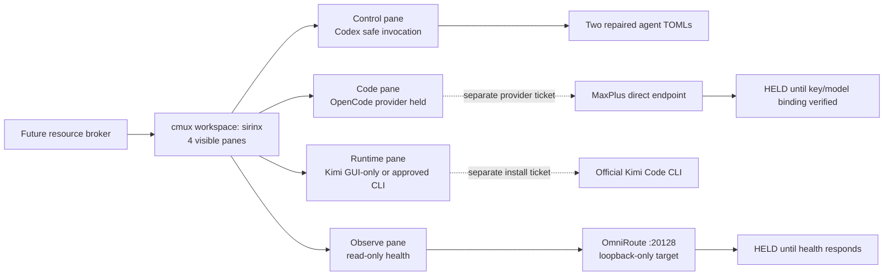

# cmux Recovery Packet — SIRINX Workspace

- Date: 2026-07-19 (Asia/Bangkok)
- Mode: read-only diagnosis and patch plan
Implementation status: **WAITING FOR `APPROVE_IMPLEMENTATION`**

## Outcome

No cmux app or primary-config fault was observed. The supplied UI shows one
`sirinx` workspace with four visible panes, and `cmux config doctor` reports
valid JSONC for `~/.config/cmux/cmux.json`. That evidence does not prove every
cmux CLI/runtime path is healthy; it does show that the visible pane errors have
independent command, process, and agent-config causes.

Do not reinstall cmux, replace API keys, trust hooks, or start more agents to
fix this. The smallest recovery is two local TOML corrections, a safe Codex
relaunch, containment of the OmniRoute listener, and explicit decisions for
Kimi CLI and provider routing.

No runtime/config file, process, key, hook, provider, or service was changed
while preparing this packet. This documentation packet itself was created.

## Evidence snapshot

| Surface | Observed at (Asia/Bangkok) | Verified evidence | Classification |
|---|---|---|---|
| cmux app | 2026-07-19 02:39:32 +07 | `/opt/homebrew/bin/cmux` → app CLI, version `0.64.19 (99)`; app active | Healthy presence only |
| cmux config | 2026-07-19 02:39:32 +07 | primary `~/.config/cmux/cmux.json`, valid JSONC; doctor/validate passed | No primary-config fault observed |
| cmux layout | 2026-07-19 02:21:00 +07 | supplied screenshot shows workspace `sirinx`, four panes | UI layout verified only |
| mux launcher | 2026-07-19 02:39 +07 | `scripts/agents-mux.sh` emits tmux session/window verbs not offered by the current cmux workspace/surface API | Incompatible adapter claim |
| Codex role 1 | 2026-07-19 02:39 +07 | `coding-model-router.toml` parses but has blank `description` | Semantic config error |
| Codex role 2 | 2026-07-19 02:39 +07 | `repo-intake-quarantine.toml` line 2 has unescaped inner quotes | TOML syntax error |
| Codex hooks | 2026-07-19 02:21:00 +07 | running pane includes `--dangerously-bypass-hook-trust` | Security hold |
| Codex versions | screenshot/current check | pane shows `0.146.6`; `/Users/sirinx/.local/bin/codex --version` returned `0.144.6` at 02:39:32 +07 | Version/surface drift; do not update during recovery |
| Chronicle | 2026-07-19 02:39 +07 | feature enabled; unstable-feature warning visible | Warning, not a crash |
| Kimi CLI | 2026-07-19 02:39:32 +07 | `/opt/homebrew/bin/kimi` is a 101-byte shell stub that always exits successfully | Stub, not installed CLI |
| Kimi desktop | 2026-07-19 02:39 +07 | `/Applications/Kimi.app` 3.1.2 installed/running | GUI presence only |
| OmniRoute | 2026-07-19 02:39:08 +07 | local package 3.8.48; Node PID 88951 listens on `*:20128` | Volatile process/listener proof only; **LAN exposure hold** |
| OmniRoute health | 2026-07-19 02:39:08 +07 | loopback `/health` timed out after 3 seconds; an independent same-session recheck briefly observed HTTP 500, with its exact timestamp not retained | Inconsistent and unhealthy; no provider proof |
| OpenCode provider | 2026-07-19 02:39 +07 | configured direct `maxplus-deepseek/kimi-k3` endpoint; no registered OmniRoute provider | Key-pool error is downstream MaxPlus mismatch |
| `lsof` prompt | 2026-07-19 02:21:00 +07 | a tool asked permission to inspect port 20128 | Tool policy prompt, not cmux error |
| `stub` error | 2026-07-19 02:21:00 +07 | shell received a separate `stub` command | User/pane command error, not Kimi stub behavior |

Earlier runtime evidence showed port 20128 down. The later listener is a state
change and supersedes that point only. Health then varied between HTTP 500 and
timeout, so every process action requires a fresh, timestamped pre-action
listener and bounded-health check. None of these observations supplies a
successful readiness or provider-inference receipt.

## Exact root causes

### 1. Blank Codex agent description

`/Users/sirinx/.codex/agents/coding-model-router.toml` is syntactically valid,
but Codex rejects an empty role description.

Validated replacement:

```toml
description = "Routes coding tasks to the appropriate model while preserving GhostClaw safety gates."
```

### 2. Broken quarantine-agent TOML

`/Users/sirinx/.codex/agents/repo-intake-quarantine.toml` closes its basic
string at the quote before `install`, so the remainder is parsed as an
unexpected key/value.

Validated full replacement:

```toml
description = "Use when a repository, archive, code sample, or GitHub URL must be assessed before cloning, installing, or executing it. Produce a provenance-bound, prompt-injection-resistant quarantine report and promotion decision; trigger this skill for third-party repo intake, dependency due diligence, unknown scripts, or requests to \"install every awesome repo.\""
```

Both replacement values passed an in-memory `tomllib` parse and nonblank-field
check. They have not been written.

### 3. Hook-trust bypass

The warning is caused by the current Codex invocation, not a persistent config
key. Relaunch the affected pane without `--dangerously-bypass-hook-trust`.
Never “fix” this by suppressing the warning or auto-trusting repository hooks.
Before any relaunch, inventory the enabled hook source paths, SHA-256 digests,
and persisted trust state read-only. After relaunch, verify that no new trust
entry appeared. Every enabled hook path/digest and every existing persisted
trust entry must match an explicitly approved inventory before relaunch;
unknown, mutable, or unmatched hooks/trust fail-stop and keep the surface held.
Warning disappearance by itself is not safety evidence.

The exact recovery launch must pin the existing executable, observed version,
cmux workspace/pane/surface identity, working directory, and full launch command
before execution. The screenshot pane reports Codex `0.146.6`, while the current
`/Users/sirinx/.local/bin/codex` reports `0.144.6`; do not install or update Codex
as part of this recovery and do not assume these are the same launch surface.

### 4. Chronicle warning

`features.chronicle = true` is enabled in `/Users/sirinx/.codex/config.toml`.
The warning accurately reports an experimental feature. Recommended choices:

1. retain Chronicle and retain the visible warning; or
2. disable Chronicle for a stable lane.

Adding `suppress_unstable_features_warning` only hides risk and is not a repair.

### 5. Kimi command shadowing

`/opt/homebrew/bin/kimi` is a standalone compatibility stub, not a symlink to
Kimi Desktop or Kimi Code. It ignores `tui` and returns exit code zero, which
can make supervision falsely report success.

Do not install over it automatically. The two valid target choices are:

- **GUI-only lane:** label the pane `Kimi Desktop (GUI only)` and do not invoke
  `kimi` from automation; or
- **CLI lane:** under a separate install ticket, back up/move the stub, install
  the official Kimi Code CLI from the approved source, verify provenance and
  version, and do not auto-login.

Kimi Desktop being open is not Kimi K3 provider inference proof.

### 6. OmniRoute and MaxPlus are different failures

OmniRoute was observed as a Node dev process bound to all interfaces on port
20128. Its bounded health observations were inconsistent—one independent
recheck saw HTTP 500 and the fresh 02:39:08 +07 check timed out. This is a
volatile local-network exposure and readiness defect; it must not be tunneled
or treated as healthy. Re-resolve the exact PID, parent, bind, and bounded health
immediately before any containment action.

The OpenCode pane is not using OmniRoute. It targets MaxPlus directly with a
model/key pool mismatch. Restarting OmniRoute or changing its port cannot fix
that message. Key selection, endpoint selection, and any provider probe require
a separate provider-routing ticket; no secret value may be printed or copied
into this packet.

## Recovery topology



cmux is presentation and supervision. It does not grant provider, hook, shell,
merge, deploy, or gate authority.

## Gated fix sequence

| Order | Change | Authority | Pass condition |
|---:|---|---|---|
| 0 | Preserve timestamped backups of the two exact agent files before editing | `APPROVE_IMPLEMENTATION agent_toml_edit` scoped to `/Users/sirinx/.codex/agents/coding-model-router.toml` and `/Users/sirinx/.codex/agents/repo-intake-quarantine.toml` | backup paths/digests recorded; no secret content copied into logs |
| 1 | Apply only the two validated TOML description replacements | same `agent_toml_edit` authority | both files parse; descriptions nonblank; Codex discovers both roles |
| 2 | Inventory hook source paths/digests, persisted trust, exact Codex binary/version, workspace/pane/surface, cwd, and launch command; then relaunch only that surface without hook-trust bypass | separate `APPROVE_IMPLEMENTATION codex_surface_relaunch` containing those exact resolved fields and the explicitly approved hook/trust inventory | every enabled hook and existing trust entry matches the approved inventory or relaunch remains held; no bypass argument or new trust entry; pinned binary/version recorded |
| 3 | Stop or rebind the freshly resolved exact OmniRoute dev PID/listener to loopback; do not touch credentials | separate `APPROVE_IMPLEMENTATION model_gateway_containment` naming the pre-action PID, parent, current bind, target bind, and stop/restart command | listener is `127.0.0.1:20128` or absent; no LAN bind |
| 4 | Verify OmniRoute health contract locally | read-only after containment | bounded response; status/version only; no key/provider claim |
| 5 | Choose Kimi GUI-only or CLI lane | human design decision | no stub counted as healthy |
| 6 | If CLI chosen, move the conflicting stub and install pinned official Kimi Code | separate install ticket | provenance/version checked; no login; rollback restores stub |
| 7 | Choose the approved MaxPlus key/model/endpoint binding | separate paid-provider ticket | secret-presence check only; one narrow probe receipt |
| 8 | Implement a dedicated cmux adapter instead of `MUX_BIN=cmux` | separate `APPROVE_IMPLEMENTATION cmux_adapter_source` naming the repo, exact files, and test commands | pinned adapter contract tests; no tmux-only verbs sent to cmux |

Each implementation authority above is single-purpose. Do not batch process
containment, CLI installation, provider/auth work, source changes, or any
rollback under the generic request to “fix cmux”; they cross separate trust
boundaries. The mandatory `APPROVE_IMPLEMENTATION` marker is necessary but is
not sufficient unless the named authority and exact targets are present.

## cmux adapter contract

The current `scripts/agents-mux.sh` uses `attach -t`, `kill-session`,
`has-session`, `new-session`, `new-window`, `send-keys`, and `select-window`.
The current cmux CLI is centered on windows, workspaces, panes, surfaces and the
socket API (`new-workspace`, `new-split`, `new-surface`, `send`, health/tree
queries). A direct binary substitution is therefore not the supported path.

Target interface:

| Operation | tmux adapter | cmux adapter |
|---|---|---|
| create isolated view | session/window | workspace/pane/surface |
| send bounded command | `send-keys` | `send` to an exact surface |
| inspect | list/capture pane | tree/surface-health/read-screen with redaction |
| stop | exact session/window | exact workspace/surface |
| receipt identity | session:window | workspace/pane/surface UUID |

The resource broker must approve a lane lease before either adapter creates a
view or sends a command.

## Verification matrix after approval

| Check | Expected |
|---|---|
| `tomllib` parse both agent files | pass |
| Codex role discovery | no blank-description or quarantine TOML warning |
| Hook inventory | every enabled path/digest and existing trust entry matches the explicitly approved inventory; pre/post state matches; no new persisted trust |
| Codex launch identity | exact existing binary/version, workspace/pane/surface, cwd, and command recorded; no update/install |
| Codex launch arguments | no hook-trust bypass |
| cmux config doctor | valid JSONC |
| cmux workspace | four intended surfaces mapped to bounded roles |
| OmniRoute listener | loopback-only or stopped |
| OmniRoute health | bounded success response; otherwise held |
| Kimi pane | explicitly GUI-only or verified official CLI; never the stub |
| OpenCode provider | remains held until compatible key/model receipt |
| secrets | no values in terminal, artifacts, receipts, or process arguments |

## Rollback

Rollback is not implicit. Each mutation authority must include its own exact
rollback authority and targets:

- `APPROVE_IMPLEMENTATION agent_toml_rollback`: restore only the two named,
  digest-matched timestamped backups if Codex role discovery regresses.
- `APPROVE_IMPLEMENTATION codex_surface_rollback`: close only the exact newly
  relaunched workspace/pane/surface identity; do not kill unrelated cmux panes.
- `APPROVE_IMPLEMENTATION model_gateway_rollback`: stop the exact post-change
  PID/listener or restore the explicitly approved prior bind; never fall back to
  `0.0.0.0` merely to regain readiness.
- `APPROVE_IMPLEMENTATION cmux_adapter_rollback`: revert only the named adapter
  source files using the recorded pre-change commit/digests and rerun its tests.
- Restore the Kimi stub only if the separately approved CLI install is rolled
  back; never overwrite an unknown binary without its backup digest.
- Provider changes roll back through their own ticket; never reuse an install,
  cmux, or OmniRoute authorization.

## Stop point

The diagnostic and exact TOML patch values are ready. Runtime/config edits,
surface relaunch, listener containment, install, and provider configuration
have not run because no target-scoped implementation authority has been
supplied in this conversation.
